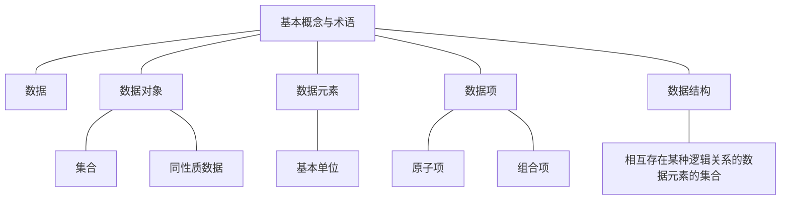
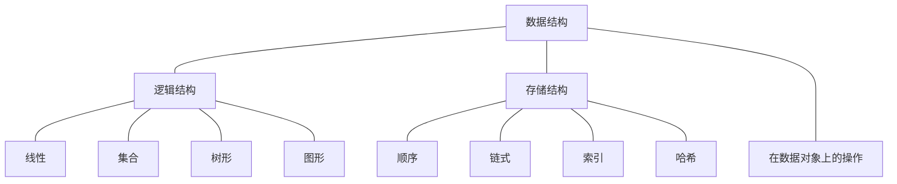

span

- [1. 绪论](#1-%E7%BB%AA%E8%AE%BA)
  - [1.1. 基本概念与术语](#11-%E5%9F%BA%E6%9C%AC%E6%A6%82%E5%BF%B5%E4%B8%8E%E6%9C%AF%E8%AF%AD)
  - [1.2. 数据结构](#12-%E6%95%B0%E6%8D%AE%E7%BB%93%E6%9E%84)
  - [1.3. 抽象数据类型 Abstract Data Type（ADP）](#13-%E6%8A%BD%E8%B1%A1%E6%95%B0%E6%8D%AE%E7%B1%BB%E5%9E%8B-abstract-data-typeadp)
  - [1.4. 算法 Algorithm ：解决特定问题求解步骤的描述](#14-%E7%AE%97%E6%B3%95-algorithm-%E8%A7%A3%E5%86%B3%E7%89%B9%E5%AE%9A%E9%97%AE%E9%A2%98%E6%B1%82%E8%A7%A3%E6%AD%A5%E9%AA%A4%E7%9A%84%E6%8F%8F%E8%BF%B0)
    - [1.4.1. 算法特性](#141-%E7%AE%97%E6%B3%95%E7%89%B9%E6%80%A7)
    - [1.4.2. 算法设计的要求](#142-%E7%AE%97%E6%B3%95%E8%AE%BE%E8%AE%A1%E7%9A%84%E8%A6%81%E6%B1%82)
    - [1.4.3. 算法效率的度量方法](#143-%E7%AE%97%E6%B3%95%E6%95%88%E7%8E%87%E7%9A%84%E5%BA%A6%E9%87%8F%E6%96%B9%E6%B3%95)
    - [1.4.4. 函数渐进增长性：对比不同算法的优劣](#144-%E5%87%BD%E6%95%B0%E6%B8%90%E8%BF%9B%E5%A2%9E%E9%95%BF%E6%80%A7%E5%AF%B9%E6%AF%94%E4%B8%8D%E5%90%8C%E7%AE%97%E6%B3%95%E7%9A%84%E4%BC%98%E5%8A%A3)
    - [1.4.5. 复杂度](#145-%E5%A4%8D%E6%9D%82%E5%BA%A6)
      - [1.4.5.1. 时间复杂度：T（n） = O（ f（ n ））](#1451-%E6%97%B6%E9%97%B4%E5%A4%8D%E6%9D%82%E5%BA%A6tn--o-f-n-)
        - [1.4.5.1.1. 分类](#14511-%E5%88%86%E7%B1%BB)
        - [1.4.5.1.2. 推导大O阶](#14512-%E6%8E%A8%E5%AF%BC%E5%A4%A7o%E9%98%B6)
      - [1.4.5.2. 空间复杂度：S（n） = O（ f（ n ）） 所需存储空间](#1452-%E7%A9%BA%E9%97%B4%E5%A4%8D%E6%9D%82%E5%BA%A6sn--o-f-n--%E6%89%80%E9%9C%80%E5%AD%98%E5%82%A8%E7%A9%BA%E9%97%B4)
    - [1.4.6. 算法的分析](#146-%E7%AE%97%E6%B3%95%E7%9A%84%E5%88%86%E6%9E%90)

<!-- /TOC -->

## 绪论

<center>程序 = 算法 + 数据结构</center>

<center>数据结构 = 数据对象 + 结构</center>

### 1.1. 基本概念与术语



### 1.2. 数据结构



### 1.3. 抽象数据类型 Abstract Data Type（ADP）

* 数据类型
  * 原子类型
  * 结构类型
* ADP：一个数学模型以及定义在该模型上的一组操作。

  * 体现了程序设计的**问题分解**、**抽象**和**信息隐藏**
  * **描述**
  * ADP 抽象数据类型名
    Data
    数据元素之间逻辑关系的定义
    Operation
    操作1
    初始条件
    操作结果描述
    操作2
    初始条件
    操作结果描述
    操作3
    初始条件
    操作结果描述
    ···
    操作n
    初始条件
    操作结果描述
    end ADP

### 1.4. 算法 Algorithm ：解决特定问题求解步骤的描述

#### 1.4.1. 算法特性


#### 1.4.2. 算法设计的要求

* 正确性
* 可读性
* 健壮性
* 时间效率高、存储量低

#### 1.4.3. 算法效率的度量方法

* 事后统计（不科学、不准确）
* 事前分析估算

#### 1.4.4. 函数渐进增长性：对比不同算法的优劣

#### 1.4.5. 复杂度

##### 1.4.5.1. 时间复杂度：T（n） = O（ f（ n ））

T（n）：执行次数
看数量级、看增长率、越小越优

###### 1.4.5.1.1. 分类

* 常数阶：    O（1）
* 线性阶：    O（n）
* 平方阶：    O（n^2^）
* 对数阶：    O（logn）
* nlogn阶：   O（nlogn）
* 立方阶：    O（n^3^）
* 指数阶：    O（2^n^）
* ······

###### 1.4.5.1.2. 推导大O阶

* 用“1”取代加法常数
* 只保留最高阶项
* 最高阶项系数改为1

  注：O(1) < O(logn) < O(n) < O(nlogn) < (n^2^) < O(n^3^) < O(2^n^) < O(n!) < O(n^n^)

##### 1.4.5.2. 空间复杂度：S（n） = O（ f（ n ）） 所需存储空间

注：“复杂度”一般指时间复杂度

#### 算法的存储量

1. 输入数据所占空间
2. 程序本身所占空间
3. 辅助变量所占空间

#### 1.4.6. 算法的分析

* 平均情况：期望的运行时间，计算平均时间复杂度。
* 最坏情况：计算最坏时间复杂度，是一种保证，一般时间复杂度指最坏情况。

```
ADT MainWindow {
数据对象：D = { Qt自带功能窗口界面对象 }
数据关系：R = { MainWindow与其控件部分存在Qt自定义的关系树 }
基本操作：
——setupUi(QMainWindow)
		操作结果：创建窗口
——close()
		操作结果：关闭窗口
——hide()
		操作结果：隐藏窗口
——setWindowIcon(QIcon())
初始条件：参数指定Icon进行显示
		操作结果：设置窗口的图标
——setWindowTitle(QString)
		初始条件：参数指定标题内容，为QString类型
		操作结果：设置窗口标题
——setFixedSize(int x, int y)
		初始条件：长x宽y为大于零的正实数
		操作结果：设置窗口大小为长x宽y的矩形
——QFileDialog::getOpenFileName(QWidgettitlepathfilter_style)
		操作结果：打开path下的文件夹窗口，并返回选中文件的绝对路径
——paintEvent(QPaintEvent *)
		操作结果：重写paintEvent事件，画出窗口背景图
} ADT MainWindow
```