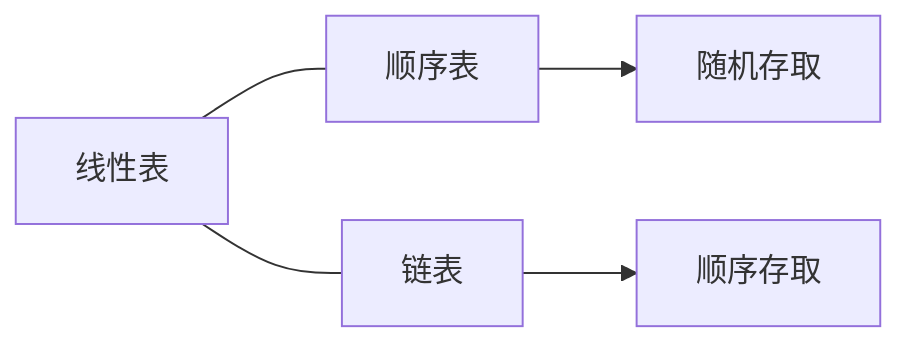

# 线性表
<!-- TOC -->
- [1. 顺序表的顺序存储](#1-顺序表的顺序存储)
	- [1.1. 补充：操作算法中用到的预定义常量和类型](#11-补充操作算法中用到的预定义常量和类型)
	- [1.2. 线性表顺序存储的结构代码](#12-线性表顺序存储的结构代码)
	- [1.3. 顺序表基本操作的实现](#13-顺序表基本操作的实现)
		- [1.3.1. InitList(&L)](#131-initlistl)
		- [1.3.2. DestroyList(&L)](#132-destroylistl)
		- [1.3.3. ClearList(&L)](#133-clearlistl)
		- [1.3.4. Listlnsert(&L, i, e)](#134-listlnsertl-i-e)
		- [1.3.5. ListDelete(&L, i, &e)](#135-listdeletel-i-e)
		- [1.3.6. lsEmpty(L)](#136-lsemptyl)
		- [1.3.7. ListLength(L)](#137-listlengthl)
		- [1.3.8. LocateElem(L, e)](#138-locateeleml-e)
		- [1.3.9. GetElem(L, i, &e)](#139-geteleml-i-e)
- [2. 顺序表的链式存储（链表）](#2-顺序表的链式存储链表)
	- [2.1. 单链表](#21-单链表)
		- [2.1.1. 单链表结构代码](#211-单链表结构代码)
		- [2.1.2. 初始化构造空表 int InitList(LinkList *L)](#212-初始化构造空表-int-initlistlinklist-l)
		- [2.1.3. 判断链表是否为空 int IsLinkListEmpty(LinkList L)](#213-判断链表是否为空-int-islinklistemptylinklist-l)
		- [2.1.4. 创建非空单链表 int CreateList(LinkList *L, int n)](#214-创建非空单链表-int-createlistlinklist-l-int-n)
		- [2.1.5. 遍历 int TraverLinkList(LinkList L)](#215-遍历-int-traverlinklistlinklist-l)
		- [2.1.6. 按值查找 LinkList LocateElem(LinkList L, ElemType e)](#216-按值查找-linklist-locateelemlinklist-l-elemtype-e)
		- [2.1.7. 按位序查找 LinkList GetPosElem(LinkList L, int i)](#217-按位序查找-linklist-getposelemlinklist-l-int-i)
		- [2.1.8. 求长度 int ListLength(LInkList L)](#218-求长度-int-listlengthlinklist-l)
		- [2.1.9. 按位序插入 int InsertList(LinkList L, int i, ElemType e)](#219-按位序插入-int-insertlistlinklist-l-int-i-elemtype-e)
		- [2.1.10. 按位序删除 int DeleteList(List L, int i; ElemType *e)](#2110-按位序删除-int-deletelistlist-l-int-i-elemtype-e)
		- [2.1.11. 单链表的清空 int ClearList(LinkList *L)](#2111-单链表的清空-int-clearlistlinklist-l)
		- [2.1.12. 单链表的销毁 int DestroyList(LinkList *L)](#2112-单链表的销毁-int-destroylistlinklist-l)
		- [2.1.13. 单链表的逆置 void inverted(LinkList L)](#2113-单链表的逆置-void-invertedlinklist-l)
		- [2.1.14. 单向链表的就地排序 int sort(LinkList L)](#2114-单向链表的就地排序-int-sortlinklist-l)
		- [2.1.15. 单链表的有序插入](#2115-单链表的有序插入)
		- [2.1.16. 有序表的归并](#2116-有序表的归并)
		- [2.1.17. 集合的运算](#2117-集合的运算)
			- [2.1.17.1. 交集](#21171-交集)
			- [2.1.17.2. 并集](#21172-并集)
			- [2.1.17.3. 差集](#21173-差集)
	- [2.2. 单向循坏链表](#22-单向循坏链表)
		- [2.2.1. 单向循环链表的插入	int CirInsertLink(LinkList L, int i, ElemType e)](#221-单向循环链表的插入int-cirinsertlinklinklist-l-int-i-elemtype-e)
		- [2.2.2. 单向循环链表的删除	int CirDeleteLink(LinkList L, int i, ElemType e)](#222-单向循环链表的删除int-cirdeletelinklinklist-l-int-i-elemtype-e)
		- [2.2.3. 单向循环链表的合并	LinkList Connect(LinkList Ta,LinkList Tb)](#223-单向循环链表的合并linklist-connectlinklist-talinklist-tb)
	- [2.3. 双向循环链表](#23-双向循环链表)
		- [2.3.1. 双向循环链表的初始化	int InitDuLinkList(DuLinkList *L)](#231-双向循环链表的初始化int-initdulinklistdulinklist-l)
		- [2.3.2. 双向循环链表的插入	int DuInsert(DuLinkList *L, int i, ElemType e)](#232-双向循环链表的插入int-duinsertdulinklist-l-int-i-elemtype-e)
		- [2.3.3. 双向循环链表的删除	int DuDelete(DuLinkList *L, int i, ElemType e)](#233-双向循环链表的删除int-dudeletedulinklist-l-int-i-elemtype-e)

<!-- /TOC -->

## 1. 顺序表的顺序存储

### 1.1. 补充：操作算法中用到的预定义常量和类型

* 函数结果状态代码
```
 define TRUE         1
 define TRUE         1
 define FALSE        0
 define ERROR        0
 define INFEASIBLE  -1
 define OVERFLOW    -2
```

* Status是函数的类型，其值是函数结果状态代码

```C
typedef int Status;
typedef char Elemtype;
```

### 1.2. 线性表顺序存储的结构代码

```C
//顺序存储结构代码		创建线性表

define MAXSIZE 20				/*存储空间初始分配量*/

define OK 1

define ERROR 0

//线性表的动态分配存储结构

define ListInitSize 100		/*存储空间初始分配量*/

define ListIncrement 10		/*存储空间分配增量*/
typedef int Status;
typedef int Elemtype;
Elemtype *newbase;				//重新分配存储空间

typedef struct
{
	Elemtype *data;				/*储存数据元素  这里使用指针方便后边进行动态分配	储存空间基址*/
	int length;					/*当前线性表的长度	线性表长度<=数组长度*/
	int listsize;				//当前分配的存储容量 第三个属性根据需要，可有可无
}SqList;
```

注：status是一种函数类型，当函数返回值为函数结果状态代码时，函数定义为Status类型。
函数结果状态码：
TRUE        1、FALSE    0
OK          1、ERROR    0
INFEASIBLE -1、OVERFLOW -2

### 1.3. 顺序表基本操作的实现

#### 1.3.1. InitList(&L)

初始化操作，建立一个空的线性表L

* C

```C
Status InitList(SqList* L)			//构造一个空的线性表
{
	//动态分配
	L->data = (Elemtype *)malloc(sizeof(Elemtype) * ListInitSize )

	if (!L->data);      //存储分配失败退出
		exti(ERROR);

	L->length = 0;      //空表长度为0
	L->listsize = ListInitSize;
	return OK;
}
```

* C++

```C++
Status InitList(SqList* L)			//构造一个空的线性表
{
	//动态分配
	L->data = new Elemtype(ListInitSize);

	if (!L->data);      //存储分配失败退出
		exti(ERROR);

	L->length = 0;      //空表长度为0
	L->listsize = ListInitSize;
	return OK;
}
```

#### 1.3.2. DestroyList(&L)

销毁已存在的线性表L

* C

```C
void DestroyList(SqList *L)
{
    if(L->data)  free(L->data);  //释放存储空间
}
```

* C++

```C++
void DestroyList(SqList &L)
{
    if(L.data)  delete[] L.data;  //释放存储空间
}
```

注：如果动态分配了一个数组，但是却用delete p的方式释放，没有用[]，则编译时没有问题，运行时也一般不会发生错误，但实际上会导致动态分配的数组没有被完全释放。

#### 1.3.3. ClearList(&L)

将线性表清空

* C++

```C++
void ClearList(SqList &L)
{
    L->length = 0;          //将线性表的长度置为零
}
```

注：其实这只是形式上的清空，让计算机识别不了而已，真正的线性表在内存中还存在。

#### 1.3.4. Listlnsert(&L, i, e)

在线性表L中第i个位置插入新元素e

* C

```C++
Status ListInsert(SqList* L, int i, Elemtype e)			//在第i个位置插入新元素e
{
	//初始条件      i的位置要合理同时线性表要有空间可以插入新元素
	int k;
	if (L->length == MAXSIZE)
		return ERROR;
	if (i < 1 || i > L->length + 1)
		return ERROR;
	if (L->length >= L->listsize)		//存储空间已满，需要重新分配
	{
		newbase = (Elemtype*)realloc(L->data, (L->listsize + ListInitSize) * sizeof(Elemtype))
			if (!newbase)
				exit(EOVERFLOW);
		L->data = newbase;
		L->listsize += ListIncrement;
	}

	//操作结果
	if (i <= L->length)
	{
		for (k = L->length - 1; k >= i - 1; k--)
			L->data[k + 1] = L->data[k];
	}
	L->data[i-1] = e;
	L->length++;

	return OK;
}

L.date[length] = e;
L.length++;

e = L.data[length];
L.length--;
```

#### 1.3.5. ListDelete(&L, i, &e)

删除线性表L中第i个位置元素，用e返回

* C

```C++
Status ListDelete(SqList* L, int i, Elemtype* e)
{
	//初始条件
	int k;
	if (i<1 || i>L->length)			//删除的位置不合理
		return ERROR;
	if (L->length == 0)				//线性表没有元素可以删除
		return ERROR;

	//操作结果
	*e = L->data[i - 1];

	if (i < L->length)
	{
		for (k = i; k < L->length; k++)
			L->data[k - 1] = L->data[k];
	}
	L->length--;
	return OK;

}

```

#### 1.3.6. lsEmpty(L)

若线性表为空，返回true，否则false

* C

```C++
int IsEmpty(SqList *L)
{
    if(L->length == 0)
        return 1;
    else return 0;
}
```

* C++

```C++
int IsEmpty(SqList &L)
{
    if(L->length == 0)
        return 1;
    else return 0;
}
```

#### 1.3.7. ListLength(L)

返回线性表L的元素个数

* C

```C++
int ListLength(SqList *L)
{
    return L->length;
}
```

* C++

```C++
int ListLength(SqList &L)
{
    return L->length;
}
```

#### 1.3.8. LocateElem(L, e)

L中查找与给定值e相等的元素，若成功返回该元素在表中的序号，否则返回0

<center>顺序查找 O（n） </center>

```C++
//for语句实现
Status LocateElem(SqList *L,Elemtype *e)
{
	int i;
	for(i = 0; i < L->length; i++)
	{
		if(L->data[i] == *e)
		return i+1;
	}
	return 0;
}

//while语句实现
Status LocateElem(SqList *L,Elemtype *e)
{
	int i = 0;
	while( i < L->length && L->data[i] != *e)
	{
		i++;
		if( i < L->length)
			return i+1;
	}

	return 0;
}

```

#### 1.3.9. GetElem(L, i, &e)

将线性表L中的第i个位置元素返回给e

* C

```C++
Status GetElem(SqList L, int i, Elemtype *e)	//获得元素操作，讲读取的元素赋给e
{
	//初始条件  i的位置要合理
	if (L.length == 0 || i < 1 || i > L.length)
		return ERROR;
	//操作结果
	*e = L.data[i - 1];

	return OK;
}
```

* C++

```C++
Status GetElem(SqList L, int i, Elemtype &e)	//获得元素操作，讲读取的元素赋给e
{
	//初始条件  i的位置要合理
	if (L.length == 0 || i < 1 || i > L.length)
		return ERROR;
	//操作结果
	*e = L.data[i - 1];

	return OK;
}
```

## 2. 顺序表的链式存储（链表）

### 2.1. 单链表

```c++
typedef struct
{
	char name[20];
	float score;
}STD;
```

#### 2.1.1. 单链表结构代码

```C++
typedef struct node
{
	Elemtype data;		//数据域
	struct node *next;	//指针域
}LNode,*LinkList;		//Node为数据类型<=>struct node
						//LinkList为指向结点的指针类型
//申请一个结点
s = (LinkList)malloc(sizeof(Node));
s = (LNode*)malloc(sizeof(LNode))
```

#### 2.1.2. 初始化构造空表 int InitList(LinkList *L)

```c++
//①被动修改
int InitList(LinkList *L)
{
	*L = (LNode*)malloc(sizeof(LNode));
	if(*L = NULL)
		return 0;
	(*L)->next = NULL;
		return 1;
}
//②主动接受
LinkList InitList()		//返回地址，不传参数
{
	LinkList L;
	L = (LNode*)malloc(sizeof(LNode));
	if( L == NULL)
		return NULL;
	L->next = NULL;
		return L;
}
//调用
	LinkList H;
	H = InitList();

```

#### 2.1.3. 判断链表是否为空 int IsLinkListEmpty(LinkList L)

```c++
int IsLinkListEmpty(LinkList L)
{
	if(L->next)
		return 0;
	else
		return 1;
}
```

#### 2.1.4. 创建非空单链表 int CreateList(LinkList *L, int n)

<center>头插法</center>

```c++
int CreateLinkListFront(LinkList *L, int n)				//O(n)
{
	*L = (*LNode)malloc(sizeof(LNode));		//建立带头节点的链表
	if(*L == NULL)
		return 0;

	int i;
	LinkList s;
	for(i = 0; i < n; i++)
	{
		s = (LinkList)malloc(sizeof(LNode));
		scanf(&s->data);						//伪代码
		s->next = (*L)->next;
		(*L)->next = s;
	}
	return 1;
}
```

<center>尾插法</center>

```c++
int CreateLinkListRear(LinkList *L, int n)				//O(n)
{
	*L= (LinkList)malloc(sizeof(LNode))
	if(*L == NULL)
		return 0;
	(*L)->next = NULL;

	LinkList R;
	R = *L;
	for(i = 0; i < n; i++)
	{
		LinkList s;
		s = (LinkList)malloc(sizeof(LNode));
		scanf(&s->data);	//伪代码
		s->next = NULL;
		R->next = s;
		R = s;
	}
}
```

<center>初始化函数和插入函数组合</center>

```c++
int CreateList(LinkList *L,int n)
{
	int i = 1;
	Elemtype e；
	InitList(L);
	while( i < n )
	{
		InsertList(L,i++,e)
	}
	return 0；
}
```

#### 2.1.5. 遍历 int TraverLinkList(LinkList L)

```c++
int TraverLinkList(LinkList L)		//O(n)
{
	LinkList p = L->next;
	while(p)
	{
		printf(p->data);		//只是伪代码
		p = p->next;
	}
}
```

#### 2.1.6. 按值查找 LinkList LocateElem(LinkList L, ElemType e)

<center>返回地址</center>

```c++
 LinkList LocateElem(LinkList L, ElemType e)		//返回地址
 {
	 LinkList p = L->next;
	 while(p)
	 {
		if( p->data == e )		//伪代码
		 	break;
		p = p->next;
	 }
	 return p;					//就算找不到也是返回NULL
 }
```

<center>返回位序</center>

```C++
int LocateElem(LinkList L, ElemType e)
{
	LinkList p = L->next;
	int j = 1;
	while(p && p->data != e)
	{
		p = p->next;
		j++;
	}
	if(p)
		return j;
	else 
		return 0;
}
```

#### 2.1.7. 按位序查找 LinkList GetPosElem(LinkList L, int i)

```c++
LinkList GetPosElem(LinkList L, int i)	//LinkList类型，返回结点地址或空指针
{
	if( i < 0 )
		return NULL;
	LinkList p = L->next;
	int j = 1;
	while( p && j < i )
	{
		p = p->next;
		j++;
	}
	if( !p || j > i )
		return NULL;
	return p; 
}
```

#### 2.1.8. 求长度 int ListLength(LInkList L)

```c++
{
	LinkList p = L->next;
	int j = 1;
	while(p)
	{
		p = p->next;
		j++;
	}
}
```

#### 2.1.9. 按位序插入 int InsertList(LinkList L, int i, ElemType e)

```c++
//已知头指针L，位置i，待插入元素值e
int InsertList(LinkList L, int i, ElemType e)
{
	if(i <= 0)				//越界
		return 0;

	LinkList p;
		p = L;
	int j = 0;
	while(p && j<i-1)		//<=> p = GetPosElem(L, i-1)
	{
		p = p->next;
		++j;
	}

	if(!p)					//越界
		return 0;

	LinkList s = (LNode*)malloc(sizeof(LNode));		//生成新结点
	s->data = e;
	s->next = p->next;
	p->next = s;							//插入
}
```

#### 2.1.10. 按位序删除 int DeleteList(List L, int i; ElemType *e)

```c++
int DeleteList(LinkList L, int i, ElemType *e)		//O(n)
{
	if(i<=0)
		return 0;

	LinkList p;
	p = L;
	int j = 0;
	while(p && j<i-1)
	{
		p = p->next;
		++j;
	}

	if(!p)
		return 0;

	LinkList q;
	q = p->next;
	p->next = q->next;
	*e = q->data;
	free(q);
		return 1;
}
```

#### 2.1.11. 单链表的清空 int ClearList(LinkList *L)

清空只清空元素，保留头节点和头指针

```c++
int ClearList(LinkList L)			//O(n)
{
	LinkList p;
	while((*L)->next)
	{
		p = (*L)->next;
		(*L)->next = p->next;
		free(p);
	}
}
```

#### 2.1.12. 单链表的销毁 int DestroyList(LinkList *L)

销毁不保留头节点

```c++
int DestroyList(LinkList *L)
{
	LinkList p;
	while(L)
	{
		p = (*L);
		(*L) = (*L)->next;
		free(p);
	}
}
```

#### 2.1.13. 单链表的逆置 void inverted(LinkList L)

算法思路：讲单链表从头节点开始分割成两个链表，用头插法重新插入即可

```c++
void Inverted(LinkList L)
{
    LinkList p;
    p = L->next;		//临时指针，用于头插法
    L->next = NULL;		//断成两个链表
    while (p) {
        LinkList q;     //临时指针，保存链表
        q = p->next;
        p->next = L->next;
        L->next = p;
        p = q;
    }
}
```

迭代法

```c++
void Inverted(LinkList L)
{
	LinkList pre = NULL;
	LinkList cur = L->next;
	while(cur)
	{
		LinkList Next = cur->next;
		cur->next = pre;
		pre = cur;
		cur = Next;
	}
}
```

#### 2.1.14. 单向链表的就地排序 int sort(LinkList L)

```c++
int sort(LinkList *L)
{
	LinkList p;
	p = (*L)->next;
	(*L)->next = NULL;
	while(p){
		LinkList q;				//q用于保存未排序的链表
		linkList s;				//s用于保存第i-1个结点，确定插入位置
		q = p->next;
		s = (*L);
		while(s->next!=NULL && s->next->data <p->data){
			s = s->next;
		}
		p->next = s->next;
		s->next = p;
		p = q;
	}
	return 1;
}
```

#### 2.1.15. 单链表的有序插入

```c++
void orderInsert(LinkList L)
{
	LinkList s = (LinkList)malloc(sizeof(Lnode));
	scanf("%d", s->data);
	if(s->data > L->next->data){
		s->next = L->next->next ;
		L->next->next = s;
	}
	else{
		s->next = L->next;
		L->next = s;
	}
}
```

#### 2.1.16. 有序表的归并

```c++
/*
*	问题:已知线性表LA和LB，数据元素均按值非递减有序排列，
*	将LA、LB归并成一个新的线性表Lc，
*	且Lc中的数据元素按值非递减有序排列。
*/
```

<center>顺序表</center>

```C++
void MergeSq(SqList LA, SqList LB, SqList *LC)
{
	int i = 0, j = 0, k = 0;
	LC->length = LA.length + LB.length;
	while(i<LA.length && j<LB.length){		//LA和LB非空，写入小的元素到LC
		if( LA.elme[i] < LB.elem[j] )
			LC->elem[k++] = LA.elem[i++];
		else LC->elem[k++] = LB.elem[j++];
	}
	while(i<LA.length)
		LC->elem[k++] = LA.elem[i++];
	while(j<LB.length)
		LC->elem[k++] = LB.elem[j++];
}												//O(m+n)

//去除重复元素
void MergeSq(SqList LA, SqList LB, SqList *LC)
{
	int i = 0, j = 0, k = 0;
	LC->length = LA.length + LB.length;
	while(i<LA.length && j<LB.length){
		if( LA.elem[i] < LB.elem[j] ){
			if(LC->elem[k]!=LA.elem[i])
				LC->elem[k++] = LA.elem[i++];
			else i++;
		}
		else if(LA.elem[i]>LB.elem[j]){
			if(LC->elem[k]!=LB.elem[j])
				LC->elem[k++] = LB.elem[j++];
			else j++;
		}
	}
	while(i<LA.length)
		LC->elem[k++] = LA.elem[i++];
	while(j<LB.length)
		LC->elem[k++] = LB.elem[j++];
}
```

<center>单链表</center>

```c++
void MergeLink(LinkList LA, LinkList LB)
{
	LinkList qa = LA, pa = LA->next;
	LinkList pb = LB->next, qb = pb->next;
	while(pa&&pb){
		if(pa->data <= pb->data){			//寻找插入位置
   			qa = pa;
			pa = pa->next;
		}
		else{
			qa->next = pb;
			pb->next = pa;
			qa = pb;
			qb = pb->next;
		}
	}
	if(!pa)
		qa->next = pb;
		free(LB);
}

//递归法
void linkMerge(linkNode* la, linkNode *lb ,linkNode** lc)
{
	if(!la){
		*lc = lb; return ;
	}
	if(!lb){
		*lc = la; return ;
	}
	if(la->data < lb->data) {
		*lc = la;
		linkMerge(la->next, lb, &(*lc)->next);
	}
	else {
		*lc = lb;
		linkMerge(lb->next, la, &(*lc)->next);
	}
}

//去除重复元素
void linkMerge(linkNode* la, linkNode *lb ,linkNode** lc)
{
	if(!la){
		*lc = lb;
		return ;
	}
	if(!lb){
		*lc = la;
		return ;
	}
	if(la->data < lb->data)
	{
		*lc = la;
		linkMerge(la->next, lb, &(*lc)->next);
	}

	///去除重复元素
	else if(la->data == lb->data)
		linkMerge(la, lb->next, &(*lc));

	else
	{
		*lc = lb;
		linkMerge(lb->next, la, &(*lc)->next);
	}
}

```

有序单链表的合并[参考这里](https://blog.csdn.net/yuki_1209/article/details/120243807)

#### 2.1.17. 集合的运算

##### 2.1.17.1. 交集

```c++
int Intersection(LinkList LA, LinkList LB)
{
	LinkList LC = (LinkList)malloc(sizeof(LNode));
	LC->next = NULL;
	LinkList pc = LC;
	LinkList pa = LA->next;
	LinkList pb = LB->next;
	while (pa && pb) {
		if (pa->data < pb->data) {
			pa = pa->next;
		}
		else if (pa->data > pb->data) {
			pb = pb->next;
		}
		else {
			LinkList s = (LinkList)malloc(sizeof(LNode));
			s->data = pa->data;
			s->next = pc->next;
			pc->next = s;
			pc = s;
			pa = pa->next;
			pb = pb->next;
		}
	}

	printf("集合Set_A为：\n");
	printf("		");
	TraverLinkList(LA);
	printf("集合Set_B为：\n");
	printf("		");
	TraverLinkList(LB);
	printf("集合Set_A与Set_B的交集为：\n");
	printf("		");
	TraverLinkList(LC);
	return 1;
}
```

##### 2.1.17.2. 并集

```c++
int Union(LinkList LA, LinkList LB)
{
	LinkList LC = (LinkList)malloc(sizeof(LNode));
	LC->next = NULL;
	LinkList pc = LC;
	LinkList pa = LA->next;
	LinkList pb = LB->next;
	while (pa && pb) {
		if (pa->data < pb->data) {
			LinkList s = (LinkList)malloc(sizeof(LNode));
			s->data = pa->data;
			s->next = pc->next;
			pc->next = s;
			pc = s;
			pa = pa->next;
		}
		else if (pa->data > pb->data) {
			LinkList s = (LinkList)malloc(sizeof(LNode));
			s->data = pb->data;
			s->next = pc->next;
			pc->next = s;
			pc = s;
			pb = pb->next;
		}
		else {
			LinkList s = (LinkList)malloc(sizeof(LNode));
			s->data = pa->data;
			s->next = pc->next;
			pc->next = s;
			pc = s;
			pa = pa->next;
			pb = pb->next;
		}
	}
	if (pa)
		pc->next = pa;
	if (pb)
		pc->next = pb;

	printf("集合Set_A为：\n");
	printf("		");
	TraverLinkList(LA);
	printf("集合Set_B为：\n");
	printf("		");
	TraverLinkList(LB);
	printf("集合Set_A与Set_B的并集为：\n");
	printf("		");
	TraverLinkList(LC);
	return 1;
}
```

##### 2.1.17.3. 差集

```c++
int Complement(LinkList LA, LinkList LB)
{
	LinkList LC = (LinkList)malloc(sizeof(LNode));
	LC->next = NULL;
	LinkList pc = LC;
	LinkList pa = LA->next;
	LinkList pb = LB->next;
	while (pa&&pb) {
		if (pa->data == pb->data) {
			pa = pa->next;
			pb = pb->next;
		}
		else if (pa->data < pb->data) {
			LinkList s = (LinkList)malloc(sizeof(LNode));
			s->data = pa->data;
			s->next = pc->next;
			pc->next = s;
			pc = s;
			pa = pa->next;
		}
		else if (pa->data > pb->data) {
			pb = pb->next;
		}
	}
	if (pa)
		pc->next = pa;


	printf("集合Set_A为：\n");
	printf("		");
	TraverLinkList(LA);
	printf("集合Set_B为：\n");
	printf("		");
	TraverLinkList(LB);
	printf("集合Set_A与Set_B的差集为：\n");
	printf("		");
	TraverLinkList(LC);
	return 1;
}
```

### 2.2. 单向循坏链表

判断是否为空的条件为p是否等于头指针
`p!=L` or `p->next!=L`
尾指针表示：a~1~ = `R->next->next`; a~n~ = `R`.

#### 2.2.1. 单向循环链表的插入	int CirInsertLink(LinkList L, int i, ElemType e)

```c++
int CirInsertLink(LinkList L, int i, ElemType e)
{
	LinkList p = L;
	int j = 0;
	while( p->next!=L && j<i-1 ){
		p = p->next;
		j++;
	}

	if( j<i-1 || j>i-1 ){
		printf("位置异常！");
		return 0；
	}

	LinkList s = (LinkList)malloc(sizeof(LNode));
	s->data = e;			//伪代码
	s->next = p->next;
	p->next = s;
	return 1;

}
```

#### 2.2.2. 单向循环链表的删除	int CirDeleteLink(LinkList L, int i, ElemType e)

```c++
int CirDeleteLink(LinkList L, int i, ElemType e)
{
	LinkList p = L;
	int j = 0;
	while( p->next!=L && j < i-1 ){
		p = p->next;
		j++;
	}

	if(j<i-1 || j>i-1){
		printf("链表为空或位置异常！");
		return 0;
	}

	LinkList q = p->next;
	e = q->next;
	p->next = q->next;
	free(q);
	return 1;
}
```

#### 2.2.3. 单向循环链表的合并	LinkList Connect(LinkList Ta,LinkList Tb)

这里是用尾指针表示的单向循环链表

```c++
LinkList Connect(LinkList Ta,LinkList Tb)
{
	LinkList p = Ta->next;			//保存Ta表的头结点，便于Tb表接上
	Ta->next = Tb->next->next;		//Tb表尾接到Ta表头
	free(Tb->next);					//释放Tb头结点
	Tb->next = p;					//Tb表尾接到Ta表头
	return Tb;						//因为这里是用Tb的尾指针表示的
}
```

### 2.3. 双向循环链表

```c++
typedef struct DulNode			//dual
{
	struct DulNode *prior;		//前驱
	ElemType data;
	struct DulNode *next;		//后继
}DulNode,*DuLinkLIst
```

#### 2.3.1. 双向循环链表的初始化	int InitDuLinkList(DuLinkList *L)

```c++
int InitDuLinkList(DuLinkList *L)
{
	*L = (DuLinkList)malloc(sizeof(DulNode));
	if(*L == NULL){
		printf("申请空间失败！\n")；
		exit(0);
	}
	(*L)->next = (*L)->prior = *L;
	return 1;
}
```

#### 2.3.2. 双向循环链表的插入	int DuInsert(DuLinkList *L, int i, ElemType e)

```c++
int DuInsert(DuLinkList *L, int i, ElemType e)
{
	DuLinkList p = L;		//临时指针，指向头结点
	DuLinkList New_p;		//用于指向新节点
	int j = 0;

	while(p->next!=L && j < i-1){
		p = p->next;
		j++;
	}

	if(j<i-1 ||j>i-1){
		printf("位置不合理！\n");
		return 0;
	}

	s = (DuLinkList)malloc(sizeof(DulNode));
	s->data = e;

	s->next = p->next;		//后继
	p->next = s;

	s->prior = p;			//前驱
	p->next->prior = s;
}
```

#### 2.3.3. 双向循环链表的删除	int DuDelete(DuLinkList *L, int i, ElemType e)

```c++
int DuDelete(DuLinkList *L, int i, ElemType e)
{
	DuLinkList p = L;
	int j = 0;
	while(p->next != L && j<i-1 ){
		p = p->next;
	}

	if( j<i-1 || j >i-1 ){
		printf("链表为空或位置不合理！\n");
		return 0;
	}

	DuLinkList q = p->next;
	e = q->next;
	p->next = q->next;
	q->next->prior = p;
	free(q);
	return 1;
}
```


