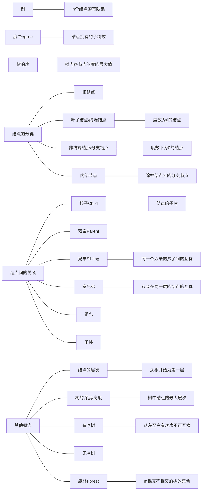
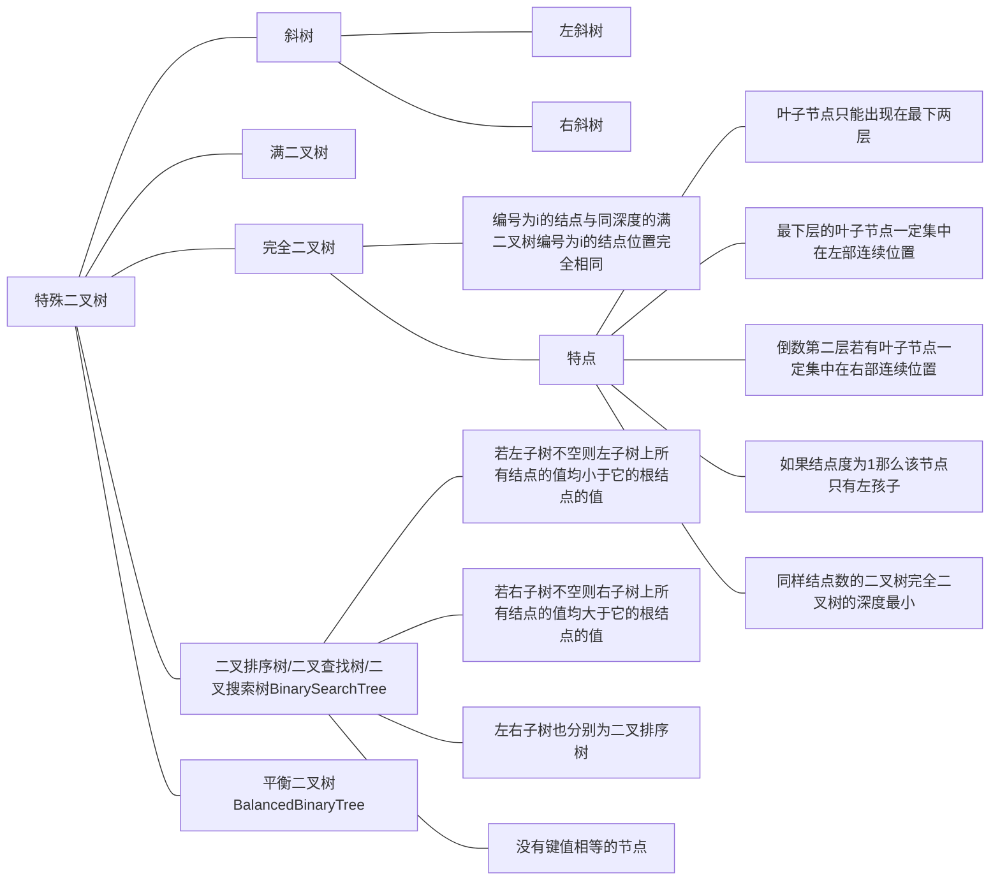

# 树和二叉树

<!-- TOC -->

- [树和二叉树](#树和二叉树)
	- [1. 一些基本概念](#1-一些基本概念)
	- [2. 二叉树](#2-二叉树)
		- [2.1. 二叉树的性质](#21-二叉树的性质)
		- [2.2. 二叉树的存储结构](#22-二叉树的存储结构)
			- [2.2.1. 顺序存储](#221-顺序存储)
			- [2.2.2. 二叉链表](#222-二叉链表)
			- [2.2.3. 三叉链表](#223-三叉链表)
		- [2.3. 二叉树的遍历（递归算法）](#23-二叉树的遍历递归算法)
			- [2.3.1. DLR：先序遍历法](#231-dlr先序遍历法)
			- [2.3.2. LDR：中序遍历法](#232-ldr中序遍历法)
			- [2.3.3. LRD：后序遍历法](#233-lrd后序遍历法)
			- [2.3.4. 凹入输出](#234-凹入输出)
		- [2.4. 二叉树的遍历（非递归算法）](#24-二叉树的遍历非递归算法)
			- [2.4.1. 非递归先序遍历](#241-非递归先序遍历)
			- [2.4.2. 非递归中序遍历](#242-非递归中序遍历)
			- [2.4.3. 非递归后序遍历](#243-非递归后序遍历)
			- [2.4.4. 层次遍历法](#244-层次遍历法)
			- [2.4.5. 任务分析法](#245-任务分析法)
		- [2.5. 二叉树的建立](#25-二叉树的建立)
			- [2.5.1. 基于前序遍历递归算法](#251-基于前序遍历递归算法)
			- [2.5.2. 基于读边法](#252-基于读边法)
		- [2.6. 查找指定结点](#26-查找指定结点)
		- [2.7. 各种数量](#27-各种数量)
			- [2.7.1. 求叶子节点个数](#271-求叶子节点个数)
			- [2.7.2. 求总的结点个数](#272-求总的结点个数)
			- [2.7.3. 分支节点的个数](#273-分支节点的个数)
			- [2.7.4. 求二叉树的深度](#274-求二叉树的深度)
			- [2.7.5. 求二叉树的宽度](#275-求二叉树的宽度)
			- [2.7.6. 查找结点的层数](#276-查找结点的层数)
			- [2.7.7. 某一层的节点数](#277-某一层的节点数)
			- [2.7.8. 求最大结点](#278-求最大结点)
		- [2.8. 路径](#28-路径)
			- [2.8.1. 根到叶子结点的所有路径](#281-根到叶子结点的所有路径)
			- [2.8.2. 输出一颗子树上任意两点间的路径](#282-输出一颗子树上任意两点间的路径)
		- [2.9. 二叉树的镜像](#29-二叉树的镜像)
		- [2.10. 二叉树的销毁](#210-二叉树的销毁)
	- [3. 树与森林（Tree）](#3-树与森林tree)
		- [3.1. 树的存储结构](#31-树的存储结构)
			- [3.1.1. 双亲表示法](#311-双亲表示法)
			- [3.1.2. 孩子表示法](#312-孩子表示法)
			- [3.1.3. 双亲孩子表示法](#313-双亲孩子表示法)
			- [3.1.4. 孩子兄弟表示法（链表）](#314-孩子兄弟表示法链表)
		- [3.2. 树的创建](#32-树的创建)
			- [3.2.1. 孩子链表创建](#321-孩子链表创建)
			- [3.2.2. 读边法创建孩子兄弟链表](#322-读边法创建孩子兄弟链表)
		- [3.3. 树和二叉树的转换](#33-树和二叉树的转换)
			- [3.3.1. 树的遍历](#331-树的遍历)
				- [3.3.1.1. 先根遍历](#3311-先根遍历)
				- [3.3.1.2. 后根遍历](#3312-后根遍历)
				- [3.3.1.3. 层次遍历](#3313-层次遍历)
			- [3.3.2. 森林的遍历](#332-森林的遍历)
				- [3.3.2.1. 先序遍历](#3321-先序遍历)
				- [3.3.2.2. 中序遍历](#3322-中序遍历)
		- [3.4. 树的基本操作](#34-树的基本操作)
			- [3.4.1. 按值查找](#341-按值查找)
				- [3.4.1.1. 结点值不相同](#3411-结点值不相同)
				- [3.4.1.2. 结点值予许相同](#3412-结点值予许相同)
			- [3.4.2. 求树的深度](#342-求树的深度)
			- [3.4.3. 树的插入](#343-树的插入)
			- [3.4.4. 树的删除](#344-树的删除)
			- [3.4.5. 输出树中所有从根到叶子的路径](#345-输出树中所有从根到叶子的路径)
			- [3.4.6. 输出树中从根到指定叶子的路径（假设无重复结点）](#346-输出树中从根到指定叶子的路径假设无重复结点)
			- [3.4.7. 凹入法输出](#347-凹入法输出)

<!-- /TOC -->

## 1. 一些基本概念



## 2. 二叉树



### 2.1. 二叉树的性质

1. 第$i$层至多有$2^{i-1}$个结点。
2. 深度为$k$的二叉树至多有$2^{k}-1$个结点。
3. 分支线总数为$n-1$.
4. 记$n_0$为终端结点数，$n_1$为度数为$2$的结点数，$n_2$为度数为$2$的结点数，则

   1. $分叉总数 = n_1+2n_2$
   2. $n_0=n_2+1$

   $$
   prove:  \begin{cases}n - 1 = n_1 + 2n_2\\ n = n_0 + n_1 + n_2\end{cases} \ Q.E.D.
   $$
5. 具有$n$个结点的**完全二叉树**的深度是$[log_{2}n]+1$。
6. 对于有$n$个结点的完全二叉树的结点按层序编号，对任一结点$i$有

   1. 如果$i=1$,则结点$i$是二叉树的根，无双亲；如果$i>1$,则双亲结点是$[\frac{i}{2}]$。
   2. 如果$2i>n$，则结点$i$无左孩子（结点$i$为叶子结点）；否则其左孩子是结点$2i$。
   3. 如果$2i+1>n$，则结点$i$无右孩子；否则其右孩子为结点$2i+1$。

### 2.2. 二叉树的存储结构

#### 2.2.1. 顺序存储

```c++
#define MAXNODE 100						//最大结点数
typedef ElemType SqBiTree[MAXNODE+1];	//1号单元存放根结点
```

#### 2.2.2. 二叉链表

```c++
typedef struct BiTNode
{
	DataType data;
	struct BITNode *Lchild;
	struct BITNode *Rchild;
}BiTNode, *BiTree;
```

#### 2.2.3. 三叉链表

```c++
typedef struct TriTNode
{
	DataType data;
	struct TriTNode *Lchild;
	struct TriTNode *Rchild;
	struct TriTNode *Rchild;
}TriTNode, *TriTree;
```

### 2.3. 二叉树的遍历（递归算法）

#### 2.3.1. DLR：先序遍历法

```c++
void PreOrderTraverse(BiTree T)
{
	if(T == NULL)
		return ;
	printf("%c",T->data);
	PreOrderTraverse(T->Lchild);
	PreOrderTraverse(T->Rchild);
}
```

#### 2.3.2. LDR：中序遍历法

```c++
void InOrderTraverse(BiTree T)
{
	if(T == NULL)
		return ;
	InOrderTraverse(T->Lchild);
	printf("%c",T->data);
	InOrderTraverse(T->Rchild);
}
```

#### 2.3.3. LRD：后序遍历法

```c++
void PostOrderTraverse(BiTree T)
{
	if(T == NULL)
		return ;
	PostOrderTraverse(T->Lchild);
	PostOrderTraverse(T->Rchild);
	printf("%c",T->data);
}
```

#### 2.3.4. 凹入输出

```c++
void dentPrint(treeNode* T, int level, const char* flag)
{
	if (T) {
		for (int i = 0; i < level; i++) {
			cout << "-";
		}
		printf("%d(%s)\n", T->data, flag);
		dentPrint(T->leftChild, level + 4, "左");
		dentPrint(T->rightChild, level + 4, "右");
		return;
	}
}
```

### 2.4. 二叉树的遍历（非递归算法）

#### 2.4.1. 非递归先序遍历

```c++
//非递归先序遍历
void preOrderIterative(BiTNode* root)
{
	if (root == NULL)
		return;
	LinkStack nodeStack;		//创建一个栈保存结点
	push(&nodeStack, root);		//根节点进栈

	while (!IsEmpty(nodeStack))	//非空时迭代
	{
		BiTNode* node = top(nodeStack);	//保存栈顶结点
		printf("%d", node->data);			//访问栈顶数据
		pop(&nodeStack);					//栈顶结点出栈

		//子节点入栈
		if (node->RightChild)				//考虑栈学先进后出的特点
			push(node->RightChild);			//所以是先右子树进栈
		if (node->LeftChild)				//遍历时才能左子树先出栈
			push(node->LeftChild);
	}
}
```

#### 2.4.2. 非递归中序遍历

```c++
//非递归中序遍历
void InOrderIterative(BiTNode* root)
{
	if (root == NULL)
		return;
	LinkStack nodeStack;			//创建一个栈保存结点
	BiTNode* currentNode = root;	//维护一个当前结点指针

	while (currentNode || !IsEmpty(nodeStack))
	{
		//当前结点非空，或栈非空时迭代处理
		while (currentNode)				//找到最深左子树
		{
			push(nodeStack, currentNode);
			currentNode = currentNode->LeftChild;
		}
		//左子树已经访问完
		currentNode = top(nodeStack);			//取栈顶结点
		printf("%c", currentNode->data);		//访问结点数据
		pop(&nodeStack);						//出栈
		currentNode = currentNode->RightChild;	//将当前结点改为右子节点
	}
}
```

#### 2.4.3. 非递归后序遍历

```c++
//非递归后序遍历
void PostOrderIterative(BiTNode* root)
{
	if (root == NULL)
		return;
	LinkStack nodeStack;			//创建一个栈保存结点
	BiTNode* currentNode = root;	//维护一个当前结点指针
	BiTNode* visitedNode = root;	//保存上一次访问的结点

	//当前结点非空，或栈非空时迭代处理
	while (currentNode  || !IsEmpty(nodeStack))
	{
		while (currentNode)			//沿左子树方向入栈
		{
			push(&nodeStack, currentNode);
			currentNode = currentNode->LeftChild;
		}
		currentNode = top(nodeStack);	//取栈顶元素

		//栈顶元素有右子树且未被访问
		if (currentNode->RightChild && currentNode->RightChild != visitedNode)
		{
			currentNode = currentNode->RightChild;
		}
		else	//右子树为空或被访问过
		{
			printf("%d", currentNode->data);	//访问结点数据
			visitedNode = currentNode;			//记录当前访问的结点
			currentNode = NULL;					//当前结点设置为空，防止重复访问左子树
			pop(&nodeStack);					//出栈
		}
	}
}
```

#### 2.4.4. 层次遍历法

借助队列

```c++
void LeverOrderTraverse(BiTree)
{
	if(root == NULL)				//二叉树为空，结束遍历
		return ;
	Enqueue(root);					//根指针入队
	while(!IsEmpty())				//队列非空
	{
		q = Dequeue();				//出队并取出对头
		visit(q->data);				//访问（输出出队结点信息）
		if(q->Lchild != NULL)		//左孩子入队
			Enqueue(q->Lchild)
		if(q->Rchild !=NULL)		//右孩子入队
			Eequeue(q->Rchild)
	}
}
```

#### 2.4.5. 任务分析法

```c++
//任务分析法后续遍历
void Postorder_iter(BiTree T)
{
	LinkStack S;
	InitLinkStack(&S);		//初始化栈

	ET e;
	BiTNode* p;
	e.ptr = T;
	e.task = 1;
	PushLinkStack(&S, e);

	while (!IsLinkStackEmpty(S))
	{
		e = GetLinkStackTop(S);
		PopLinkStack(&S, e);
		if (e.task == 0)					//访问
		{
			printf("%s ", e.ptr->Data.str);
		}
		else                                //遍历
		{
			e.task = 0;
			PushLinkStack(&S, e);			//访问根节点

			p = e.ptr;						//维护当前指针

			e.ptr = p->RightChild;			//访问右子树

			if (e.ptr)
			{
				e.task = 1;					//布置任务
				PushLinkStack(&S, e);
			}

			e.ptr = p->LeftChild;			//访问左子树
			if (e.ptr)
			{
				e.task = 1;
				PushLinkStack(&S, e);
			}
		}
	}
}
```

### 2.5. 二叉树的建立

#### 2.5.1. 基于前序遍历递归算法

```c++
//基于前序遍历
//BiTNode root = Create(&root);
BiTNode* Create(BiTNode* bt)
{
	char ch[MAXSIZE];
	scanf("%s", ch);		//gets(ch)??
	Input(bt, ch);
	if (strcmp(ch,"#") == 1)
		bt = NULL;
	else
	{
		bt = (BiTree)malloc(sizeof(BiTNode));
		strcpy(bt->data.str, ch);
		bt->LeftChild = Create(bt->LeftChild);		//切记要将返回赋值
		bt->RightChild = Create(bt->RightChild);
	}
	return bt;
}
```

#### 2.5.2. 基于读边法

```c++
//依次输入父节点，子节点，数字0代表创建左子树，1代表创建右子树
int ReadEdgeCreate(BiTree* bt)
{
	LinkQueue Q;
	InitQueue(&Q);
	*bt = NULL;
	char father, child;
	int flag;
	printf("\t");
	scanf("%c,%c,%d", &father, &child, &flag);
	getchar();
	while ( child != '#' )
	{
		BiTree p = (BiTree)malloc(sizeof(BiTNode));
		p->Data.dt = (int)(child-'0');
		p->LeftChild = p->RightChild = NULL;
		EnQueue(&Q, p);
		if ( father == '#')
			*bt = p;
		else
		{
			BiTree s = GetHead(Q);
			while (s->Data.dt != (int)(father-'0'))
			{
				DeQueue(&Q);
				s = GetHead(Q);
			}
			if (flag == 0)
				s->LeftChild = p;
			else s->RightChild = p;
		}
		printf("\t");
		scanf("%c,%c,%d", &father, &child, &flag);
		getchar();
	}
	return OK;
}
```

### 2.6. 查找指定结点

指定结点只有一个

```c++
BiTree Find(BiTree bt, char *find)
{
	if (!bt)
		return NULL;
	if (strcmp(find, bt->Data.str) == 0)
		return bt;
	if (Find(bt->LeftChild, find))
		return Find(bt->LeftChild, find);
	else 
		return Find(bt->RightChild, find);
}
//or
treeNode* searchTree(treeNode* T, int find)
{
	if (!T)
		return NULL;
	else {
		treeNode* left;
		treeNode* right;
		if (T->data == find)
			return T;
		left = searchTree(T->leftChild, find);
		right = searchTree(T->rightChild, find);
		return left ? left : right;
	}
}
```

指定结点不止一个则需要借助数组等进行保存再输出

```cpp
BiTree Find(BiTree bt, int e, BiTree p[], int *n)
{
	if(bt)
	{
		if(bt->data == e)
			p[(*n)++] = bt;
		Find(bt->leftChild, e, p, n);
		Find(bt->RightChild, e, p, n);
	}
}
```

### 2.7. 各种数量

#### 2.7.1. 求叶子节点个数

```c++
void LeafCount(BiTree bt, int *count)
{
	if (!bt)
		return;
	if (!bt->LeftChild && !bt->RightChild)		//叶子结点判断标志
		(*count)++;
	LeafCount(bt->LeftChild, count);			//先数左子树
	LeafCount(bt->RightChild, count);			//再数右子树
}
//or
int leaveCount(treeNode* T)
{
	if (!T)
		return 0;
	if (!(T->leftChild) && !(T->rightChild))
		return 1;
	else
		return leaveCount(T->leftChild) + leaveCount(T->rightChild);
}
```

#### 2.7.2. 求总的结点个数

```c++
int SumNode(BiTree bt)
{
	if (!bt)
		return 0;
	else
	{
		int left = SumNode(bt->LeftChild);
		int right = SumNode(bt->RightChild);
		return left + right + 1;		
		//写成return SumNode(bt->LeftChild)+SumNode(bt->RightChild) + 1 即可
	}
}
```

#### 2.7.3. 分支节点的个数

<center>算法一</center>

```c++
void fenZhiNode(treeNode* T, int *sum)
{
	if (!T)
		return ;
	else {
		fenZhiNode(T->leftChild, sum);
		if (T->leftChild || T->rightChild)
			(*sum)++;
		fenZhiNode(T->rightChild, sum);
	}
}
```

<center>算法二</center>

```c++
int fenzhiNode(treeNode* T)		//二叉树中分支结点个数
{
	Queue* Q = initQueue();
	enQueue(Q, T);
	int sum = 0;
	while (!isEmpty(Q)) {
		treeNode* de = deQueue(Q);
		int flag = 0;
		if (de->leftChild) {
			enQueue(Q, de->leftChild);
			if (flag == 0) {
				sum++;
				flag = 1;
			}
		}
		if (de->rightChild) {
			enQueue(Q, de->rightChild);
			if (flag == 0) {
				sum++;
				flag = 1;
			}
		}
	}
	return sum;
}
```

<center>算法三</center>

```c++
int fenZhiNode2(treeNode* T)
{
	return sumNode(T) - leaveCount(T);
}
```

#### 2.7.4. 求二叉树的深度

```c++
int Depth(BiTree bt)
{
	if (!bt)
		return 0;
	else
	{
		int DepLeft = Depth(bt->LeftChild);		//左边的深度
		int DepRight = Depth(bt->RightChild);	//右边的深度
		if (DepLeft >= DepRight)				//取最大的数作为深度
			return DepLeft + 1;					//加1是加上根结点
		else 
			return DepRight + 1;
	}
}
```

#### 2.7.5. 求二叉树的宽度

```c++
int Width(BiTree bt)
{
	int width = 0;			//更新最大宽度
	int len = 0;			//记录每一层的宽度
	int i;					//遍历每一层的结点

	LinkQueue Q;			//基于层次遍历，故用队列
	InitQueue(&Q);

	BiTree p;
	if (!bt)
		return 0;

	EnQueue(&Q, bt);		//根结点入队
	while (!IsEmpty(Q))
	{
		len = GetLengthQueue(Q);	//每一层入队后队列的长度即为该层的宽度
		width = len > width ? len : width;	//更新最大宽度
		for (i = 0; i < len; i++)
		{
			p = DeQueue(&Q);		//出队并记录出队结点便于访问该结点的孩子结点
			if (p->LeftChild)				//先左孩子入队
				EnQueue(&Q, p->LeftChild);
			if (p->RightChild)				//再右孩子入队
				EnQueue(&Q, p->RightChild);
		}
	}
	return width;
}
```

#### 2.7.6. 查找结点的层数

```c++
int findLevel(treeNode* T, int find, int level)
{
	if (T) {
		int res;
		if (T->data == find)
			return level;
		res = findLevel(T->leftChild, find, level + 1);
		if (res != 0)
			return res;
		else 
			return findLevel(T->rightChild, find, level + 1);

	}
	return 0;
}

void printFindLevel(treeNode* T)
{
	cout << "请输入要查找的值：";
	int find;
	cin >> find;
	cout << "该结点所在的层次为：" << findLevel(T, find, 1) << endl;
}
```

#### 2.7.7. 某一层的节点数

```c++
void levelNode(treeNode* T, int find, int level, int &sum)
{
	int i;
	if (T) {
		if (find == level)
			sum++;
		else {
			levelNode(T->leftChild, find, level + 1, sum);
			levelNode(T->rightChild, find, level + 1, sum);
		}
	}
}

void printLevelNode(treeNode* T)
{
	int find;
	cin >> find;
	int sum = 0;
	levelNode(T, find, 1, sum);
	cout << "该层的结点个数为：" << sum << endl;
}
```

#### 2.7.8. 求最大结点

```c++
//结点类型为整形
int* PreFindMaxInt(BiTree bt, int* max)
{
	if (bt)
	{
		if (*max<=bt->Data.dt)
			*max = bt->Data.dt;
		max = PreFindMaxInt(bt->LeftChild, max);
		max = PreFindMaxInt(bt->RightChild, max);
	}
	return max;
}

//结点类型为字符串
char* PreFindMaxStr(BiTree bt, char *max)
{
	if (bt)
	{
		if (strcmp(max, bt->Data.str) <= 0)
			max = bt->Data.str;
		max = PreFindMaxStr(bt->LeftChild, max);
		max = PreFindMaxStr(bt->RightChild, max);
	}
	return max;
}
void PreFindMaxStr2(BiTree bt, char** max)		//利用二级指针
{
	if (bt)
	{
		if (strcmp(*max, bt->Data.str) <= 0)
			*max = bt->Data.str;
		PreFindMaxStr2(bt->LeftChild, max);
		PreFindMaxStr2(bt->RightChild, max);
	}
}
void PreFindMaxStr3(BiTree bt, char* max)
{
	if (bt)
	{
		if (strcmp(max, bt->Data.str) <= 0)
			strcpy(max, bt->Data.str);			//借助strcpy，注意区别于方法一
		PreFindMaxStr3(bt->LeftChild, max);
		PreFindMaxStr3(bt->RightChild, max);
	}
}

```

### 2.8. 路径

#### 2.8.1. 根到叶子结点的所有路径

<center>算法一</center>

```c++
void pathToLeaf(treeNode* T, stack* S)
{
	if (T) {
		push(S, T);
		if ( (T->leftChild == NULL) && (T->rightChild == NULL) ) {
			printStack(S);
		}
		else {
			pathToLeaf(T->leftChild, S);
			pathToLeaf(T->rightChild, S);
		}
		pop(S);
	}
}

void printPathToLeaf(treeNode* T)
{
	stack* S = initStack();
	pathToLeaf(T, S);
}
```

<center>算法二</center>

```c++
void AllPath(treeNode* T, int path[], int index)
{
	int i;
	if (T) {
		path[index] = T->data;
		if ((T->leftChild == NULL) && (T->rightChild == NULL)) {
			for (i = 0; i < index; i++) {
				cout << path[i] << "->";
			}
			cout << path[index] << endl;
		}
		else {
			AllPath(T->leftChild, path, index + 1);
			AllPath(T->rightChild, path, index + 1);
		}
	}
}

void printAllPath(treeNode* T)
{
	int* path = (int*) malloc(sizeof(int) * depthTree(T));
	AllPath(T, path, 0);
}
```

#### 2.8.2. 输出一颗子树上任意两点间的路径

<center>算法一</center>

```c++
void path_StartToEnd(treeNode* T, treeNode* end, stack* S)
{
	if (T) {
		push(S, T);
		if (T == end) {
			printStack(S);
		}
		else {
			path_StartToEnd(T->leftChild, end, S);
			path_StartToEnd(T->rightChild, end, S);
		}
		pop(S);
	}
}

void printPath_StartToEnd(treeNode* T)
{
	cout << "请依次输入起点和终点：" << endl;
	int s;	cin >> s;
	treeNode* start = searchTree(T, s);
	int e;	cin >> e;
	treeNode* end = searchTree(T, e);

	stack* S = initStack();
	path_StartToEnd(start, end, S);
}
```

<center>算法二</center>

```c++
void path_StartToEnd(treeNode* T, treeNode* end, int path[], int index)
{
	int i;
	if (T) {
		path[index] = T->data;
		if (T == end) {
			for (i = 0; i < index; i++) {
				cout << path[i] << "->";
			}
			cout << path[index] << endl;
		}
		else {
			path_StartToEnd(T->leftChild, end, path, index + 1);
			path_StartToEnd(T->rightChild, end, path, index + 1);
		}
	}
}

void printPath_StartToEnd(treeNode* T)
{
	cout << "请依次输入起点和终点：" << endl;
	int s;	cin >> s;
	treeNode* start = searchTree(T, s);
	int e;	cin >> e;
	treeNode* end = searchTree(T, e);

	int* path = (int*) malloc(sizeof(int) * depthTree(start));
	path_StartToEnd(start, end, path, 0);
}
```

### 2.9. 二叉树的镜像

```c++
void jingxiang(treeNode** T)
{
	treeNode* temp;
	Queue* Q = initQueue();
	enQueue(Q, *T);
	while (!isEmpty(Q)) {
		treeNode* de = deQueue(Q);
		temp = de->leftChild;
		de->leftChild = de->rightChild;
		de->rightChild = temp;
		if (de->leftChild)
			enQueue(Q, de->leftChild);
		if (de->rightChild)
			enQueue(Q, de->rightChild);
	}
}
```

### 2.10. 二叉树的销毁

```c++
int DeleteTree(BiTree& bt)
{
	if (bt->LeftChild)
	{
		DeleteTree(bt->LeftChild);
	}
	if (!(bt->LeftChild && bt->RightChild))
	{
		free(bt);
		bt = NULL;
		return 0;
	}
	if (bt->RightChild)
	{
		DeleteTree(bt->RightChild);
	}
}
```

## 3. 树与森林（Tree）

### 3.1. 树的存储结构

#### 3.1.1. 双亲表示法

```c++
#define MAXSIZE 100

typedef int TElemType;

typedef struct PTNode	//结点结构
{
	ElemType data;
	int parent;			//双亲位置
	//int FirstChild;		//长子位置
	//int RightSib;		//右兄弟位置
}PTNode;

typedef struct
{
	PTNode nodes[MAXSIZE];
	int r,n;			//根位置和结点数
}PTree;
```

#### 3.1.2. 孩子表示法

```c++
#define MAXSIZE 100

typedef int TElemType;

typedef struct CTNode			//孩子结点
{
	int child;
	struct CTNode* next;
}CTNode, *ChildPtr;

typedef struct					//双亲结点
{
	TElemType data;
	ChildPtr firstchild;
}CTBox;

typedef struct					//树结构
{
	CTBox nodes[MAXSIZE];
	int r, n;					//结点数和根节点位置
}CTree;
```

#### 3.1.3. 双亲孩子表示法

```cpp
typedef struct CTNode			//孩子结点
{
	int child;
	struct CTNode* next;
}CTNode, * ChildPtr;

typedef struct					//双亲结点
{
	TElemType data;
	int parent;
	ChildPtr firstchild;		//孩子链头指针
}CTBox;

typedef struct					//树类型
{
	CTBox nodes[MAXSIZE];
	int r, n;					//结点数和根节点位置
}CPTree;

```

#### 3.1.4. 孩子兄弟表示法（链表）

```c++
typedef struct CSNode
{
	TElemType data;
	struct CSNode *firstchild, *nextsibling;
}CSNode, *CSTree;
```

### 3.2. 树的创建

#### 3.2.1. 孩子链表创建

```c++
int CreateChildLink(CTree* T)
{
	scanf("%d", &T->n);		//读入结点数
	T->r = 0;				//根位置
	for (int i = 0; i < T->n; i++)
	{
		scanf("%d", &T->nodes[i].data);
		T->nodes[i].firstchild = NULL;
		int f, c;
		scanf("%d%d", &f, &c);
		while (c != -1)		//循环读边
		{
			ChildPtr s = (ChildPtr)malloc(sizeof(CTNode));
			s->child = c;		//单链表的头插法
			s->next = NULL;
			s->next = T->nodes[f].firstchild;
			T->nodes[f].firstchild = s;
			scanf("%d%d", &f, &c);
		}
	}
}
```

#### 3.2.2. 读边法创建孩子兄弟链表

```cpp
void CreateCSTree(CSTree* T)		//读边法创建孩子兄弟链表
{
	*T = NULL;
	char fa, ch;
	for (scanf("%c%c", &fa, &ch); ch != '#'; scanf("%c%c", &fa, &ch))
	{
		CSTree p = (CSTree)malloc(sizeof(CSNode));
		CSTree s, r;	//s用来保存队头元素；r用来保存上一次的链接点

		p->data = ch;
		p->firstchild = NULL;
		p->nextsibling = NULL;		//创建结点

		EnQueue(Q, p);				//指针入队

		if (fa == '#')		//所建为根节点
			*T = p;
		else				//非根节点的情况
		{

			GetHead(Q, s);

			while (s->data != fa)		//找父节点
			{
				DeQueue(Q, s);
				GetHead(Q, s);
			}

			if ((s->data == fa))		//链接第一个孩子结点
			{
				s->firstchild = p;
				r = p;
			}
			else						//链接其他孩子结点
			{
				r->nextsibling = p;
				r = p;
			}

		}
	}
}
```

### 3.3. 树和二叉树的转换

#### 3.3.1. 树的遍历

##### 3.3.1.1. 先根遍历

```cpp
void PreOrderTree(CSTree T)
{
	if(T)
	{
		printf("%d", T->data);
		PreOrderTree(T->firstchild);
		PreOrderTree(T->nextsibling);
	}
}

或者
void PreOrderTree(CSTree T)
{
	if(T)
	{
		printf("%d", T->data);
		CSTree p;
		for(p = T->firstchild; p; p = p->nextsibling)
			PreOrderTree(p);
	}
}
```

注意：树的**先根**遍历等价于二叉树的**先序**遍历！！！

##### 3.3.1.2. 后根遍历

```cpp
void PostOrderTree(CSTree T)
{
	if(T)
	{
		PreOrderTree(T->firstchild);
		printf("%d", T->data);
		PreOrderTree(T->nextsibling);
	}
}
或者
void PostOrderTree(CSTree T)
{
	if(T)
	{
		CSTree p;
		for(p = T->firstchild; p; p = p->nextsibling)
			PreOrderTree(p);
		printf("%d", T->data);
	}
}
```

注意：树的**后根**遍历等价于二叉树的**中序**遍历！！！

##### 3.3.1.3. 层次遍历

#### 3.3.2. 森林的遍历

##### 3.3.2.1. 先序遍历

##### 3.3.2.2. 中序遍历

<center>对应关系</center>
<table align = "center">
    <tr>
        <th>二叉树</th>
        <th>树</th>
        <th>森林 </th>
    </tr>
	<tr style = "font-family:kaiti">
        <td>先序遍历</td>
        <td>先根遍历</td>
        <td>先序遍历 </td>
    </tr>
    <tr style = "font-family:kaiti">
        <td>中序遍历</td>
        <td>
			<b>后根</b>遍历
		</td>
        <td>中序遍历 </td>
    </tr>
</table>

### 3.4. 树的基本操作

#### 3.4.1. 按值查找

##### 3.4.1.1. 结点值不相同

```cpp
CSTree PreSearchBiT(CSTree T,ElemType e)
{					// T是树根的地址，e是要找的结点值
	if(!T) 
		return NULL;
	else
	{
		if(T->data == e)
			return T;
		else if(T->firstchild)
			return PreSearchBiT(T->firstchild, e);
		else if(T->nextsibling)
			return PreSearchBiT(T->nextsibling, e);
	}
}
```

##### 3.4.1.2. 结点值予许相同

```cpp
void PreSearchBiT(CSTree T, ElemType e, CSTree p[], int *n)
{	//T是根指针，e是要找的结点值，数组p存放的是查找结果，*n是个数
	if(T) 
	{
		if(T->data == e)
			p[(*n)++] = T;
		PreSearchBiT(T->firstchild, e, p, n);
		PreSearchBiT(T->nextsibling, e, p, n); 
	}
}
```

#### 3.4.2. 求树的深度

```cpp
int Depth(CSTree T)
{
	int d1, d2;
	if (T == NULL)
		return 0;
	else
	{
		d1 = Depth(T->firstchild);
		d2 = Depth(T->nextsibling);
		return d1+1 > d2? d1+1 : d2;
	}
}
```

#### 3.4.3. 树的插入

```cpp

CSTree InsertCSTree(CSTree* T, char fa, char ch)	//树的插入算法
{
	CSTree s, p;		//s用来保存插入结点；
	if (*T == NULL)
		return 0;
	else
	{
		if (fa == (*T)->data)		//找到父节点
			return InsertNode(T, ch);
		else if (p = InsertCSTree(&((*T)->firstchild), fa, ch))
			return p;
		else 
			return InsertCSTree(&((*T)->nextsibling), fa, ch));
	}
}

CSTree InsertNode(CSTree* T, char ch)			//寻找插入位置
{
	CSTree s = (CSTree)malloc(sizeof(CSNode));
	CSTree p, q;		//p，q用来寻找插入位置
	s->data = ch;
	s->firstchild = s->nextsibling = NULL;		//创建结点

	if ((*T)->firstchild == NULL)		//插入位置恰好为第一个孩子
		(*T)->firstchild = s;
	else								//插入不为第一个孩子
	{
		p = (*T)->firstchild;
		q = p->nextsibling;
		while (q)				//寻找插入位置
		{
			p = q;
			q = q->nextsibling;
		}

		p->nextsibling = s;

	}
	return *T;
}
```

#### 3.4.4. 树的删除

```cpp
int DelNode(CSTree T)
{
	if (T)
	{
		DelNode(T->firstchild);
		DelNode(T->nextsibling);
		free(T);
	}
}

int DelCSTree(CSTree* T, char e)		//树的删除（删除指定结点）
{
	CSTree q;
	if (!(*T))
		return 0;
	else
	{
		if (e == (*T)->data)
		{
			q = *T;
			*T = (*T)->nextsibling;
			q->nextsibling = NULL;
			DelNode(q);
			return 1;
		}
		DelCSTree(&((*T)->firstchild), e);
		DelCSTree(&((*T)->nextsibling), e);
	}
}
```

#### 3.4.5. 输出树中所有从根到叶子的路径

```cpp
//求根到叶子节点路径的算法
void LeavePath(CSTree T, LinkStack S)
{
	if (T)
	{
		PushLinkStack(&S, T->data);
		if (!T->firstchild)
			PrintStack(&S);				//输出路径
		else
			for (CSTree p = T->firstchild; p; p = p->nextsibling)
				LeavePath(p, S);
		PopLinkStack(&S);				//删除路径最后一个结点
	}
}
```

#### 3.4.6. 输出树中从根到指定叶子的路径（假设无重复结点）

```c++
int flag = 1;
void OutputGivenPath(CSTree T, Stack *S, char *e)
{
	Push(S, T);
	if (FindSuccess(T, e))
	{
		flag = 0;
		return;
	}
	
	if(T->firstchild && flag)
		OutputGivenPath(T->firstchild, S, e);
	if (T->nextsibling && flag)
	{
		Pop(S);
		OutputGivenPath(T->nextsibling, S, e);
	}
	return ;
}
```

#### 3.4.7. 凹入法输出

```cpp
void dispTree(CSTree T, int level)
{
	int i, j;
	if (!T)
		return;
	for (i = 1; i < level; i++)
		putchar(' ');
	printf("%s+", T->CSTdata);
	for (j = i + 1; j < 40; j++)			//j小于多少可自定义
		putchar('-');
	putchar('\n');
	dispTree(T->firstchild, level + 3);		// level加多少可自定义
	dispTree(T->nextsibling, level);		//因为兄弟结点与第一个孩子是同一层的，所以level不用变。
}
```
