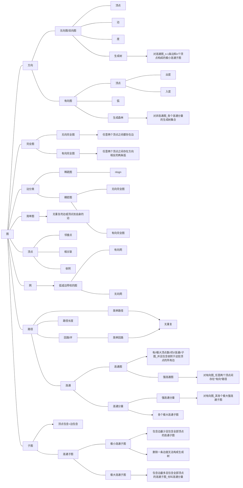
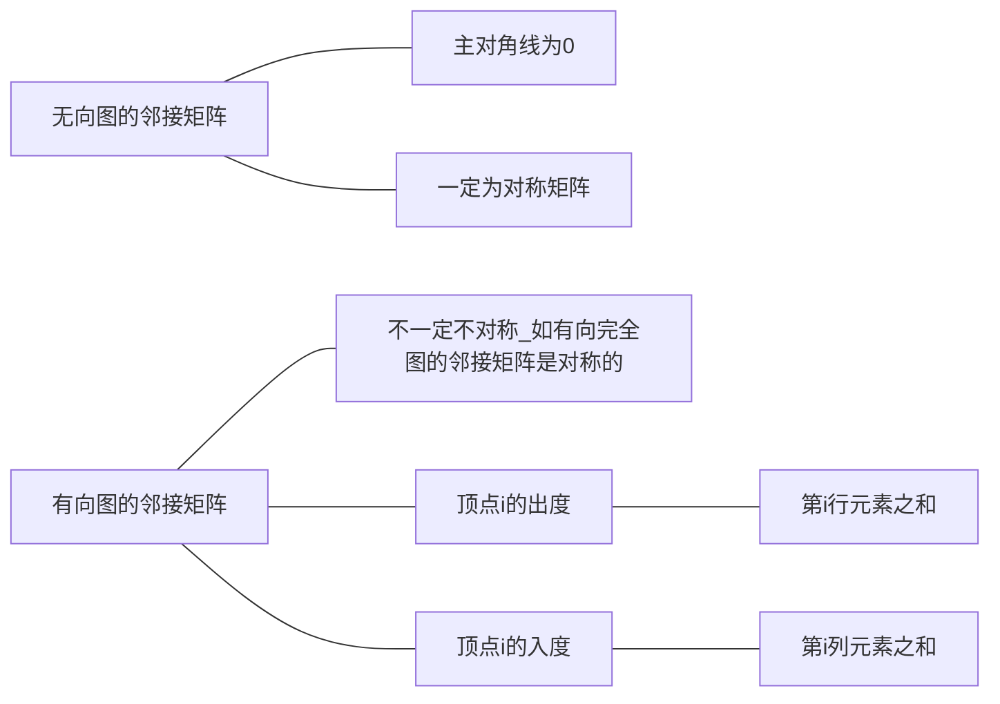
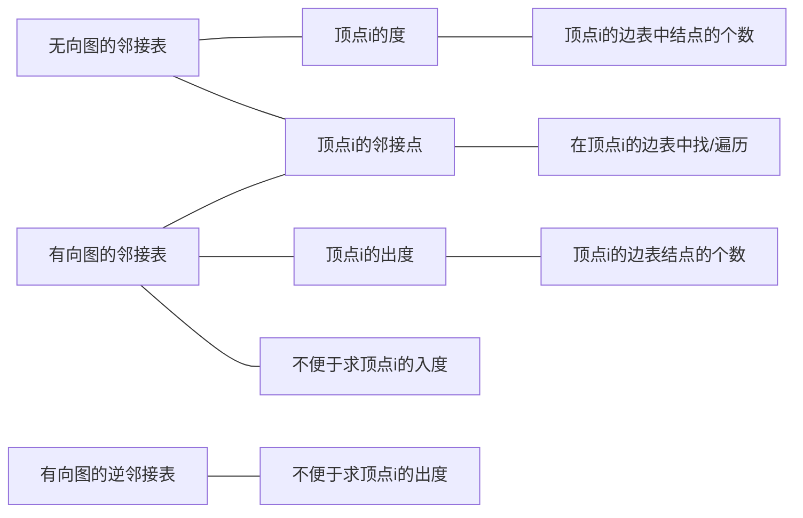
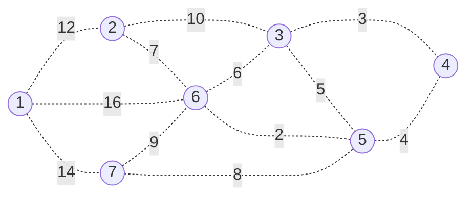
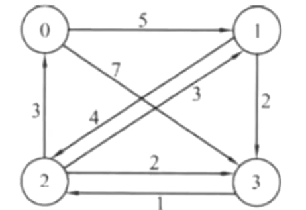

## 1. 图

<!-- TOC -->

- [1. 图](#1-图)
	- [1.1. 图的一些基本概念与术语](#11-图的一些基本概念与术语)
	- [1.2. 图的存储结构](#12-图的存储结构)
		- [1.2.1. 邻接矩阵存储 **Adjacency Matrix**](#121-邻接矩阵存储-adjacency-matrix)
			- [1.2.1.1. 邻接矩阵的存储代码](#1211-邻接矩阵的存储代码)
			- [1.2.1.2. 基于邻接矩阵——创建函数](#1212-基于邻接矩阵创建函数)
				- [1.2.1.2.1. 无向图](#12121-无向图)
				- [1.2.1.2.2. 无向图](#12122-无向图)
				- [1.2.1.2.3. 无向网](#12123-无向网)
				- [1.2.1.2.4. 有向网](#12124-有向网)
			- [1.2.1.3. 在邻接矩阵中求顶点的度](#1213-在邻接矩阵中求顶点的度)
		- [1.2.2. 邻接表存储 **Adjacencyc List**](#122-邻接表存储-adjacencyc-list)
			- [1.2.2.1. 邻接表存储代码](#1221-邻接表存储代码)
			- [1.2.2.2. 基于邻接表——创建函数](#1222-基于邻接表创建函数)
				- [1.2.2.2.1. 无向图](#12221-无向图)
				- [1.2.2.2.2. 有向图](#12222-有向图)
				- [1.2.2.2.3. 无向网](#12223-无向网)
				- [1.2.2.2.4. 有向图](#12224-有向图)
		- [1.2.3. 十字链表](#123-十字链表)
		- [1.2.4. 邻接多重表](#124-邻接多重表)
		- [1.2.5. 边集数组](#125-边集数组)
	- [1.3. 图的增删、存储结构转换、打印](#13-图的增删存储结构转换打印)
		- [1.3.1. 将邻接矩阵转换为邻接表](#131-将邻接矩阵转换为邻接表)
		- [1.3.2. 邻接矩阵的增删](#132-邻接矩阵的增删)
			- [1.3.2.1. 增加顶点](#1321-增加顶点)
			- [1.3.2.2. 删除顶点](#1322-删除顶点)
			- [1.3.2.3. 增加边](#1323-增加边)
			- [1.3.2.4. 删除边](#1324-删除边)
		- [1.3.3. 邻接矩阵的打印](#133-邻接矩阵的打印)
		- [1.3.4. 邻接表的打印](#134-邻接表的打印)
	- [1.4. 图的遍历 Traversing Graph](#14-图的遍历-traversing-graph)
		- [1.4.1. 深度优先搜索(Depth-First Search, DFS)](#141-深度优先搜索depth-first-search-dfs)
			- [1.4.1.1. 邻接矩阵的深度遍历算法](#1411-邻接矩阵的深度遍历算法)
			- [1.4.1.2. 邻接表的深度遍历算法](#1412-邻接表的深度遍历算法)
		- [1.4.2. 广度优先搜索(Breadth-First Search, BFS)](#142-广度优先搜索breadth-first-search-bfs)
			- [1.4.2.1. 邻接矩阵的广度遍历算法](#1421-邻接矩阵的广度遍历算法)
			- [1.4.2.2. 邻接表的广度遍历算法](#1422-邻接表的广度遍历算法)
		- [1.4.3. 基于深度遍历求两点间路径](#143-基于深度遍历求两点间路径)
		- [1.4.4. 基于深度遍历判断两点间是否可达](#144-基于深度遍历判断两点间是否可达)
	- [1.5. 最小生成树 Minimum Cost Spanning Tree](#15-最小生成树-minimum-cost-spanning-tree)
		- [1.5.1. 普里姆算法 Prim's Algorithm](#151-普里姆算法-prims-algorithm)
		- [1.5.2. 克鲁斯卡尔算法 Kruskal's Algorithm](#152-克鲁斯卡尔算法-kruskals-algorithm)
	- [1.6. 最短路径](#16-最短路径)
		- [1.6.1. 迪杰斯特拉算法 Dijkstra's Algorithm](#161-迪杰斯特拉算法-dijkstras-algorithm)
		- [1.6.2. 弗洛伊德算法 Floyd–Warshall Algorithm](#162-弗洛伊德算法-floydwarshall-algorithm)
	- [1.7. 拓扑排序](#17-拓扑排序)
		- [1.7.1. 基本概念](#171-基本概念)
			- [1.7.1.1. 有向无环图 DAG(Directed Acyclic Graph)](#1711-有向无环图-dagdirected-acyclic-graph)
			- [1.7.1.2. AOV网 Activity On Vertex Network](#1712-aov网-activity-on-vertex-network)
			- [1.7.1.3. 拓扑序列](#1713-拓扑序列)
			- [1.7.1.4. 拓扑排序](#1714-拓扑排序)
		- [1.7.2. 拓扑排序算法](#172-拓扑排序算法)
			- [1.7.2.1. 基本思路:](#1721-基本思路)
			- [1.7.2.2. 基于邻接表的代码](#1722-基于邻接表的代码)
			- [1.7.2.3. 基于邻接矩阵的代码](#1723-基于邻接矩阵的代码)
	- [1.8. 关键路径](#18-关键路径)
		- [1.8.1. 基本概念](#181-基本概念)
			- [1.8.1.1. AOE网 Activity On Edge Network](#1811-aoe网-activity-on-edge-network)
			- [1.8.1.2. 事件的最早发生时间etv (earliest time of vertex)](#1812-事件的最早发生时间etv-earliest-time-of-vertex)
			- [1.8.1.3. 事件的最晚发生时间ltv (latest time of vertex)](#1813-事件的最晚发生时间ltv-latest-time-of-vertex)
			- [1.8.1.4. 活动的最早开工时间ete (earliest time of edge)](#1814-活动的最早开工时间ete-earliest-time-of-edge)
			- [1.8.1.5. 活动的最晚开工时间lte (latest time of edge)](#1815-活动的最晚开工时间lte-latest-time-of-edge)
			- [1.8.1.6. 时间余量](#1816-时间余量)
			- [1.8.1.7. 路径长度](#1817-路径长度)
			- [1.8.1.8. 关键活动、关键路径](#1818-关键活动关键路径)
		- [1.8.2. 关键路径的算法](#182-关键路径的算法)
			- [1.8.2.1. 基于邻接表的代码](#1821-基于邻接表的代码)
			- [1.8.2.2. 基于邻接矩阵的代码](#1822-基于邻接矩阵的代码)

<!-- /TOC -->

### 1.1. 图的一些基本概念与术语

$$
图：顶点集V\ + 弧集E构成Graph<V,E>
$$

$$
<v,w>：从v到w的一条弧
$$

$$
P(v,w):附加到<v,w>的信息，一般称为权重
$$



### 1.2. 图的存储结构

#### 1.2.1. 邻接矩阵存储 **Adjacency Matrix**

图的邻接矩阵：数组表示法

$$
arcs[i][j]=\begin{cases}
1\quad if(v_i,V_j)\in E\ or\  <>	<v_i,V_j>\in E\\
0\quad 其他
\end{cases}
$$

网的邻接矩阵

$$
arcs[i][j]=\begin{cases}
w_{ij}\quad if(v_i,V_j)\in E\ or\ 	<v_i,V_j>\in E\\
0\quad\ \ \  if\ \ i=j\\
\infin/-1\quad 其他 
\end{cases}
$$

**$空间复杂度为O(n^2)$ 适用于稠密图**



##### 1.2.1.1. 邻接矩阵的存储代码

```c++
typedef char GElemType
#define MAXSIZE 20
typedef struct
{
	GElemTyoe vertex[MAXSIZE];		//顶点数据类型。存放顶点信息
	EdgeType Edges[MAXSIZE][MAXSIZE];	//边/弧的数据类型，存放顶点间的关系
	int vertexNum, EdgeNum;			//存放顶点和边数
}MGraph;
```

##### 1.2.1.2. 基于邻接矩阵——创建函数

###### 1.2.1.2.1. 无向图

```c++
//无向图
void creatMGraph(MGraph *G)
{
	int i, j, k;
	printf("请输入顶点数和边数:");
	scanf("%d%d", &G->vertexNum, &G->EdgeNum);
	for (i = 0; i < G->vertexNum; i++)
	{
		printf("请输入第%d个顶点的值: ", i+1);
		scanf(&G->vertex[i]);
	}

	for (i = 0; i < G->vertexNum; i++)	//初始化邻接矩阵
		for (j = 0; j < G->vertexNum;j++)
			G->arcs[i][j] = 0;

	for (k = 0; k < G->EdgeNum; k++)		//依次输入每一条边
	{
		printf("请输入第%d条边依附的两个顶点的序号: ", k+1);
		scanf("%d%d", &i, &j);			//边依附的两个顶点的序号
			G->arcs[i][j] = 1; 
			G->arcs[j][i] = 1;			//置有边标志
	}
}
```

###### 1.2.1.2.2. 无向图

```cpp
//有向图
void creatMGraph(MGraph *G)
{
	int i, j, k;
	printf("请输入顶点数和边数:");
	scanf("%d%d", &G->vertexNum, &G->EdgeNum);
	for (i = 0; i < G->vertexNum; i++)
	{
		printf("请输入第%d个顶点的值: ", i+1);
		scanf(&G->vertex[i]);
	}

	for (i = 0; i < G->vertexNum; i++)	//初始化邻接矩阵
		for (j = 0; j < G->vertexNum;j++)
			G->arcs[i][j] = O;

	for (k = 0; k < G->EdgeNum; k++)		//依次输入每一条边
	{
		printf("请输入第%d条边依附的两个顶点的序号: ", k+1);
		scanf("%d%d", &i, &j);			//边依附的两个顶点的序号
			G->arcs[i][j] = 1; 			//置有边标志
	}
}
```

###### 1.2.1.2.3. 无向网

```cpp
void creatMGraph(MGraph *G)
{
	int i, j, k;
	int w;		//权值
	printf("请输入顶点数和边数:");
	scanf("%d%d", &G->vertexNum, &G->EdgeNum);
	for (i = 0; i < G->vertexNum; i++)
	{
		printf("请输入第%d个顶点的值: ", i+1);
		scanf(&G->vertex[i]);
	}

	printf("请输入边不存在的标志：");
	int flag;
	scanf("%d", &flag);

	for (i = 0; i < G->vertexNum; i++)	//初始化邻接矩阵
		for (j = 0; j < G->vertexNum;j++)
			if(i == j) 
				G->arcs[i][j] = O;
			else
				G-> arcs[i][j] = flag;

	for (k = 0; k < G->EdgeNum; k++)		//依次输入每一条边
	{
		printf("请输入第%d条边的弧尾、弧头、序号和权值: ", k+1);
		scanf("%d%d%d", &i, &j, &w);	//边依附的两个顶点的序号
			G->arcs[i][j] = 1; 
			G->arcs[j][i] = 1;			//置有边标志
	}
}
```

###### 1.2.1.2.4. 有向网

```cpp
void creatMGraph(MGraph *G)
{
	int i, j, k;
	int w;		//权值
	printf("请输入顶点数和边数:");
	scanf("%d%d", &G->vertexNum, &G->EdgeNum);
	for (i = 0; i < G->vertexNum; i++)
	{
		printf("请输入第%d个顶点的值: ", i+1);
		scanf(&G->vertex[i]);
	}

	printf("请输入边不存在的标志：");
	int flag;
	scanf("%d", &flag);

	for (i = 0; i < G->vertexNum; i++)	//初始化邻接矩阵
		for (j = 0; j < G->vertexNum;j++)
			if(i == j) 
				G->arcs[i][j] = O;
			else
				G-> arcs[i][j] = flag;

	for (k = 0; k < G->EdgeNum; k++)		//依次输入每一条边
	{
		printf("请输入第%d条边的弧尾、弧头、序号和权值: ", k+1);
		scanf("%d%d%d", &i, &j, &w);	//边依附的两个顶点的序号
			G->arcs[i][j] = 1; 			//置有边标志
	}
}
```

##### 1.2.1.3. 在邻接矩阵中求顶点的度

```c++
int* find_MaxDegree(MGraph* G)		//交通最发达其实就是顶点的度数最大
{
	int* d = new int[MAXSIZE];
	memset(d, 0, sizeof(int) * MAXSIZE);		//初始化所有元素为0

	for (int i = 0; i < G->vertexNum; i++)		//遍历邻接矩阵，求各顶点的度数
		for (int j = 0; j < G->vertexNum; j++) 
			if (G->Matrix[i][j] != 0 and i != j) d[i] ++;

	return d;
}
```

#### 1.2.2. 邻接表存储 **Adjacencyc List**

$$
邻接表存储=顶点表+边表\\
边表：邻接于v_i的顶点链成的单链表\\
顶点表：由所有边表的头指针和存储顶点信息的一维数组构成
$$

邻接表不唯一！！！
有向图邻接表：按出度建立
有向图逆邻接表：按入度建立



**$空间复杂度为O(n+e)$适用于稀疏图**

##### 1.2.2.1. 邻接表存储代码

```cpp
//图的邻接表存储代码
typedef char GElemType
#define MSXSIZE 20
typedef struct EdgeNode
{
	int adjvex;		//存放顶点编号
	struct EdgeNode *next;	//链域
}EdgeNode;	//边表结点数据类型

typedef struct vertexNode
{
	GElemType vertex;	//存放顶点值
	EdgeNode *FirstEdge;	//存放边表的头指针
}VertexNode;		//顶点表结点的数据类型

typedef struct algraph
{
	VertexNode AdjList[MAXSIZE];
	int vertexNum, EdgeNum;		//顶点数和边数
}ALGraph;	//邻接表数据类型
```

```cpp
//网的邻接表存储代码
#define MSXSIZE 20
typedef struct EdgeNode
{
	int adjvex;		//存放顶点编号
	int weight;		//存放边上的权值
	struct EdgeNode *next;
}EdgeNode;	//边表结点数据类型

typedef struct vertexNode
{
	GElemType vertex;	//存放顶点值
	EdgeNode *FirstEdge;	//存放边表的头指针
}VertexNode;		//顶点表结点的数据类型

typedef struct algraph
{
	VertexNode AdjList[MAXSIZE];
	int vertexNum, EdgeNum;
}ALGraph;	//邻接表数据类型
```

##### 1.2.2.2. 基于邻接表——创建函数

###### 1.2.2.2.1. 无向图

```cpp
void CreateAlGraph(AlGraph *G)
{
	int i, k;
	printf("请输入顶点数和边数：");
	scanf("%d,%d", G->vertexNum, G->EdgeNum);
	//输入顶点信息，初始化边表
	for (i = 0; i < G->vertexNum; i++)	//创建顶点表
	{
		printf("请输入第%d个顶点信息：", i+1);
		scanf(" ",&G->adjList[i].vertex);
		G->adjList[i].FirstEdge = NULL;
	}
	//创建边表
	//依次输入边的信息存储在边表中
	for(k = 0; k < G->EdgeNum; k++)
	{
		printf("请输入第%d条边依附的顶点编号i、j：", k+1);
		scanf("%d%d", &i, &j);
		s = (EdgeNode*)malloc(sizeof(EdgeNode));
		s->adjvex = j;
		//头插法
		s->next = G->adjList[i].FirstEdge;
		G->adjList[i].FirstEdge = s;

		s = (EdgeNode*)malloc(sizeof(EdgeNode));
		s->adjvex = i;
		//头插法
		s->next = G->adjList[j].FirstEdge;
		G->adjList[j].FirstEdge = s;
	}
}
```

###### 1.2.2.2.2. 有向图

```cpp
void CreateAlGraph(AlGraph *G)
{
	int i, k;
	printf("请输入顶点数和边数：");
	scanf("%d,%d", G->vertexNum, G->EdgeNum);
	//输入顶点信息，初始化边表
	for (i = 0; i < G->vertexNum; i++)	//创建顶点表
	{
		printf("请输入第%d个顶点信息：", i+1);
		scanf(" ",&G->adjList[i].vertex);
		G->adjList[i].FirstEdge = NULL;
	}
	//创建边表
	//依次输入边的信息存储在边表中
	for(k = 0; k < G->EdgeNum; k++)
	{
		printf("请输入第%d条边依附的顶点编号i、j：", k+1);
		scanf("%d%d", &i, &j);
		s = (EdgeNode*)malloc(sizeof(EdgeNode));
		s->adjvex = j;
		//头插法
		s->next = G->adjList[i].FirstEdge;
		G->adjList[i].FirstEdge = s;
	}
}
```

###### 1.2.2.2.3. 无向网

```cpp
void CreateAlGraph(AlGraph *G)
{
	int i, k;
	int w;
	printf("请输入顶点数和边数：");
	scanf("%d,%d", G->vertexNum, G->EdgeNum);
	//输入顶点信息，初始化边表
	for (i = 0; i < G->vertexNum; i++)	//创建顶点表
	{
		printf("请输入第%d个顶点信息：", i+1);
		scanf(" ",&G->adjList[i].vertex);
		G->adjList[i].FirstEdge = NULL;
	}
	//创建边表
	//依次输入边的信息存储在边表中
	for(k = 0; k < G->EdgeNum; k++)
	{
		printf("请输入第%d条边的弧尾、弧头、序号和权值: ", k+1);
		scanf("%d%d", &i, &j, &w);
		s = (EdgeNode*)malloc(sizeof(EdgeNode));
		s->adjvex = j;
		s->weight = w;
		//头插法
		s->next = G->adjList[i].FirstEdge;
		G->adjList[i].FirstEdge = s;

		s = (EdgeNode*)malloc(sizeof(EdgeNode));
		s->adjvex = i;
		s->weight = w;
		//头插法
		s->next = G->adjList[j].FirstEdge;
		G->adjList[j].FirstEdge = s;
	}
}
```

###### 1.2.2.2.4. 有向图

```cpp
void CreateAlGraph(AlGraph *G)
{
	int i, k;
	int w;
	printf("请输入顶点数和边数：");
	scanf("%d,%d", G->vertexNum, G->EdgeNum);
	//输入顶点信息，初始化边表
	for (i = 0; i < G->vertexNum; i++)	//创建顶点表
	{
		printf("请输入第%d个顶点信息：", i+1);
		scanf(" ",&G->adjList[i].vertex);
		G->adjList[i].FirstEdge = NULL;
	}
	//创建边表
	//依次输入边的信息存储在边表中
	for(k = 0; k < G->EdgeNum; k++)
	{
		printf("请输入第%d条边的弧尾、弧头、序号和权值: ", k+1);
		scanf("%d%d", &i, &j, &w);
		s = (EdgeNode*)malloc(sizeof(EdgeNode));
		s->adjvex = j;
		s->weight = w;
		//头插法
		s->next = G->adjList[i].FirstEdge;
		G->adjList[i].FirstEdge = s;
	}
}
```


#### 1.2.3. 十字链表

整合了邻接表和逆邻接表，用于有向图。

#### 1.2.4. 邻接多重表

方便对边操作（删除）。

#### 1.2.5. 边集数组

$$
边集数组 \begin{cases}
顶点信息数组\\
边信息数组 \begin{cases}
起点下标 \ 	begin \\
终点下标 \ end \\
权值 \ weight
\end{cases}
\end{cases}
$$

$其应用详见克鲁斯卡尔（Kruskal）算法。$

### 1.3. 图的增删、存储结构转换、打印

#### 1.3.1. 将邻接矩阵转换为邻接表

```c++
ALGraph* turn_MgToALg(MGraph* G)
{
	ALGraph* GL = new ALGraph;
	GL->vexNum = G->vertexNum;
	GL->arcsNum = G->arcsNum;

	for (int i = 0; i < GL->vexNum; i++) {
		GL->List[i].vex = G->vertex[i];
		GL->List[i].First = NULL;
	}

	int start, end;
	for (int i = 0; i < GL->vexNum; i++) {
		for (int j = 0; j < GL->vexNum; j++) {
			if (G->Matrix[i][j] != 0) {
				start = i, end = j;
				
				arcNode* s = new arcNode;
				s->vex_num = end;
				s->next = GL->List[start].First;
				GL->List[start].First = s;
			}
		}
	}

	cout << "转换成功！" << endl;

	return GL;
}
```

#### 1.3.2. 邻接矩阵的增删

##### 1.3.2.1. 增加顶点

```c++
void addVertex(MGraph** G)
{
	string add;
	cin >> add;
	int newPos = (*G)->vertexNum;
	(*G)->vertex[newPos] = add;
	(*G)->vertexNum++;
	for (int i = 0; i < (*G)->vertexNum; i++) {
		(*G)->Matrix[i][newPos] = 52725;
		(*G)->Matrix[newPos][i] = 52725;
	}
	(*G)->vertexNum++;
}
```

##### 1.3.2.2. 删除顶点

```c++
void deleteVertex(MGraph** G)
{
	string del;
	cin >> del;
	int d = positionInGraph(*G, del);
	for (int i = 0; i < (*G)->vertexNum; i++) {
		(*G)->Matrix[i][d] = 52725;
		(*G)->Matrix[d][i] = 52725;
	}
}
```

##### 1.3.2.3. 增加边

```c++
void addArc(MGraph** G)
{
	string add_start, add_end;
	int w;
	cin >> add_start >> add_end >> w;
	int d1 = positionInGraph(*G, add_start);
	int d2 = positionInGraph(*G, add_end);
	(*G)->Matrix[d1][d2] = w;
	(*G)->Matrix[d2][d1] = w;
	(*G)->arcsNum++;
}
```

##### 1.3.2.4. 删除边

```c++
void deleteArc(MGraph** G)
{
	string del_start, del_end;
	cin >> del_start >> del_end;
	int d1 = positionInGraph(*G, del_start);
	int d2 = positionInGraph(*G, del_end);
	(*G)->Matrix[d1][d2] = 52725;
	(*G)->Matrix[d2][d1] = 52725;
	(*G)->arcsNum--;
}
```

#### 1.3.3. 邻接矩阵的打印

```c++
void show_MGraph(MGraph* G)
{
	cout << "\t" ;
	for (int i = 0; i < G->vertexNum; i++) cout << G->vertex[i] << "\t"; cout << endl;

	for (int i = 0; i < G->vertexNum; i++) {
		cout << G->vertex[i] << "\t";
		for (int j = 0; j < G->vertexNum; j++) cout << G->Matrix[i][j] << "\t";
		cout << endl;
	}
}
```

#### 1.3.4. 邻接表的打印

```c++
void show_ALGraph(ALGraph* GL)
{
	for (int i = 0; i < GL->vexNum; i++) {
		if (GL->List[i].First) {
			printf("\t____\n");
			cout << '\t' << GL->List[i].vex << "-->";
			arcNode* s = GL->List[i].First;
			while (s) {
				arcNode* p = s->next;
				cout << GL->List[s->vex_num].vex << '(' << s->weight << ')';
				if (p) printf("-->");
				s = s->next;
			}
			printf("\n");
			printf("\t￣￣\n");
		}
	}
}
```

### 1.4. 图的遍历 Traversing Graph

#### 1.4.1. 深度优先搜索(Depth-First Search, DFS)

##### 1.4.1.1. 邻接矩阵的深度遍历算法

```cpp
//邻接矩阵DFS
define MAXSIZE 9
int visited[MAXSIZE];	//访问标志数组

//深度优先递归算法
void DFS_MGraph(MGraph G, int i)
{
	int j;
	visited[i] = 0;
	printf("%c", G.vertex[i]);		//打印顶点
	for (j = 0; j < G.vertexNum; j++)
		if (G.Edges[i][j] == 1 && visited[j] == 0 )
			DFS_MGrapf(G, j);
}

//深度遍历操作(对不连通图适用)
void DFS_Traverse(MGraph G)
{
	int i;
	for (i = 0; i < G.vertexNum; i++)
		visited[i] == 1;
	for (i = 0; i < G.vertexNum; i++)
		if(!visited[i])
			DFS_MGraph(G, i);
}
```

##### 1.4.1.2. 邻接表的深度遍历算法

```cpp
void DFS_Traver (ALGraph G, int v)
{
	printf(" ", G.AList[v].vertex);		//访问出发点
	visit[v] = 1;		//做标志，1为已经访问过

	EdgeNode* p = G.AdjList[v].FirstEdge;
	while (p)
	{
		if (visited[p->adjvex] == 0)
			DFS_Traver (G, p->adjvex);
		p = p->next;
	}
}	//O(n+e)

//or
	//邻接表深度优先递归算法
void DFS(ALGraph GL, int i)
{
	EdgeNode* p;
	visited[i] = 0;
	printf("%c", GL.AdjList[i].vertex);
	p = GL.AdjList[i].FirstEdge;
	while (p)
	{
		if (visited[p->adjvex] == 0)
			DFS(GL, p->adjvex)
		p = p->next;
	}
}
	//深度优先遍历操作
void DFS_Traverse(ALGraph Gl)
{
	int i;
	for (i = 0; i < GL.vertexNum; i++)
		visited[i] = 1;
	for (i = 0; i < GL.vertexNum; i++)
		if (visited[i] ==0)
			DFS(GL, i);
}
```

#### 1.4.2. 广度优先搜索(Breadth-First Search, BFS)

类似于*树的层次遍历*，需要借助**队列**。

##### 1.4.2.1. 邻接矩阵的广度遍历算法

```cpp
void BFS_Traver (MGraph G)
{
	int i, j;		//i为行，j为列
	Queue Q;
	InitQueue(&Q);
	for (i = 0; i < G.vertexNum; i++)
	{
		if (visited[i] == 0)	//顶点未被访问
		{
			visited[i] = 1;		//标记访问
			printf("%c ", &G.vertex[i]);	//打印顶点
			EnQueue(&Q, i);		//顶点入队
			while (!IsQueueEmpty(Q))
			{
				i = DeQueue(&Q);	//取对头后出队
				for (j = 0; j < G.vertexNum; j++)	//判断其他顶点与当前顶点是否存在边；
													//并且未被访问过
					if (G.Edges[i][j] == 1 && visited[j] ==0)
					{
						visited[j] = 1;			//标记访问
						printf("%c ", &G.vertex[j]);	//打印顶点
						EnQueue(&Q, j);		//顶点入队
					}
			}
		}
	}
}
```

##### 1.4.2.2. 邻接表的广度遍历算法

```cpp
//邻接表的广度遍历算法
void BFS_Traver (AdjGraph G, int v)
{
	Queue Q;
	InitQueue(&Q);
	printf(" ", G.AdjList[v].vertex);			//打印顶点
	visited[v] = 1;
	EnQueue(&Q, v);
	whlie(!IsQueueEmpty(Q))
	{
		v = DeQueue(&Q);
		EdgeNode* p = G.AdjList[v].FirstEdge;	//取v的邻接点
		while (p)
		{
			if (visit[p->adjvex] == 0)			//若此顶点未被访问
			{
				printf(" ", G.AdjList[p->adjvex].vextex);
				visited[p->adjvex] = 1;			//标记已访问
				EnQueue(&Q, p->adjvex);			//将该顶点入队
			}
			p = p->next;						//指针指向下一个邻接点
		}
	}
}
```
#### 1.4.3. 基于深度遍历求两点间路径

```c++
string path[MAXSIZE];
void dfs_path(MGraph* G, int start, int end, int top)
{
	visited[start] = 1;
	path[top] = G->vertex[start];
	if (start == end) {
		for (int j = 0; j < top; j++) {
			cout << path[j] << " --> ";
		} cout << path[top] << endl;
		visited[start] = 0;
		return;
	}
	for (int i = 0; i < G->vertexNum; i++) {
		if (visited[i] == 0 and G->Matrix[start][i])
			dfs_path(G, i, end, top + 1);
	}
	visited[start] = 0;
}

void printPath(MGraph* G)
{
	string s, e;
	cin >> s >> e;
	int start = positionInGraph(G, s);
	int end = positionInGraph(G, e);
	memset(visited, 0, sizeof visited);
	dfs_path(G, start, end, 0);
}
```

#### 1.4.4. 基于深度遍历判断两点间是否可达

```c++
void dfs_MGraph(MGraph* G)
{
	memset(visited, 0, sizeof visited);		//初始化所有元素为0；

	string s, e;	cin >> s >> e;
	int start = positionInGraph(G, s);
	int end = positionInGraph(G, e);
	dfs(G, start, visited);
	
	if (visited[end] == 1) cout << s << " 和 " << e << " 之间通过可达!" << endl;
	else cout << s << " 和 " << e << " 之间通过 不 可达!" << endl;
}
```

### 1.5. 最小生成树 Minimum Cost Spanning Tree

最小生成树:构造连通网的最小代价生成树

#### 1.5.1. 普里姆算法 Prim's Algorithm

借助网的邻接矩阵

```cpp
#define INFINITY 66666
#define MAXVEX 10	//顶点个数最大值
void MiniSpanTree_Prim(MGrapf)
{
	int min, i, j, k;
	int adjvex[MAXVEX];		//保存起点下标
	int lowcost[MAXVEX];	//保存下标为起点到终点间的权值
	adjvex[0] = 0;			//初始化第一个顶点下标为0
	lowcost[0] = 0;			//初始化第一个权值为0,即v0加入生成树

	for (i = 1; i < G.vertexNum; i++)		//遍历除下标为0以外的全部顶点
	{
		adjvex[i] = 0;				//初始化默认v0为起点
		lowcost[i] = G.Edges[0][i];	//将v0顶点与之有边的权值存入数组
	}

	for (i = 1; i < G.vertexNum; i++)	//循环全部顶点,找最小的权值边
	{
		min = INFINITY;		//初始化最小权值为INFINITY
		j = 1;				//j用来循环自增
		k = 0;				//k用来标记最小权值终点的位置
		while (j < G.vertexNum)
		{
			if (lowcost[j] != 0 && lowcost[j] < min)
			{		//如果权值为0并且还小于min
				min = lowcost[j];	//更新最小权值
				k = j;				//标记最小权值终点位置,以便下一个循环遍历邻接矩阵第k行
			}
			j++;
		}

		printf("(%d,%d)\n", adjvex[k], k);		//打印边(起点,终点)
		lowcost[k] = 0;							//将当前最小权值起点的权值置为0,表示该顶点已放入最小生成树中,后续不再对该顶点进行操作

		for (j = 0; j < G.vertexNum; j++)		//从上一次的顶点开始,循环全部顶点,更新权值数组
		{
			if (lowcost[j] != 0 && G.Edges[k][j] < lowcost[j])		//如果顶点未放入生成树 并且 各边权值小于未被加入生成树的顶点权值
			{
				lowcost[j] = G.Edges[k][j];		//将较小的权值存入权值数组
				adjvex[j] = k;					//更新起点下标
			}
		}	//这里的lowcost[]数组保存了上一次起点各未加入边的最小权值以及当前顶点各未遍历边的最小权值
	}
}	//O(n^2)
```

$算法的基本思想为:G(V,E)为连通网,假设U是V的一个非空子集,TE为最小生成树中边的集合,(u,v)是一条最小权值的边, \\ 
如果u\in U,v\in U-V,那么必有(u,v)在最下生成树里.$$从U=\left\{u_0\right\}开始,TE=\left\{\right\}开始,重复一下操作:\\ 
在所有{u}\in {U},\ {v}\in {U-V} \ 里找一条权值最小的边\left\{u_0,v_0\right\}并入TE,同时v_0并入U,
直至U = V为止.此时U中必有n-1条边.最后T = \left(V,\left\{TE\right\}\right)为最小生成树.$

Step:

1. 记录当前U集合的状态
2. 选择最小边以及权值加入到U集合中

```cpp
#include <stdio.h>
#include <stdlib.h>

/**
 * 图顶点之前不通，那么邻接矩阵的值为MAX
 * 如果顶点是自己本身，那么值为0
 */
#define MAX 32767

typedef struct Graph {
    char* vexs;		//
    int** arcs;		//二维数组
    int vexNum;
    int arcNum;
}Graph;

typedef struct Edge {
    char vex;		//记录U集合到最小边的起始节点
    int weight;		//记录最小边
}Edge;

/**
 * 当edge.weight = 0时，代表顶点加入到U集合中
 */ 
Edge* initEdeg(Graph* G, int index) {
    Edge* edge = (Edge*)malloc(sizeof(Edge) * G -> vexNum);
    for (int i = 0; i < G ->vexNum; i++) {
        edge[i].vex = G -> vexs[index]; 
        edge[i].weight = G -> arcs[index][i];
    }
    return edge;
}

int getMinEdge(Edge* edge, Graph* G) {		//返回最小边的终点点位置下标
    int index;
    int min = MAX;
    for (int i = 0; i < G -> vexNum; i++) {
        if (edge[i].weight != 0 && edge[i].weight < min ) {
            min = edge[i].weight;
            index = i;
        }
    }
    return index;
}

void prim(Graph* G, int index) {		//Prim算法的实现  index表示从哪个结点开始
    int min;		//记录最小权值
    int seleted[MAXSIZE] = { 0 };	//标记已经加入集合U的顶点,避免重复加入相同的边
    seleted[index] = 1;		//源点已加入集合U
    Edge* edge = initEdeg(G, index);	//初始化边数组
    for (int i = 0; i < G -> vexNum - 1; i++) {		//已经加入一个顶点,所以只需要遍历n-1次
        min = getMinEdge(edge, G);		//取最小
        printf("v%c --> v%c, weight = %d\n", edge[min].vex, G -> vexs[min], edge[min].weight);		//打印最小生成树结点信息
        edge[min].weight = 0;		//权值为0表示加入到U集合
		seleted[min] = 1;		//标志终点已经加入集合U
        for (int j = 0; j < G -> vexNum; j++) {		//更新权值信息,再循环一次
            if (G -> arcs[min][j] < edge[j].weight) {	//仅对权值更小的边起点作更新
                edge[j].weight = G -> arcs[min][j];		//更新权值
                edge[j].vex = G -> vexs[min];			//更新起点
            }
        }
    }
} 

Graph* initGraph(int vexNum) {
    Graph* G = (Graph*)malloc(sizeof(Graph));
    G -> vexs = (char*)malloc(sizeof(char) * vexNum);
    G -> arcs = (int**)malloc(sizeof(int*) * vexNum);
    for (int i = 0 ; i < vexNum; i++) {
        G -> arcs[i] = (int*)malloc(sizeof(int) * vexNum);
    }
    G -> vexNum = vexNum;
    G -> arcNum = 0;
    return G;
}

void createGraph(Graph* G, char* vexs, int* arcs) {
    for (int i = 0 ; i < G -> vexNum; i++) {
        G -> vexs[i] = vexs[i];
        for (int j = 0; j < G -> vexNum; j++) {
            G -> arcs[i][j] = *(arcs + i * G -> vexNum + j);
            if (G -> arcs[i][j] != 0 && G -> arcs[i][j] != MAX)  
                G -> arcNum ++;
        }
    }
    G -> arcNum /= 2;
}

void DFS(Graph* G, int* visited, int index) {
    printf("%c\t", G -> vexs[index]);
    visited[index] = 1;
    for (int i = 0; i < G ->vexNum; i++) {
        if (G -> arcs[index][i] > 0 && G -> arcs[index][i] != MAX && !visited[i]) {
            DFS(G, visited, i);
        }
    }
}

int main() {
    Graph* G = initGraph(6);
    int* visited = (int*)malloc(sizeof(int) * G -> vexNum);
    for (int i = 0; i < G -> vexNum; i++)
        visited[i] = 0;
    int arcs[6][6] = {
        0, 6, 1, 5, MAX, MAX,
        6, 0, 5, MAX, 3, MAX,
        1, 5, 0, 5, 6, 4,
        5, MAX, 5, 0, MAX, 2,
        MAX, 3, 6, MAX, 0, 6,
        MAX, MAX, 4, 2, 6, 0
    };
    createGraph(G, "123456", (int*)arcs);
    DFS(G, visited, 0);
    printf("\n");
    prim(G, 0);
    return 0;
}
```

$$
完整代码
$$

#### 1.5.2. 克鲁斯卡尔算法 Kruskal's Algorithm

以边为目标去构建最小生成树
首先需要一个边集数组

```cpp
typedef struct Edge
{
	int begin;	//起点
	int end;	//终点
	int weight;	//权值
}Edge;
//初始化边集数组
Edge* initEdge(MGraph *G)
{
	int index = 0;
	Edge* edges = (Edge*)malloc(sizeof(Edge) * G->vertexNum);
	for (int i = 0; i < G.numVertexes - 1; i++)			//只有n-1条边
	{
		for (int j = i + 1; j < G.numVertexes; j++)		//从i+1开始,避免了同一条边重复加入边集数组
		{
			if (G.arc[i][j] < GRAPH_INFINITY)		//vi,vj之间存在边,将信息存入边集数组
			{
				edges[index].begin = i;
				edges[index].end = j;
				edges[index].weight = G.arc[i][j];
				index++;
			}
		}
	}
	return edges;
}
```

然后要对边集数组中应该按权值从小到大的顺序排列

```cpp
/* 对权值进行排序 */
void sort(Edge *edges,MGraph *G)
{
	Edge temp;	//结构体也可以直接复制
	int i, j;
	for ( i = 0; i < G->numEdges; i++)
	{
		for ( j = i + 1; j < G->numEdges; j++)
		{
			if (edges[i].weight > edges[j].weight)
			{
				temp = edge[i];
				edge[i] = edge[j];
				edge[j] = tmep;
			}
		}
	}
	printf("权排序之后的为:\n");
	for (i = 0; i < G->numEdges; i++)
	{
		printf("(%d, %d) %d\n", edges[i].begin, edges[i].end, edges[i].weight);
	}
}
```

最后是Kruskal算法的实现
在加边的过程中,要判断图是否连通
此时需要一个辅助数组,来记录当前索引结点属于哪个连通分量
这里规定将第一个结点作为后续加入结点的连通分量,即后续加结点进来的时候,连通分量都统一为始节点

```cpp
#define MAXEDGE 20
#define MAXVEX 20
#define GRAPH_INFINITY 65535

/* 查找连线顶点的尾部下标 */
//规定当parent[i]=0时表示在已经加入最小生成树的顶点集中vi为尾部,即只有一个邻接点
int Find(int *parent, int f)
{
	while ( parent[f] > 0)		//这个循环的作用在于找出尾部顶点
	{
		f = parent[f];
	}
	return f;
}

void MST_Kruskal(MGraph G)
{
	int i, j, n, m;
	int k = 0;
	int parent[MAXVEX];/* 定义一数组用来判断边与边是否形成环路 */

	/* 用来构建边集数组并排序********************* */
	Edge *edges = initEdge(G);/* 定义边集数组,edge的结构为begin,end,weight,均为整型 */
	sort(edges, &G);	//对边集数组进行排序
	/* ******************************************* */

	for (i = 0; i < G.numVertexes; i++)		//一开始最小生成树顶点集中还没有度为2的结点
		parent[i] = 0;	/* 初始化数组值为0 */

	printf("打印最小生成树：\n");
	for (i = 0; i < G.numEdges; i++)	/* 循环每一条边 */
	{
		n = Find(parent,edges[i].begin);	//找到顶点集中的尾部顶点
		m = Find(parent,edges[i].end);		//若end恰为尾部顶点,则说明形成回路
		if (n != m) /* 假如n与m不等，说明此边没有与现有的生成树形成环路 */
		{
			parent[n] = m;	/* 将此边的结尾顶点放入下标为起点的parent中。 */
							/* 表示此顶点已经在生成树集合中 */
			printf("(%d, %d) %d\n", edges[i].begin, edges[i].end, edges[i].weight);
		}
	}
}
```

$$
完整程序
$$

```cpp
#include <stdio.h>
#include <stdlib.h>

#define MAX 32767

typedef struct Graph {
    char* vexs;
    int** arcs;
    int vexNum;
    int arcNum;
}Graph;

typedef struct Edge {
    int start;
    int end;
    int weight;
}Edge;

Edge* initEdge(Graph* G) {
    int index = 0;
    Edge* edge = (Edge*)malloc(sizeof(Edge) * G -> arcNum);
    for (int i = 0; i < G -> vexNum; i++) {
        for (int j = i + 1; j < G -> vexNum; j++) {
            if (G -> arcs[i][j] != MAX) {
                edge[index].start = i;
                edge[index].end = j;
                edge[index].weight = G -> arcs[i][j];
                index++;
            }
        }
    }
    return edge;
}

void sortEdge(Edge* edge, Graph* G) {
    Edge temp;
    for (int i = 0; i < G -> arcNum - 1; i++) {
        for (int j = 0; j < G -> arcNum - i - 1; j++) {
            if (edge[j].weight > edge[j + 1].weight) {
                temp = edge[j];
                edge[j] = edge[j + 1];
                edge[j + 1] = temp;
            }
        }
    }
}

void kruskal(Graph* G) {
    int* connected = (int*)malloc(sizeof(int) * G -> vexNum);
    for (int i = 0 ; i < G -> vexNum; i++) {
        connected[i] = i;		//规定一开始的连通分量是自己
    }
    Edge* edge = initEdge(G);
    sortEdge(edge, G);
    for (int i = 0; i < G -> arcNum; i++) {
        int start = connected[edge[i].start];
        int end = connected[edge[i].end];
        if (start != end) {
            printf("v%c --> v%c weight = %d\n", G -> vexs[edge[i].start], G -> vexs[edge[i].end], edge[i].weight);
            for (int j = 0; j < G -> vexNum; j++) {
                if (connected[j] == end) {
                    connected[j] = start;
                }
            }
        }
    }
}

Graph* initGraph(int vexNum) {
    Graph* G = (Graph*)malloc(sizeof(Graph));
    G -> vexs = (char*)malloc(sizeof(char) * vexNum);
    G -> arcs = (int**)malloc(sizeof(int*) * vexNum);
    for (int i = 0 ; i < vexNum; i++) {
        G -> arcs[i] = (int*)malloc(sizeof(int) * vexNum);
    }
    G -> vexNum = vexNum;
    G -> arcNum = 0;
    return G;
}

void createGraph(Graph* G, char* vexs, int* arcs) {
    for (int i = 0 ; i < G -> vexNum; i++) {
        G -> vexs[i] = vexs[i];
        for (int j = 0; j < G -> vexNum; j++) {
            G -> arcs[i][j] = *(arcs + i * G -> vexNum + j);
            if (G -> arcs[i][j] != 0 && G -> arcs[i][j] != MAX)
                G -> arcNum ++;
        }
    }
    G -> arcNum /= 2;
}

void DFS(Graph* G, int* visited, int index) {
    printf("%c\t", G -> vexs[index]);
    visited[index] = 1;
    for (int i = 0; i < G ->vexNum; i++) {
        if (G -> arcs[index][i] > 0 && G -> arcs[index][i] != MAX && !visited[i]) {
            DFS(G, visited, i);
        }
    }
}

int main() {
    Graph* G = initGraph(6);
    int* visited = (int*)malloc(sizeof(int) * G -> vexNum);
    for (int i = 0; i < G -> vexNum; i++)
        visited[i] = 0;
    int arcs[6][6] = {
        0, 6, 1, 5, MAX, MAX,
        6, 0, 5, MAX, 3, MAX,
        1, 5, 0, 5, 6, 4,
        5, MAX, 5, 0, MAX, 2,
        MAX, 3, 6, MAX, 0, 6,
        MAX, MAX, 4, 2, 6, 0
    };
    createGraph(G, "123456", (int*)arcs);
    DFS(G, visited, 0);
    printf("\n");
    kruskal(G);
    return 0;
}
```

$$
总结:最小生成树 \begin{cases}
普里姆(Prim)算法
\begin{cases}
O(n^2)\\
适用于稠密图\\
\end{cases} \\
克鲁斯卡尔(Kruskal)算法
\begin{cases}
O(eloge),\ e为边数\\
适用于稀疏图\\
\end{cases} \\
\end{cases}
$$

### 1.6. 最短路径

#### 1.6.1. 迪杰斯特拉算法 Dijkstra's Algorithm

```cpp
#define MAXEDGE 20
#define MAXVEX 20
#define GRAPH_INFINITY 65535
typedef struct
{
	int vexs[MAXVEX];
	int arc[MAXVEX][MAXVEX];
	int numVertexes, numEdges;
}MGraph;

typedef int Patharc[MAXVEX];    /* 用于存储最短路径下标的数组 */
typedef int ShortPathTable[MAXVEX];/* 用于存储到各点最短路径的权值和 */ 
/*  Dijkstra算法，求有向网G的v0顶点到其余顶点v的最短路径P[v]及带权长度D[v] */  
/*  P[v]的值为前驱顶点下标,D[v]表示v0到v的最短路径长度和 */  
void ShortestPath_Dijkstra(MGraph G, int v0, Patharc *P, ShortPathTable *D)
{  
	int v,w,k,min;  
	int final[MAXVEX];/* final[w]=1表示求得顶点v0至vw的最短路径 */
	for(v=0; v<G.numVertexes; v++)    /* 初始化数据 */
	{  
		final[v] = 0;			/* 全部顶点初始化为未知最短路径状态 */
		(*D)[v] = G.arc[v0][v];/* 将与v0点有连线的顶点加上权值 */
		(*P)[v] = -1;				/* 初始化路径数组P为-1  */   
	}

	(*D)[v0] = 0;  /* v0至v0路径为0 */  
	final[v0] = 1;    /* v0至v0不需要求路径 */  
	/* 开始主循环，每次求得v0到某个v顶点的最短路径 */   
	for(v=1; v<G.numVertexes; v++)   
	{
		min=GRAPH_INFINITY;    /* 当前所知离v0顶点的最近距离 */  
		for(w=0; w<G.numVertexes; w++) /* 寻找离v0最近的顶点 */  
		{  
			if(!final[w] && (*D)[w]<min)   
			{   
				k=w;  
				min = (*D)[w];    /* w顶点离v0顶点更近 */  
			}  
		}  
		final[k] = 1;    /* 将目前找到的最近的顶点置为1 */
		for(w=0; w<G.numVertexes; w++) /* 修正当前最短路径及距离 */
		{
			/* 如果经过v顶点的路径比现在这条路径的长度短的话 */
			if(!final[w] && (min+G.arc[k][w]<(*D)[w]))   
			{ /*  说明找到了更短的路径，修改D[w]和P[w] */
				(*D)[w] = min + G.arc[k][w];  /* 修改当前路径长度 */   
				(*P)[w]=k;  
			}   
		}   
	}
}
```

$迪杰斯特拉算法本质是一种广义贪心算法, 先找到局部最优解, 再找到全局最优解$
$迪杰斯特拉算法需要三个辅助数组\\
① S数组:记录目标顶点到其他顶点的最短路径是否求得(\ 0 \ or \ 1)\\
② P数组:记录了目标结点到其他结点最短路径的前驱结点\\
\ \ \ \ 例如:v_0到v_5的最短距离为v_0->v_3->v_5, 则前驱节点为v_3 \\
③ D数组:记录了目标顶点到其他顶点最短路径的长度\\
设集合X表示已经加入最短路径的顶点集 \\
$



$如图,开始时数组S, P, D值如表$

**$phase \ 1$**

|             | $v_1$ | $v_2$ |  $v_3$  |  $v_4$  |  $v_5$  | $v_6$ | $v_7$ |
| :---------: | :-----: | :-----: | :--------: | :--------: | :--------: | :-----: | :-----: |
|             |    0    |    1    |     2     |     3     |     4     |    5    |    6    |
| **S** |    1    |    0    |     0     |     0     |     0     |    0    |    0    |
| **P** |   -1   |    0    |     -1     |     -1     |     -1     |    0    |    0    |
| **D** |    0    |   12   | $\infty$ | $\infty$ | $\infty$ |   16   |   14   |

$$
X=\left\{v_1\right\}
$$

$①顶点到自身最短路径默认找到且为0 \\
②没有前驱记为-1 \\
③如果一个顶点到期邻接点有弧,那么暂定这条弧为最短路径 \\
$
$在D数组中找到最短的边12,把这条边的终点v_2加入X集合当中\\$
**$phase \ 2$**

|             | $v_1$ | $v_2$ | $v_3$ |  $v_4$  |  $v_5$  | $v_6$ | $v_7$ |
| :---------: | :-----: | :-----: | :-----: | :--------: | :--------: | :-----: | :-----: |
|             |    0    |    1    |    2    |     3     |     4     |    5    |    6    |
| **S** |    1    |    1    |    0    |     0     |     0     |    0    |    0    |
| **P** |   -1   |    0    |    1    |     -1     |     -1     |    0    |    0    |
| **D** |    0    |   12   |   22   | $\infty$ | $\infty$ |   16   |   14   |

$$
X=\left\{v_1,v_2\right\}
$$

$在D数组中找到最短的边14,把这条边的终点v_7加入X集合当中\\$
**$phase \ 3$**

|             | $v_1$ | $v_2$ | $v_3$ |  $v_4$  | $v_5$ | $v_6$ | $v_7$ |
| :---------: | :-----: | :-----: | :-----: | :--------: | :-----: | :-----: | :-----: |
|             |    0    |    1    |    2    |     3     |    4    |    5    |    6    |
| **S** |    1    |    1    |    0    |     0     |    0    |    0    |    1    |
| **P** |   -1   |    0    |    1    |     -1     |    6    |    0    |    0    |
| **D** |    0    |   12   |   22   | $\infty$ |   22   |   16   |   14   |

$$
X=\left\{v_1,v_2,v_7\right\}
$$

$在D数组中找到最短的边16,把这条边的终点v_6加入X集合当中\\$
**$phase \ 4$**

|             | $v_1$ | $v_2$ | $v_3$ |  $v_4$  | $v_5$ | $v_6$ | $v_7$ |
| :---------: | :-----: | :-----: | :-----: | :--------: | :-----: | :-----: | :-----: |
|             |    0    |    1    |    2    |     3     |    4    |    5    |    6    |
| **S** |    1    |    1    |    0    |     0     |    0    |    1    |    1    |
| **P** |   -1   |    0    |    1    |     -1     |    5    |    0    |    0    |
| **D** |    0    |   12   |   22   | $\infty$ |   18   |   16   |   14   |

$$
X=\left\{v_1,v_2,v_7,v_6\right\}
$$

$在D数组中找到最短的边18,把这条边的终点v_5加入X集合当中\\$
**$phase \ 5$**

|             | $v_1$ | $v_2$ | $v_3$ | $v_4$ | $v_5$ | $v_6$ | $v_7$ |
| :---------: | :-----: | :-----: | :-----: | :-----: | :-----: | :-----: | :-----: |
|             |    0    |    1    |    2    |    3    |    4    |    5    |    6    |
| **S** |    1    |    1    |    0    |    0    |    1    |    1    |    1    |
| **P** |   -1   |    0    |    1    |    4    |    5    |    0    |    0    |
| **D** |    0    |   12   |   22   |   22   |   18   |   16   |   14   |

$$
X=\left\{v_1,v_2,v_7,v_6,v_5\right\}
$$

$在D数组中找到最短的边22,把这条边的终点v_3加入X集合当中\\$
**$phase \ 6$**

|             | $v_1$ | $v_2$ | $v_3$ | $v_4$ | $v_5$ | $v_6$ | $v_7$ |
| :---------: | :-----: | :-----: | :-----: | :-----: | :-----: | :-----: | :-----: |
|             |    0    |    1    |    2    |    3    |    4    |    5    |    6    |
| **S** |    1    |    1    |    1    |    0    |    1    |    1    |    1    |
| **P** |   -1   |    0    |    1    |    4    |    5    |    0    |    0    |
| **D** |    0    |   12   |   22   |   22   |   18   |   16   |   14   |

$$
X=\left\{v_1,v_2,v_7,v_6,v_5,v_3\right\}
$$

$在D数组中找到最短的边22,把这条边的终点v_4加入X集合当中$
**$phase \ 7$**

|             | $v_1$ | $v_2$ | $v_3$ | $v_4$ | $v_5$ | $v_6$ | $v_7$ |
| :---------: | :-----: | :-----: | :-----: | :-----: | :-----: | :-----: | :-----: |
|             |    0    |    1    |    2    |    3    |    4    |    5    |    6    |
| **S** |    1    |    1    |    1    |    0    |    1    |    1    |    1    |
| **P** |   -1   |    0    |    1    |    4    |    5    |    0    |    0    |
| **D** |    0    |   12   |   22   |   22   |   18   |   16   |   14   |

$$
X=\left\{v_1,v_2,v_7,v_6,v_5,v_3,v_4\right\}
$$

$
至此,迪杰斯特拉算法的整个流程已经结束了\\
现在只需要根据目标顶点在P中找前驱即可得到最短路径\\
例如,目标顶点为v_4,\\
则
$

$$
v_4在P中前驱为4即v_5\\
v_5在P中前驱为5即v_6 \\
v_6在P中前驱为0即v_1
$$

$这样就得到v_1到v_4的最短路径为$

$$
v_1->v_6->v_5->v_4
$$

$$
完整代码
$$

```c++
#include <stdio.h>
#include <stdlib.h>

#define MAX 32767

typedef struct Graph {
    char* vexs;
    int** arcs;
    int vexNum;
    int arcNum;
}Graph;

Graph* initGraph(int vexNum) {
    Graph* G = (Graph*)malloc(sizeof(Graph));
    G -> vexs = (char*)malloc(sizeof(char) * vexNum);
    G -> arcs = (int**)malloc(sizeof(int*) * vexNum);
    for (int i = 0 ; i < vexNum; i++) {
        G -> arcs[i] = (int*)malloc(sizeof(int) * vexNum);
    }
    G -> vexNum = vexNum;
    G -> arcNum = 0;
    return G;
}

void createGraph(Graph* G, char* vexs, int* arcs) {
    for (int i = 0 ; i < G -> vexNum; i++) {
        G -> vexs[i] = vexs[i];
        for (int j = 0; j < G -> vexNum; j++) {
            G -> arcs[i][j] = *(arcs + i * G -> vexNum + j);
            if (G -> arcs[i][j] != 0 && G -> arcs[i][j] != MAX)
                G -> arcNum ++;
        }
    }
    G -> arcNum /= 2;
}

void DFS(Graph* G, int* visited, int index) {
    printf("%c\t", G -> vexs[index]);
    visited[index] = 1;
    for (int i = 0; i < G ->vexNum; i++) {
        if (G -> arcs[index][i] > 0 && G -> arcs[index][i] != MAX && !visited[i]) {
            DFS(G, visited, i);
        }
    }
}

int getMin(int* d, int* s, Graph* G) {
    int min = MAX;
    int index;
    for (int i = 0; i < G -> vexNum; i++) {
        if (!s[i] && d[i] < min) {
            min = d[i];
            index = i;
        }
    }
    return index;
}

void dijkstra(Graph* G, int index) {
    // 准备辅助数组
    int* s = (int*)malloc(sizeof(int) * G -> vexNum);
    int* p = (int*)malloc(sizeof(int) * G -> vexNum);
    int* d = (int*)malloc(sizeof(int) * G -> vexNum);
    // 初始化辅助数组
    for (int i = 0; i < G -> vexNum; i++) {
        if (G -> arcs[index][i] > 0 && G -> arcs[index][i] != MAX) {
            d[i] = G -> arcs[index][i];
            p[i] = index;
        }
        else {
            d[i] = MAX;
            p[i] = -1;
        }
        if (i == index) {
            s[i] = 1;
            d[i] = 0;
        }
        else
            s[i] = 0;
    }
    for (int i = 0; i < G -> vexNum - 1; i++) {
        int index = getMin(d, s, G);
        s[index] = 1;
        for (int j = 0; j < G -> vexNum; j++) {
            if (!s[j] && d[index] + G -> arcs[index][j] < d[j]) {
                d[j] = d[index] + G -> arcs[index][j];
                p[j] = index;
            }
        }
    }
    for (int i = 0; i < G ->vexNum; i++) {
        printf("%d %d %d\n", s[i], p[i], d[i]);
    }
}

int main() {
    Graph* G = initGraph(7);
    int* visited = (int*)malloc(sizeof(int) * G -> vexNum);
    for (int i = 0; i < G -> vexNum; i++)
        visited[i] = 0;
    int arcs[7][7] = {
        0, 12, MAX, MAX, MAX, 16, 14,
        12, 0, 10, MAX, MAX, 7, MAX,
        MAX, 10, 0, 3, 5, 6, MAX,
        MAX, MAX, 3, 0, 4, MAX, MAX,
        MAX, MAX, 5, 4, 0, 2, 8,
        16, 7, 6, MAX, 2, 0, 9,
        14, MAX, MAX, MAX, 8, 9, 0
    };
    createGraph(G, "1234567", (int*)arcs);
    DFS(G, visited, 0);
    printf("\n");
    dijkstra(G, 0);
    return 0;
}
```

#### 1.6.2. 弗洛伊德算法 Floyd–Warshall Algorithm

```cpp
typedef int Patharc[MAXVEX][MAXVEX];
typedef int ShortPathTable[MAXVEX][MAXVEX];
/* Floyd算法，求网图G中各顶点v到其余顶点w的最短路径P[v][w]及带权长度D[v][w]。 */  
void ShortestPath_Floyd(MGraph G, Patharc *P, ShortPathTable *D)
{  
	int v,w,k;  
	for(v=0; v<G.numVertexes; ++v) /* 初始化D与P */  
	{  
		for(w=0; w<G.numVertexes; ++w)  
		{
			(*D)[v][w]=G.arc[v][w];	/* D[v][w]值即为对应点间的权值 */
			(*P)[v][w]=w;				/* 初始化P */
		}
	}
	for(k=0; k<G.numVertexes; ++k)   
	{
		for(v=0; v<G.numVertexes; ++v)  
		{  
			for(w=0; w<G.numVertexes; ++w)  
			{
				if ((*D)[v][w]>(*D)[v][k]+(*D)[k][w])
				{/* 如果经过下标为k顶点路径比原两点间路径更短 */
					(*D)[v][w]=(*D)[v][k]+(*D)[k][w];/* 将当前两点间权值设为更小的一个 */
					(*P)[v][w]=(*P)[v][k];/* 路径设置为经过下标为k的顶点 */
				}
			}
		}
	}
}
void PrintShortestPath(MGraph G)
{
	printf("各顶点间最短路径如下:\n");  
	for(v=0; v<G.numVertexes; ++v)   
	{  
		for(w=v+1; w<G.numVertexes; w++)  
		{
			printf("v%d-v%d weight: %d ",v,w,D[v][w]);
			k=P[v][w];				/* 获得第一个路径顶点下标 */
			printf(" path: %d",v);	/* 打印源点 */
			while(k!=w)				/* 如果路径顶点下标不是终点 */
			{
				printf(" -> %d",k);	/* 打印路径顶点 */
				k=P[k][w];			/* 获得下一个路径顶点下标 */
			}
			printf(" -> %d\n",w);	/* 打印终点 */
		}
		printf("\n");
	}
	return ;
}
```



如图,一开始D、P数组如下

$$phase\ 1\ \ 加入v_0中转$$

												
| D数组 |     | 0   | 1   | 2   | 3   |     | P数组 |     | 0   | 1   | 2   | 3   |
| :---- | :-- | :-- | :-- | :-- | :-- | :-- | :---- | :-- | :-- | :-- | :-- | :-- |
|       | 0   | 0   | 5   | 66  | 7   |     |       | 0   | -1  | 0   | -1  | 0   |
|       | 1   | 66  | 0   | 4   | 2   |     |       | 1   | -1  | -1  | 1   | 1   |
|       | 2   | 3   | 3   | 66  | 2   |     |       | 2   | 2   | 2   | -1  | 2   |
|       | 3   | 66  | 666 | 1   | 66  |     |       | 3   | -1  | -1  | 3   | -1  |


$$phase\ 2\ \ 加入v_1中转$$

| D数组 |     | 0   | 1   | 2   | 3   |     | P数组 |     | 0   | 1   | 2   | 3   |
| :---- | :-- | :-- | :-- | :-- | :-- | :-- | :---- | :-- | :-- | :-- | :-- | :-- |
|       | 0   | 0   | 5   | 9   | 7   |     |       | 0   | -1  | 0   | 1   | 0   |
|       | 1   | 66  | 0   | 4   | 2   |     |       | 1   | -1  | -1  | 1   | 1   |
|       | 2   | 3   | 3   | 66  | 2   |     |       | 2   | 2   | 2   | -1  | 2   |
|       | 3   | 66  | 666 | 1   | 66  |     |       | 3   | -1  | -1  | 3   | -1  |


$$phase\ 3\ \ 加入v_2中转$$

| D数组 |     | 0   | 1   | 2   | 3   |     | P数组 |     | 0   | 1   | 2   | 3   |
| :---- | :-- | :-- | :-- | :-- | :-- | :-- | :---- | :-- | :-- | :-- | :-- | :-- |
|       | 0   | 0   | 5   | 9   | 7   |     |       | 0   | -1  | 0   | 1   | 0   |
|       | 1   | 7   | 0   | 4   | 2   |     |       | 1   | 2   | -1  | 1   | 1   |
|       | 2   | 3   | 3   | 66  | 2   |     |       | 2   | 2   | 2   | -1  | 2   |
|       | 3   | 4   | 4   | 1   | 66  |     |       | 3   | 2   | 2   | 3   | -1  |

$$phase\ 4\ \ 加入v_3中转$$

| D数组 |     | 0   | 1   | 2   | 3   |     | P数组 |     | 0   | 1   | 2   | 3   |
| :---- | :-- | :-- | :-- | :-- | :-- | :-- | :---- | :-- | :-- | :-- | :-- | :-- |
|       | 0   | 0   | 5   | 9   | 7   |     |       | 0   | -1  | 0   | 1   | 0   |
|       | 1   | 7   | 0   | 3   | 2   |     |       | 1   | 2   | -1  | 3   | 1   |
|       | 2   | 3   | 3   | 66  | 2   |     |       | 2   | 2   | 2   | -1  | 2   |
|       | 3   | 4   | 4   | 1   | 66  |     |       | 3   | 2   | 2   | 3   | -1  |

$$最短路径看P数组,例如求v_0->v_2的最短路径\\P[0][2] = 1\rightarrow P[1][2] = 3 \rightarrow P[3][2] = 2\\即最短路径为v_0\rightarrow v_1 \rightarrow v_3 \rightarrow v_2$$

$弗洛伊德算法 \\
核心:\\
\qquad 试探法,通过加入不同的点进行中转，选择出最优解 \\ 
该算法需要两个辅助数组:\\
\qquad ①D数组:保存两点间最短路径长度 \\
\qquad ②P数组:保存两点之间最短路径的前驱\\
step:\\
\qquad ①从目标顶点v_1开始进行中转比较 \\
\qquad ②到v_i顶点时,矩阵的对角线以及以v_i为行和列的元素忽略 \\
\qquad ③如果{D(v_n->v_m)>D(v_n->v_i->v_m)},则修改D[n][m]的值为D[n][i]+D[i][m],同时修改P数组中的前驱,即P[n][m]的值修改为P[n][i]的值 \\
\qquad ④最后根据前驱寻找最短路径即可
$

$$
完整代码
$$

```cpp
#include <stdio.h>
#include <stdlib.h>

#define MAX 32767

typedef struct Graph {
    char* vexs;
    int** arcs;
    int vexNum;
    int arcNum;
}Graph;

Graph* initGraph(int vexNum) {
    Graph* G = (Graph*)malloc(sizeof(Graph));
    G -> vexs = (char*)malloc(sizeof(char) * vexNum);
    G -> arcs = (int**)malloc(sizeof(int*) * vexNum);
    for (int i = 0 ; i < vexNum; i++) {
        G -> arcs[i] = (int*)malloc(sizeof(int) * vexNum);
    }
    G -> vexNum = vexNum;
    G -> arcNum = 0;
    return G;
}

void createGraph(Graph* G, char* vexs, int* arcs) {
    for (int i = 0 ; i	 < G -> vexNum; i++) {
        G -> vexs[i] = vexs[i];
        for (int j = 0; j < G -> vexNum; j++) {
            G -> arcs[i][j] = *(arcs + i * G -> vexNum + j);
            if (G -> arcs[i][j] != 0 && G -> arcs[i][j] != MAX) 
                G -> arcNum ++;
        }
    }
    G -> arcNum /= 2;
}

void DFS(Graph* G, int* visited, int index) {
    printf("%c\t", G -> vexs[index]);
    visited[index] = 1;
    for (int i = 0; i < G ->vexNum; i++) {
        if (G -> arcs[index][i] > 0 && G -> arcs[index][i] != MAX && !visited[i]) {
            DFS(G, visited, i);
        }
    }
}

void floyd(Graph* G) {
    int d[G -> vexNum][G -> vexNum];
    int p[G -> vexNum][G -> vexNum];
    for (int i = 0; i < G -> vexNum; i++) {
        for (int j = 0; j < G -> vexNum; j++) {
            d[i][j] = G -> arcs[i][j];
            if (G -> arcs[i][j] > 0 && G -> arcs[i][j] != MAX) {
                p[i][j] = i;
            }
            else
                p[i][j] = -1;
        }
    }

    for (int i = 0; i < G -> vexNum; i++) {
        for (int j = 0; j < G -> vexNum; j++) {
            for (int k = 0; k < G -> vexNum; k++) {
                if (d[j][i] + d[i][k] < d[j][k]) {
                    d[j][k] = d[j][i] + d[i][k];
                    p[j][k] = p[i][k];
                }
            }
        }
    }

    for (int i = 0; i < G -> vexNum; i++) {
        for (int j = 0; j < G -> vexNum; j++) {
            printf("%d ", d[i][j]);
        }
        printf("\n");
    }
    printf("\n");
    for (int i = 0; i < G -> vexNum; i++) {
        for (int j = 0; j < G -> vexNum; j++) {
            printf("%d ", p[i][j]);
        }
        printf("\n");
    }
}

int main() {
    Graph* G = initGraph(4);
    int* visited = (int*)malloc(sizeof(int) * G -> vexNum);
    for (int i = 0; i < G -> vexNum; i++)
        visited[i] = 0;
    int arcs[4][4] = {
        0, 1, MAX, 3,
        1, 0, 2, 2,
        MAX, 2, 0, 8,
        3, 2, 8, 0
    };
    createGraph(G, "1234", (int*)arcs);
    DFS(G, visited, 0);
    printf("\n");
    floyd(G);
    return 0;
}
```

### 1.7. 拓扑排序

#### 1.7.1. 基本概念

##### 1.7.1.1. 有向无环图 DAG(Directed Acyclic Graph)

##### 1.7.1.2. AOV网 Activity On Vertex Network

1. 表示工程
2. **无环**
3. **有向图**
4. 顶点表示活动(任务)
5. 弧表示活动之间的优先关系(先后依赖关系)

##### 1.7.1.3. 拓扑序列

$顶点序列v_1,v_2,v_1...v_n满足从顶点v_i到v_j有路劲,则顶点序列中v_i必在v_j之前$

##### 1.7.1.4. 拓扑排序

$对一个有向图构造拓扑序列的过程$

#### 1.7.2. 拓扑排序算法

##### 1.7.2.1. 基本思路:

1. 从AOV网中选择入度为0的顶点输出,并删除以顶点和以此顶点为尾的弧.
2. 重复上述步骤,直至输出全部顶点或者AOV网中不存在入度为0的顶点为止

##### 1.7.2.2. 基于邻接表的代码

使用邻接表,并在顶点表中增加入度域in

```cpp
typedef struct arcNode		//边链表
{
	int vex_num;
	int weight;
	arcNode* next;
}arcNode;

typedef struct vexNode		//顶点表数据类型
{
	int in;		//入度域
	char vex;
	arcNode* First;
}vexNode;

typedef struct ALGraph		//邻接表数据类型
{
	vexNode List[MAXSIZE];
	int vexNum;
	int	arcsNum;
}ALGraph;
```

使用栈,存储处理过程中入度为0的顶点,避免多次遍历顶点表
这里使用顺序栈即可,栈的基本操作直接写在算法里

```cpp
int ToologicalSort(ALGraph* GL)
{
	printf("拓扑序列为：\n\n\t");

	int count = 0;		//记录已经输出的顶点数量

	int* stack = (int*)malloc(sizeof(int) * GL->vexNum);	//顺序栈
	int top = -1;		//规定为-1,方便后续操作
	int getTop;			//取栈顶值
	//栈里的值为顶点对应的序号

	for (int i = 0; i < GL->vexNum; i++)
		if (GL->List[i].in == 0)		//将入度为0的顶点入栈
			stack[++top] = i;			//top记得++

	arcNode* e;			//用来遍历顶点对应的边表
	int flag = 0;		//控制"->"的输出数量
	while (top != -1)	//栈非空
	{
		getTop = stack[top--];		//取栈顶值并出栈
		printf("V%d", (int)(GL->List[getTop].vex-'a')+1);	//输出序列
		if (flag != GL->vexNum - 1)		//n个顶点应该有n-1个"->"
		{
			printf(" -> ");
			flag++;
		}
		count++;	//已输出顶点数++

		for (e = GL->List[getTop].First; e; e = e->next)	//遍历边表
		{
			int k = e->vex_num;		//k记录当前顶点序号
			GL->List[k].in--;		//由于上个顶点已删除,故入度-1
			if (GL->List[k].in == 0)	//将入度为0的顶点入栈
				stack[++top] = k;
		}
	}
	printf("\n");

	if (count < GL->vexNum)		//输出顶点数量小于总顶点数说明存在环路
	{
		printf("\t有环！\n");
		return 0;
	}
	else
		return 1;
}
```

$$
完整代码
$$

```cpp
#define MAXSIZE 20
#define _CRT_SECURE_NO_WARNINGS
#include <stdio.h>
#include <stdlib.h>
#include <string.h>
#include <windows.h>

typedef struct arcNode		//边链表
{
	int vex_num;
	int weight;
	arcNode* next;
}arcNode;

typedef struct vexNode		//顶点表数据类型
{
	int in;		//入度域
	char vex;
	arcNode* First;
}vexNode;

typedef struct ALGraph		//邻接表数据类型
{
	vexNode List[MAXSIZE];
	int vexNum;
	int	arcsNum;
}ALGraph;

ALGraph* CreateALGraph()
{
	ALGraph* G = (ALGraph*)malloc(sizeof(ALGraph));
	printf("请输入顶点数和边数：");
	scanf("%d %d", &G->vexNum, &G->arcsNum);

	printf("请依次输入各顶点的值：\n");
	for (int v = 0; v < G->vexNum; v++)
	{
		getchar();
		scanf("%c", &G->List[v].vex);
		G->List[v].First = NULL;
	}

	for (int i = 0; i < G->vexNum; i++)
	{
		G->List[i].in = 0;
	}

	printf("请依次输入弧头序号、弧尾序号：\n");
	int start, end;
	for (int k = 0; k < G->arcsNum; k++)
	{
		scanf("%d%d", &start, &end);
		arcNode* s = (arcNode*)malloc(sizeof(arcNode));
		s->vex_num = end;
		s->next = G->List[start].First;
		G->List[start].First = s;
		G->List[end].in++;
	}
	return G;
}

void printALGraph(ALGraph* LG)
{
	printf("\n图的邻接表为：\n");
	printf("\tin  vex\n");
	for (int i = 0; i < LG->vexNum; i++)
	{
		printf("\t________\n");
		printf("\t(%d) V%d  |-->", LG->List[i].in, (int)(LG->List[i].vex - 'a'));
		arcNode* s = LG->List[i].First;
		while (s)
		{
			arcNode* p = s->next;
			printf("V%d ", (int)(LG->List[s->vex_num].vex - 'a'));
			if (p)
				printf("-->");
			s = s->next;
		}
		printf("\n");
		printf("\t￣￣￣￣\n");
	}
}

int ToologicalSort(ALGraph* GL)
{
	printf("拓扑序列为：\n\n\t");
	arcNode* e;
	int i, k;
	int count = 0;

	int* stack = (int*)malloc(sizeof(int) * GL->vexNum);
	int top = -1;
	int getTop;

	for (int i = 0; i < GL->vexNum; i++)
		if (GL->List[i].in == 0)
			stack[++top] = i;

	int flag = 0;

	while (top != -1)
	{
		getTop = stack[top--];
		printf("V%d", (int)(GL->List[getTop].vex-'a')+1);
		if (flag != GL->vexNum - 1)
		{
			printf(" -> ");
			flag++;
		}
		count++;
		for (e = GL->List[getTop].First; e; e = e->next)
		{
			k = e->vex_num;
			GL->List[k].in--;
			if (GL->List[k].in == 0)
				stack[++top] = k;
		}
	}
	printf("\n");
	if (count < GL->vexNum)
	{
		printf("\t有环！\n");
		return 0;
	}
	else
		return 1;
}

int main(int argc, char* argv[])
{
	ALGraph* GL = CreateALGraph();
	printALGraph(GL);
	ToologicalSort(GL);
	return 0;
}
```

##### 1.7.2.3. 基于邻接矩阵的代码

```c++
#define _CRT_SECURE_NO_WARNINGS
#include <stdio.h>
#include <stdlib.h>
#include <string.h>
#include <windows.h>
#include <conio.h>

#define MAXSIZE 20
#define MAX 52725

typedef struct Graph
{
	char vexs[MAXSIZE];
	int arcs[MAXSIZE][MAXSIZE];
	int vexNum, arcNum;
}Graph;

void CreateGraph(Graph* G)
{
	printf("请输入顶点数和边数：");
	scanf("%d %d", &G->vexNum, &G->arcNum);

	for (int i = 0; i < G->vexNum; i++)
		for (int j = 0; j < G->vexNum; j++)
			G->arcs[i][j] = MAX;

	printf("请依次输入弧头序号、弧尾序号、权值：");
	int start, end, w;
	for (int k = 0; k < G->arcNum; k++)
	{
		scanf("%d%d%d", &start, &end, &w);
		G->arcs[start][end] = w;
	}
}

void printMGraph(Graph* G)
{
	printf("图的邻接矩阵为：\n");			//输出图的邻接矩阵
	for (int i = 0; i < G->vexNum; i++)
	{
		for (int j = 0; j < G->vexNum; j++)
		{
			if (j == 0)
			{
				printf("\t");
			}
			printf("\t%d", G->arcs[i][j]);
		}
		printf("\n\n");
	}
}

void DFS(Graph* G, int* visited, int index)
{
	printf("%d\t", index + 1);
	visited[index] = 1;
	for (int i = 0; i < G->vexNum; i++)
	{
		if (G->arcs[index][i] > 0 && G->arcs[index][i] != MAX && visited[i] != 1)
		{
			DFS(G, visited, i);
		}
	}
}

void DFS_Extended(Graph *G, int *visited)
{
	DFS(G, visited, 0);
	for (int i = 0; i < G->vexNum; i++)
	{
		if (visited[i] != 1)
		{
			DFS(G, visited, i);
		}
	}
}

typedef struct Stack
{
	int data;
	struct Stack* next;
}Stack, * StackPtr;

Stack* initStack()
{
	Stack* stack = (Stack*)malloc(sizeof(Stack));
	stack->data = 0;
	stack->next = NULL;
	return stack;
}

int isEmpty(Stack* stack)
{
	if (stack->next == NULL)
	{
		return 1;
	}
	else
	{
		return 0;
	}
}

void push(Stack* stack, int data)
{
	Stack* s = (Stack*)malloc(sizeof(Stack));
	s->data = data;
	s->next = stack->next;
	stack->next = s;
}

int pop(Stack* stack)
{
	if (!isEmpty(stack))
	{
		Stack* s = stack->next;
		stack->next = s->next;
		return s->data;
	}
	else
	{
		return -1;
	}
}

int* FindInDegrees(Graph* G)
{
	int* inDegrees = (int*)malloc(sizeof(int) * G->vexNum);
	for (int i = 0; i < G->vexNum; i++)
	{
		inDegrees[i] = 0;
	}
	for (int i = 0; i < G->vexNum; i++)
	{
		for (int j = 0; j < G->vexNum; j++)
		{
			if ( G->arcs[i][j] > 0 && G->arcs[i][j] != MAX)
			{
				inDegrees[j]++;
			}
		}
	}
	return inDegrees;
}

void ToologicalSort(Graph* G, int *inDegrees, int *tp)
{
	int index = 0;
	Stack* stack = initStack();
	for (int i = 0; i < G->vexNum; i++)
	{
		if (inDegrees[i] == 0)
		{
			push(stack, i); 
			inDegrees[i]--;		//已经入栈准备输出，置为-1，避免再次入栈
		}
	}
	while (!isEmpty(stack))
	{
		int top = pop(stack);
		tp[index++] = top;
		printf("%d\t", top + 1);
		for (int k = 0; k < G->vexNum; k++)
		{
			if (G->arcs[top][k] > 0 && G->arcs[top][k] != MAX)
			{
				inDegrees[k]--;
			}
		}
		for (int m = 0; m < G->vexNum; m++)
		{
			if (inDegrees[m] == 0)
			{
				push(stack, m);
				inDegrees[m]--;
			}
		}
	}
}

void ToologicalSort2(Graph* G, int* inDegrees)
{
	Stack* stack = initStack();
	for (int i = 0; i < G->vexNum; i++)
		if (inDegrees[i] == 0)
			push(stack, i);

	while (!isEmpty(stack))
	{
		int top = pop(stack);
		printf("%d\t", top + 1);
		for (int k = 0; k < G->vexNum; k++)
		{
			if (G->arcs[top][k] > 0 && G->arcs[top][k] != MAX)
			{
				inDegrees[k]--;
				if (inDegrees[k] == 0)
					push(stack, k);
			}
		}
	}
}

int main(int argc, char* argv[])
{
	Graph* G = (Graph*)malloc(sizeof(Graph));
	CreateGraph(G);
	printf("序号:\t");
	for (int i = 0; i < G->vexNum; i++) {
		printf("\t%d", i);
	}
	printf("\n");
	printMGraph(G);
	int* visited = (int*)malloc(sizeof(int) * G->vexNum);
	for (int i = 0; i < G->vexNum; i++)
		visited[i] = 0;
	printf("DFS:\t\t");
	DFS_Extended(G, visited);
	printf("\n");

	int* tp = (int*)malloc(sizeof(int) * G->vexNum);
	int* inDegrees = FindInDegrees(G);
	printf("\ninDegrees[]:\n\t");
	for (int i = 0; i < G->vexNum; i++)
	{
		printf("\t%d", inDegrees[i]);
	}
	printf("\n\nTopological Order:\n\t\t");
	ToologicalSort(G, inDegrees, tp);

	printf("\ntp[]:\n\t");
	for (int i = 0; i < G->vexNum; i++)
		printf("\t%d", tp[i]+1);
	printf("\n");

	int* inDegrees2 = FindInDegrees(G);
	printf("\ninDegrees2[]:\n\t");
	for (int i = 0; i < G->vexNum; i++)
	{
		printf("\t%d", inDegrees2[i]);
	}
	printf("\n\nTopological Order 2:\n\t\t");
	ToologicalSort(G, inDegrees2);
	return 0;
}
```

### 1.8. 关键路径

$$
关键路径求解步骤
	\begin{cases}
		step\ 1:\ 拓扑排序 \\
		step\ 2:\ 计算指标
			\begin{cases}
				事件指标
				\begin{cases}
					最早开始时间Ve \\最晚开始时间Vl
				\end{cases}
				\\
				活动指标
				\begin{cases}
					最早开始时间Ee \\最晚开始时间El
				\end{cases}
				\\
				时间余量
			\end{cases}
		\\
		step\ 3:\ 找出关键活动 \\
	\end{cases}
$$

#### 1.8.1. 基本概念

##### 1.8.1.1. AOE网 Activity On Edge Network

1. 表示工程的**带权有向图**
2. 顶点表示事件
3. 有向边表示活动
4. 边上权值表示活动持续时间

##### 1.8.1.2. 事件的最早发生时间etv (earliest time of vertex)

$即顶点v_k的最早发生时间,也记为Ve$
注意:

1. “发生”是针对于事件的，也就是图中的顶点。
2. 只有在指向该顶点的**所有**有向边对应的活动结束，该顶点所代表的事件才发生。
   $求顶点v_k最早发生时间的公式是$

$$
{\rm VE}[k] = \begin{cases}
0,\qquad\qquad\qquad\qquad\qquad\qquad 当k=0时\\
{\rm max}\left\{{\rm VE}[i]+{\rm len}<v_i,v_k>\right\},当k\neq 0且<v_i,v_k>\in {\rm P}[k]时 \quad \\
\end{cases}
$$

$其中{\rm P}[k]表示所有到达顶点v_k的弧集合$

##### 1.8.1.3. 事件的最晚发生时间ltv (latest time of vertex)

$即顶点v_k的最晚发生时间,即最晚需要开始对应事件的时间,超出此时间会延误整个工期,也记为Vl$

##### 1.8.1.4. 活动的最早开工时间ete (earliest time of edge)

$即弧a_k的最晚发生时间$

注意:

1. “开始”是针对于活动的
2. 只有在一个顶点所代表的事件发生后，从该顶点出发的所有边对应的活动才能开始。

$$
{\rm VL}[k] = \begin{cases}
{\rm VE}[k],\quad\quad\qquad\qquad\qquad\qquad 当k=n-1时\\
{\rm min}\left\{{\rm VL}[j]+{\rm len}<v_k,v_j>\right\},当k<n-1且<v_k,v_j>\in {\rm S}[k]时 \quad \\
\end{cases}
$$

$其中{\rm S}[k]表示所有从顶点v_k出发的弧集合$

##### 1.8.1.5. 活动的最晚开工时间lte (latest time of edge)

$即弧a_k的最晚发生时间,即不推迟工期的最晚开工时间$

[关于&#34;发生&#34;与&#34;开始&#34;](https://blog.csdn.net/qq_45831414/article/details/110395645)

##### 1.8.1.6. 时间余量

$$
活动的最晚开工时间-活动的最早开工时间
$$

$即$

$$
L(l)-L(e)
$$

##### 1.8.1.7. 路径长度

$各个活动所持续的时间之和$

##### 1.8.1.8. 关键活动、关键路径

$①最早开始时间和最晚开始时间相等的活动称为关键活动\\
②关键活动间的路径成为关键路径,也是从源点到汇点具有最大长度的路径$

#### 1.8.2. 关键路径的算法

##### 1.8.2.1. 基于邻接表的代码

$$
首先要进行拓扑排序求得拓扑序列并保存在栈中
$$

```cpp
int* VE;	//记录时间最早发生时间的数组
int* VL;	//记录时间最晚发生时间的数组
int* stack_TpOrder;//存储拓扑序列的栈
int top_TpOrder;

int ToologicalSort(ALGraph* GL)
{
	printf("拓扑序列为：\n\n\t");

	int count = 0;		//记录已经输出的顶点数量

	int* stack = (int*)malloc(sizeof(int) * GL->vexNum);	//顺序栈
	int top = -1;		//规定为-1,方便后续操作
	int getTop;			//取栈顶值
	//栈里的值为顶点对应的序号

	for (int i = 0; i < GL->vexNum; i++)
		if (GL->List[i].in == 0)		//将入度为0的顶点入栈
			stack[++top] = i;			//top记得++

//******************************************************************
	top_TpOrder = -1;										//初始化
	VE = (int*)malloc(sizeof(int) * GL->vexNum);			//初始化
	for (int i = 0; i < GL->vexNum; i++)				 //初始化为0
		VE[i] = 0;
	stack_TpOrder = (int*)malloc(sizeof(int) * GL->vexNum);	//初始化
//******************************************************************

	arcNode* e;			//用来遍历顶点对应的边表
	int flag = 0;		//控制"->"的输出数量
	while (top != -1)	//栈非空
	{
		getTop = stack[top--];		//取栈顶值并出栈
		//专注于关键路径,这里可以不输出拓扑排序结果 printf("V%d", (int)(GL->List[getTop].vex - 'a') + 1);	//输出序列
		if (flag != GL->vexNum - 1)		//n个顶点应该有n-1个"->"
		{
			printf(" -> ");
			flag++;
		}
		count++;	//已输出顶点数++

//******************************************************************************
		stack_TpOrder[++top_TpOrder] = getTop;	//将弹出的顶点序号压入拓扑序列栈
//******************************************************************************

		for (e = GL->List[getTop].First; e; e = e->next)	//遍历边表
		{
			int k = e->vex_num;		//k记录当前顶点序号
			GL->List[k].in--;		//由于上个顶点以删除,故入度-1
			if (GL->List[k].in == 0)	//将入度为0的顶点入栈
				stack[++top] = k;

//***********************************************************************
			if (VE[getTop] + e->weight > VE[k])		// 求各顶点时间的
				VE[k] = VE[getTop] + e->weight;	//最早发生时间etv的值
//***********************************************************************

		}
	}
	printf("\n");
	printf("\n");

	printf("最早发生时间的数组：\n\n");
	printf("\t序号\t");
	for (int i = 0; i < GL->vexNum; i++)
		printf("%d\t", i);
	printf("\n\n\t\t");
	for (int i = 0; i < GL->vexNum; i++)
		printf("%d\t", VE[i]);
	printf("\n");

	if (count < GL->vexNum)		//输出顶点数量小于总顶点数说明存在环路
	{
		printf("\t有环！\n");
		return 0;
	}
	else
		return 1;
}
```

$$
接着才是关键路径的求解\\
①求时间指标\\②求活动指标\\③求时间余量
$$

```cpp
void CriticalPath(ALGraph* GL)
{
	int ete, lte;		//声明活动最早发生时间和最晚发生时间的变量
	int getTop;			//取栈顶值
	ToologicalSort(GL);	//先进行拓扑排序，保存拓扑序列栈，计算各顶点最早发生时间etv数组的值

	VL = (int*)malloc(sizeof(int) * GL->vexNum);	//事件最晚发生时间数组
	for (int i = 0; i < GL->vexNum; i++)			//从汇点开始
		VL[i] = VE[GL->vexNum - 1];				//让最晚发生时间初始化为汇点最早发生时间

	while (top_TpOrder != -1)	//栈非空
	{
		getTop = stack_TpOrder[top_TpOrder--];		//取栈顶
		for (arcNode* e = GL->List[getTop].First ; e; e = e->next)	//遍历边表,修改最晚发生时间数组的值
		{
			int k = e->vex_num;		//当前访问顶点序号
			if (VL[k] - e->weight < VL[getTop])		//更新当前顶点最晚发生时间
				VL[getTop] = VL[k] - e->weight;		//最晚发生时间要不影响后续的最晚发生时间,故取小的值
		}
	}

	printf("最晚发生时间的数组：\n\n");		//输出最晚发生时间的数组
	printf("\t序号\t");
	for (int i = 0; i < GL->vexNum; i++)
		printf("%d\t", i);
	printf("\n\n\t\t");
	for (int i = 0; i < GL->vexNum; i++)
		printf("%d\t", VL[i]);
	printf("\n");

	printf("\n关键路径为：\n\t");			//输出关键路径
	for (int j = 0; j < GL->vexNum; j++)
	{
		for (arcNode* e = GL->List[j].First; e; e = e->next)
		{
			int k = e->vex_num;
			ete = VE[j];				//活动的最早发生时间
			lte = VL[k] - e->weight;	//活动的最迟发生时间
			if (ete == lte)				//相等即在关键路径上
			{
				if (j == 0)
					printf("V%d ", (int)(GL->List[j].vex - 'a'));
				printf("-->");
				printf(" V%d ", (int)(GL->List[k].vex - 'a'));
			}
		}
	}
	printf("\n");
}

int main(int argc, char* argv[])
{
	ALGraph* GL = CreateALGraph();
	CriticalPath(GL);
	return 0;
}
```

##### 1.8.2.2. 基于邻接矩阵的代码

在关键路径完整代码的基础上增加一下两个函数

```c++
int getIndex(int* tp, int i, Graph *G)		//返回顶点i在拓扑序列里面的位置
{
	for (int index = 0; index < G->vexNum; index++)
		if (tp[index] == i)
			break;
	return index;
}
void CriticalPath(Graph* G, int* tp)
{
	int* early = (int*)malloc(sizeof(int) * G->vexNum);		//最早发生时间数组
	int* late = (int*)malloc(sizeof(int) * G->vexNum);		//最晚发生时间数组
	for (int i = 0; i < G->vexNum; i++)			//两个数组初始化为0
		early[i] = late[i] = 0;

	for (int i = 1; i < G->vexNum; i++)		//生成最早发生时间数组
	{	//直接从顶点1开始就可以了,0没有必要比较
		int index = getIndex(tp, i, G);		//i作为弧尾,得到顶点i在拓扑序列中的位置
		int max = 0;	//初始化最大值
		for (int j = 0; j < index; j++)		//j表示拓扑序列的第j个位置,只需要在index之前找就可以了,不必遍历全部
			if (G->arcs[tp[j]][i] > 0 && G->arcs[tp[j]][i] != MAX)	//有弧,top[j]作为弧头
				if (G->arcs[tp[j]][i] + early[tp[j]] > max)
					max = G->arcs[tp[j]][i] + early[tp[j]];		//更新最大值
		early[i] = max;		//得到顶点i的最早发生时间
	}

	printf("early[]:\n\t");		//输出最早发生时间数组
	for (int i = 0; i < G->vexNum; i++)
		printf("\t%d", early[i]);

	late[(G->vexNum) - 1] = early[(G->vexNum) - 1];		//从汇点开始
	for (int i = G->vexNum - 2; i >= 0; i--)		//生成最晚发生时间数组,同样的道理，汇点没有必要判断
	{
		int min = late[(G->vexNum) - 1];	//初始化最大值
		int index2 = getIndex(tp, i, G);	//这里的顶点i作为弧头,返回顶点i在拓扑序列中的位置
		for (int j = (G->vexNum) - 1; j  > index2; j--)		//j是拓扑序列中的第j个位置,只要在index2的后面找,不必全部遍历判断
			if (G->arcs[i][tp[j]] > 0 && G->arcs[i][tp[j]] != MAX)	//有弧,top[j]作为弧尾
				if (late[tp[j]] - G->arcs[i][tp[j]] < min)
					min = late[tp[j]] - G->arcs[i][tp[j]];			//更新最小值
		late[i] = min;		//得到顶点i的最晚发生时间
	}

	printf("\nlate[]:\n\t");		//输出最晚发生时间数组
	for (int i = 0; i < G->vexNum; i++)
		printf("\t%d", late[i]);

	printf("\n关键路径：\n\t");
	for (int i = 0; i < G->vexNum; i++) {	//顶点i作为弧尾
		int index_c = getIndex(tp, i, G);	//先得到顶点i在拓扑序列中的位置
		for (int j = 0; j < index_c; j++) {	//j是拓扑序列中的第j个顶点,在index_c之前找就可以了
			if (G->arcs[tp[j]][i] > 0 && G->arcs[tp[j]][i] != MAX) {	//有弧,top[j]是弧头
				if (late[i] - G->arcs[tp[j]][i] == early[tp[j]]) {		//时间余量为0
					printf("\t%d -(%d)-> %d", tp[j], G->arcs[tp[j]][i], i);		//输出路径
				}
			}
		}
	}
	printf("\n" );
}
```

$$


$$
