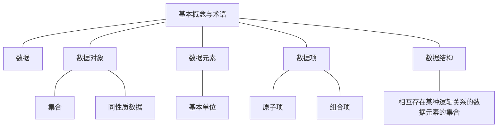
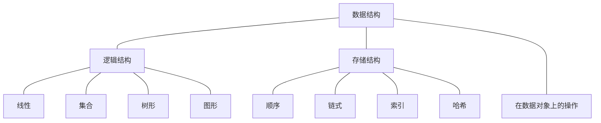
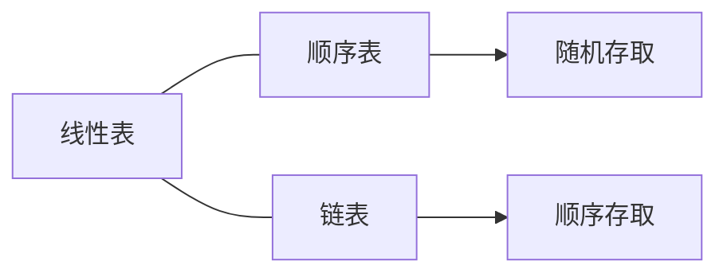
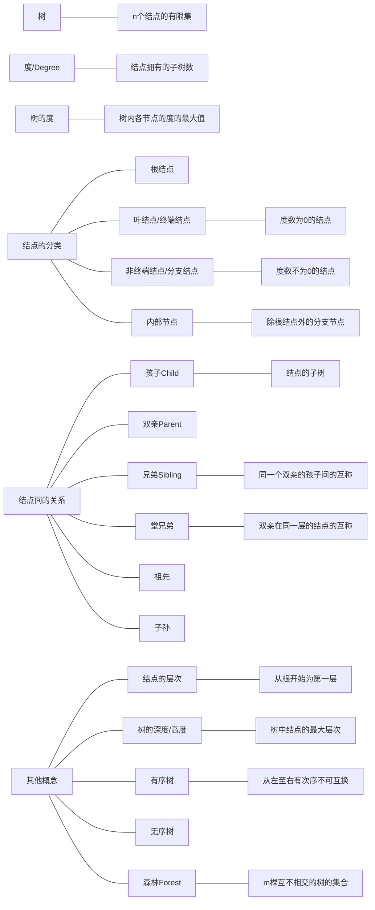
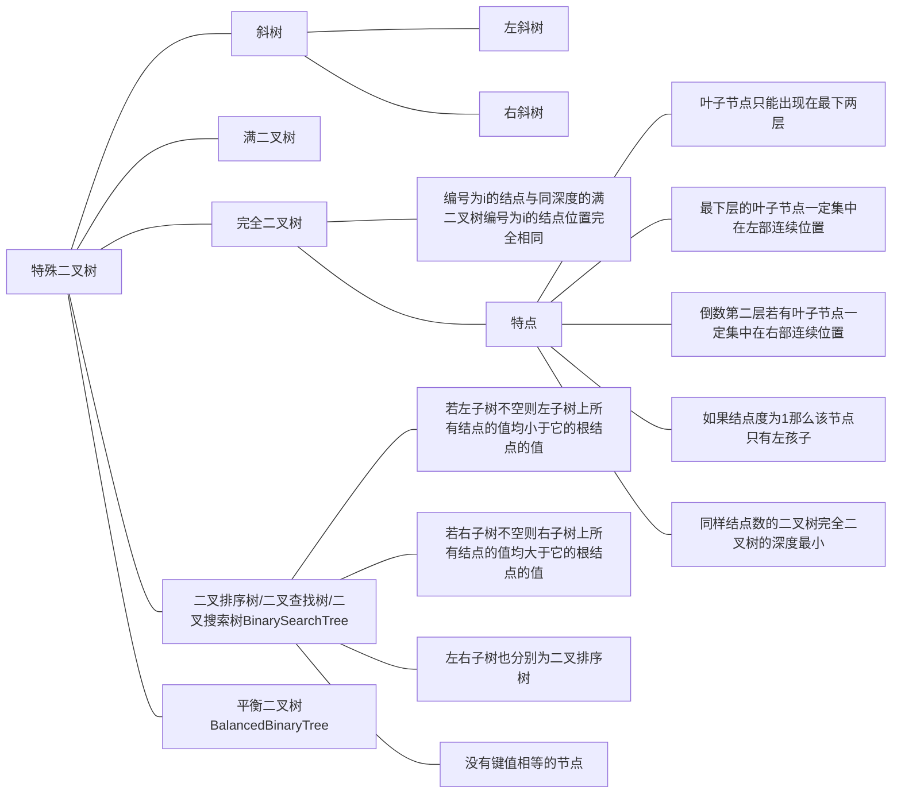
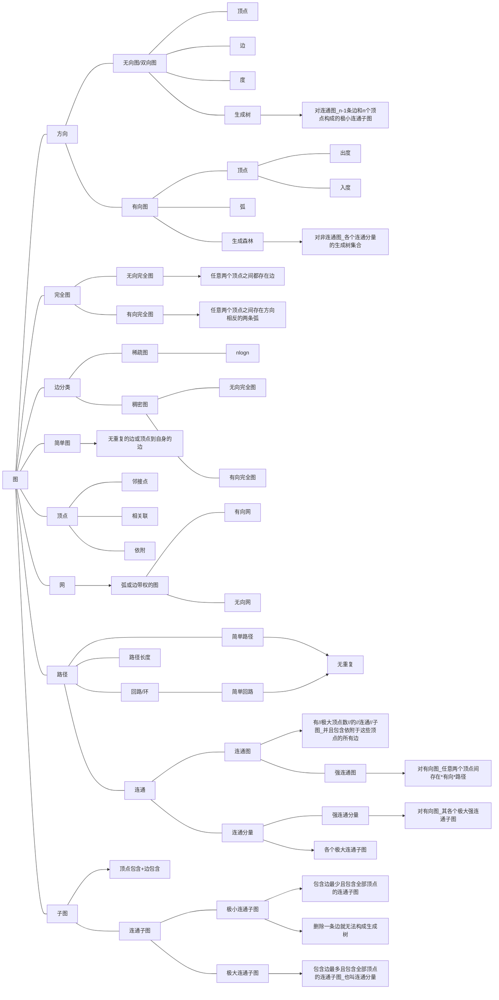
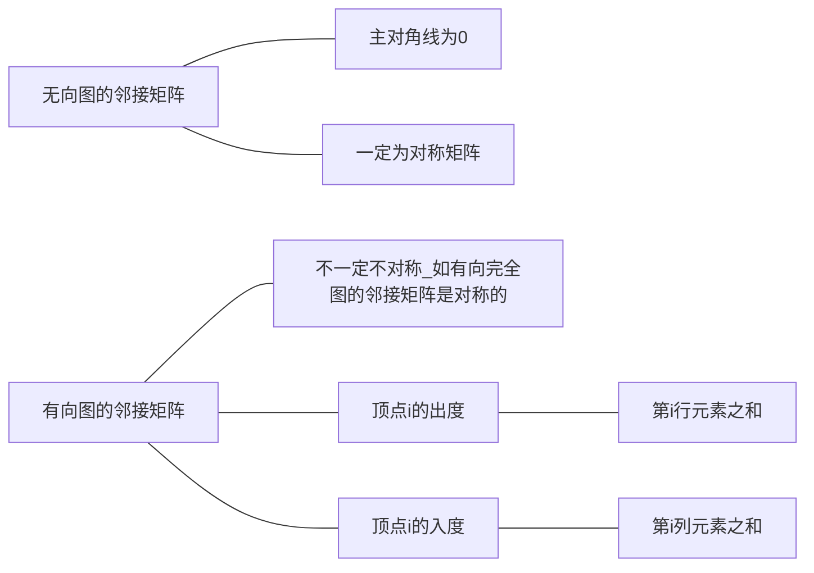
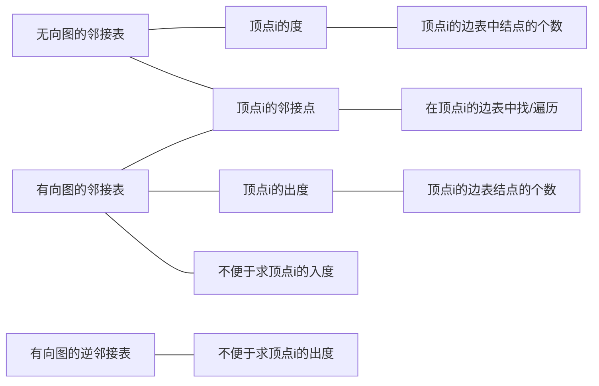
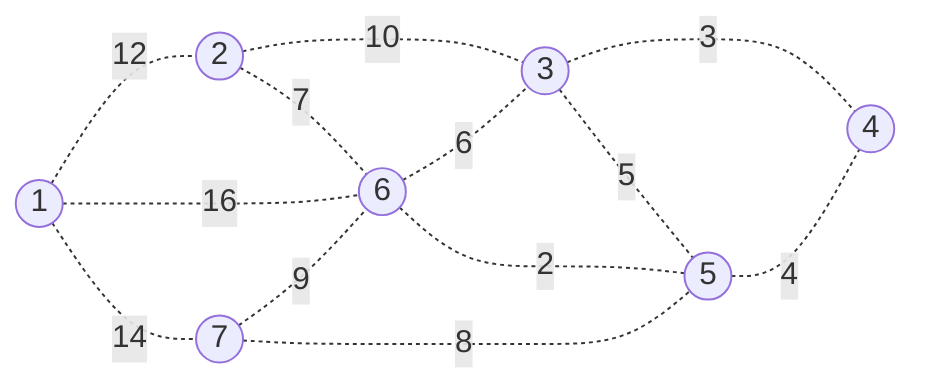

# DATA STRUCTURE NOTES
<!-- TOC -->

- [DATA STRUCTURE NOTES](#data-structure-notes)
	- [绪论](#绪论)
		- [基本概念与术语](#基本概念与术语)
		- [数据结构](#数据结构)
		- [抽象数据类型 Abstract Data Type（ADP）](#抽象数据类型-abstract-data-typeadp)
		- [算法 Algorithm ：解决特定问题求解步骤的描述](#算法-algorithm-解决特定问题求解步骤的描述)
			- [算法特性](#算法特性)
			- [算法设计的要求](#算法设计的要求)
			- [算法效率的度量方法](#算法效率的度量方法)
			- [函数渐进增长性：对比不同算法的优劣](#函数渐进增长性对比不同算法的优劣)
			- [复杂度](#复杂度)
				- [时间复杂度：T（n） = O（ f（ n ））](#时间复杂度tn--o-f-n-)
					- [分类](#分类)
					- [推导大O阶](#推导大o阶)
				- [空间复杂度：S（n） = O（ f（ n ）） 所需存储空间](#空间复杂度sn--o-f-n--所需存储空间)
			- [算法的存储量](#算法的存储量)
			- [算法的分析](#算法的分析)
	- [线性表](#线性表)
		- [顺序表的顺序存储](#顺序表的顺序存储)
			- [补充：操作算法中用到的预定义常量和类型](#补充操作算法中用到的预定义常量和类型)
			- [线性表顺序存储的结构代码](#线性表顺序存储的结构代码)
			- [顺序表基本操作的实现](#顺序表基本操作的实现)
				- [InitList(&L)](#initlistl)
				- [DestroyList(&L)](#destroylistl)
				- [ClearList(&L)](#clearlistl)
				- [Listlnsert(&L, i, e)](#listlnsertl-i-e)
				- [ListDelete(&L, i, &e)](#listdeletel-i-e)
				- [lsEmpty(L)](#lsemptyl)
				- [ListLength(L)](#listlengthl)
				- [LocateElem(L, e)](#locateeleml-e)
				- [GetElem(L, i, &e)](#geteleml-i-e)
		- [顺序表的链式存储（链表）](#顺序表的链式存储链表)
			- [单链表](#单链表)
				- [单链表结构代码](#单链表结构代码)
				- [初始化构造空表 int InitList(LinkList *L)](#初始化构造空表-int-initlistlinklist-l)
				- [判断链表是否为空 int IsLinkListEmpty(LinkList L)](#判断链表是否为空-int-islinklistemptylinklist-l)
				- [创建非空单链表 int CreateList(LinkList *L, int n)](#创建非空单链表-int-createlistlinklist-l-int-n)
				- [遍历 int TraverLinkList(LinkList L)](#遍历-int-traverlinklistlinklist-l)
				- [按值查找 LinkList LocateElem(LinkList L, ElemType e)](#按值查找-linklist-locateelemlinklist-l-elemtype-e)
				- [按位序查找 LinkList GetPosElem(LinkList L,int i)](#按位序查找-linklist-getposelemlinklist-lint-i)
				- [求长度 int ListLength(LInkList L)](#求长度-int-listlengthlinklist-l)
				- [按位序插入 int InsertList(LinkList L, int i, ElemType e)](#按位序插入-int-insertlistlinklist-l-int-i-elemtype-e)
				- [按位序删除 int DeleteList(List L, int i; ElemType *e)](#按位序删除-int-deletelistlist-l-int-i-elemtype-e)
				- [单链表的清空 int ClearList(LinkList *L)](#单链表的清空-int-clearlistlinklist-l)
				- [单链表的销毁 int DestroyList(LinkList *L)](#单链表的销毁-int-destroylistlinklist-l)
				- [单链表的逆置 void inverted(LinkList L)](#单链表的逆置-void-invertedlinklist-l)
				- [单向链表的就地排序 int sort(LinkList L)](#单向链表的就地排序-int-sortlinklist-l)
				- [有序表的归并](#有序表的归并)
			- [单向循坏链表](#单向循坏链表)
				- [单向循环链表的插入	int CirInsertLink(LinkList L, int i, ElemType e)](#单向循环链表的插入int-cirinsertlinklinklist-l-int-i-elemtype-e)
				- [单向循环链表的删除	int CirDeleteLink(LinkList L, int i, ElemType e)](#单向循环链表的删除int-cirdeletelinklinklist-l-int-i-elemtype-e)
				- [单向循环链表的合并	LinkList Connect(LinkList Ta,LinkList Tb)](#单向循环链表的合并linklist-connectlinklist-talinklist-tb)
			- [双向循环链表](#双向循环链表)
				- [双向循环链表的初始化	int InitDuLinkList(DuLinkList *L)](#双向循环链表的初始化int-initdulinklistdulinklist-l)
				- [双向循环链表的插入	int DuInsert(DuLinkList *L, int i, ElemType e)](#双向循环链表的插入int-duinsertdulinklist-l-int-i-elemtype-e)
				- [双向循环链表的删除	int DuDelete(DuLinkList *L, int i, ElemType e)](#双向循环链表的删除int-dudeletedulinklist-l-int-i-elemtype-e)
	- [栈与队列](#栈与队列)
		- [栈(stack)Last In First Out](#栈stacklast-in-first-out)
			- [栈的顺序存储](#栈的顺序存储)
				- [结构代码](#结构代码)
				- [初始化操作 InitSqStack(SqStack *S, int max)](#初始化操作-initsqstacksqstack-s-int-max)
				- [判断栈空 int IsStackEmpty(SqStack S)](#判断栈空-int-isstackemptysqstack-s)
				- [获取栈顶元素 int GetStackTop(SqStack S, int *e)](#获取栈顶元素-int-getstacktopsqstack-s-int-e)
				- [求长度 int SqStackLength(SqStack S)](#求长度-int-sqstacklengthsqstack-s)
				- [进栈操作 int PushSqStack(SqStack *S, int e)](#进栈操作-int-pushsqstacksqstack-s-int-e)
				- [出栈操作 int PopSqStack(SqStack *S, int *e)](#出栈操作-int-popsqstacksqstack-s-int-e)
				- [遍历操作 int TraverSqStack(Stack S)](#遍历操作-int-traversqstackstack-s)
				- [创建顺序栈 int CreateSqStack(SqStack *S, int max)](#创建顺序栈-int-createsqstacksqstack-s-int-max)
			- [栈的链式存取](#栈的链式存取)
				- [结构代码](#结构代码-1)
				- [初始化 int InitLinkStack(LinkStack *S)](#初始化-int-initlinkstacklinkstack-s)
				- [判断栈空 int IsLinkStackEmpty(LinkStack S)](#判断栈空-int-islinkstackemptylinkstack-s)
				- [获取栈顶元素 int GetLinkStackTop(LinkStack S, int *e)](#获取栈顶元素-int-getlinkstacktoplinkstack-s-int-e)
				- [求长度 int LinkStackLength(LinkStack S)](#求长度-int-linkstacklengthlinkstack-s)
				- [进栈操作 int PushLinkStack(LinkStack *S)](#进栈操作-int-pushlinkstacklinkstack-s)
				- [出栈操作 int PopLinkStack(LinkStack *S， int *e)](#出栈操作-int-poplinkstacklinkstack-s-int-e)
				- [遍历操作 int TraversLinkStack(LinkStack S)](#遍历操作-int-traverslinkstacklinkstack-s)
				- [创建链栈 int CreateLinkStack(LinkStack S)](#创建链栈-int-createlinkstacklinkstack-s)
		- [队列(Queue)First In First Out](#队列queuefirst-in-first-out)
			- [链队列](#链队列)
				- [链队列的结构代码](#链队列的结构代码)
				- [链队列的初始化 int InitQueue(LinkQueue *Q)](#链队列的初始化-int-initqueuelinkqueue-q)
				- [链队列入队操作 int AppendQueue(LinkQueue *Q)](#链队列入队操作-int-appendqueuelinkqueue-q)
				- [链队列出队 int DeQueue(LinkQueue *Q, QElemType &e)](#链队列出队-int-dequeuelinkqueue-q-qelemtype-e)
				- [获取链队列对头元素 int GetQueueHead(LinkQueue Q, QElemType &e)](#获取链队列对头元素-int-getqueueheadlinkqueue-q-qelemtype-e)
				- [链队列的销毁 int DestroyQueue(LinkQueue *Q)](#链队列的销毁-int-destroyqueuelinkqueue-q)
			- [顺序队列/循环队列](#顺序队列循环队列)
				- [结构代码](#结构代码-2)
				- [初始化 int InitQueue(SqQueue *Q)](#初始化-int-initqueuesqqueue-q)
				- [求长度 int QueueLength(SqQueue Q)](#求长度-int-queuelengthsqqueue-q)
				- [入队 int EnQueue(SqQueue *Q, QElemType e)](#入队-int-enqueuesqqueue-q-qelemtype-e)
				- [出队 int DeQueue(SqQueue *Q, QElemType *e)](#出队-int-dequeuesqqueue-q-qelemtype-e)
				- [取对头元素 SElemType GetHead(SqQueue Q)](#取对头元素-selemtype-getheadsqqueue-q)
	- [串、数组与广义表](#串数组与广义表)
		- [](#)
	- [树和二叉树](#树和二叉树)
		- [一些基本概念](#一些基本概念)
		- [二叉树](#二叉树)
			- [二叉树的性质](#二叉树的性质)
			- [二叉树的存储结构](#二叉树的存储结构)
				- [顺序存储](#顺序存储)
				- [二叉链表](#二叉链表)
				- [三叉链表](#三叉链表)
			- [二叉树的遍历（递归算法）](#二叉树的遍历递归算法)
				- [DLR：先序遍历法](#dlr先序遍历法)
				- [LDR：中序遍历法](#ldr中序遍历法)
				- [LRD：后序遍历法](#lrd后序遍历法)
				- [层序遍历法](#层序遍历法)
				- [基于任务分析法](#基于任务分析法)
			- [二叉树的遍历（非递归算法）](#二叉树的遍历非递归算法)
			- [二叉树的建立](#二叉树的建立)
				- [基于前序遍历递归算法](#基于前序遍历递归算法)
				- [基于读边法](#基于读边法)
			- [求最大结点](#求最大结点)
			- [查找指定结点](#查找指定结点)
			- [二叉树的销毁](#二叉树的销毁)
			- [各种数量](#各种数量)
				- [求叶子节点个数](#求叶子节点个数)
				- [求总的结点个数](#求总的结点个数)
				- [求二叉树的深度](#求二叉树的深度)
				- [求二叉树的宽度](#求二叉树的宽度)
		- [<a name='Tree'></a>树与森林（Tree）](#树与森林tree)
			- [树的存储结构](#树的存储结构)
				- [双亲表示法](#双亲表示法)
				- [孩子表示法](#孩子表示法)
				- [双亲孩子表示法](#双亲孩子表示法)
				- [孩子兄弟表示法（链表）](#孩子兄弟表示法链表)
			- [树的创建](#树的创建)
				- [孩子链表创建](#孩子链表创建)
				- [读边法创建孩子兄弟链表](#读边法创建孩子兄弟链表)
			- [树和二叉树的转换](#树和二叉树的转换)
				- [树的遍历](#树的遍历)
					- [先根遍历](#先根遍历)
					- [后根遍历](#后根遍历)
					- [层次遍历](#层次遍历)
			- [树的基本操作](#树的基本操作)
				- [按值查找](#按值查找)
					- [结点值不相同](#结点值不相同)
					- [结点值予许相同](#结点值予许相同)
				- [求树的深度](#求树的深度)
				- [树的插入](#树的插入)
				- [树的删除](#树的删除)
				- [输出树中所有从根到叶子的路径](#输出树中所有从根到叶子的路径)
				- [输出树中从根到指定叶子的路径（无重复）](#输出树中从根到指定叶子的路径无重复)
				- [凹入法输出](#凹入法输出)
	- [图](#图)
		- [图的一些基本概念与术语](#图的一些基本概念与术语)
		- [图的存储结构](#图的存储结构)
			- [<a name='AdjacencyMatrix'></a>邻接矩阵存储 **Adjacency Matrix**](#邻接矩阵存储-adjacency-matrix)
				- [邻接矩阵的存储代码](#邻接矩阵的存储代码)
				- [基于邻接矩阵——创建函数](#基于邻接矩阵创建函数)
					- [无向图](#无向图)
					- [无向图](#无向图-1)
					- [无向网](#无向网)
					- [有向网](#有向网)
			- [<a name='AdjacencycList'></a>邻接表存储 **Adjacencyc List**](#邻接表存储-adjacencyc-list)
				- [邻接表存储代码](#邻接表存储代码)
				- [基于邻接表——创建函数](#基于邻接表创建函数)
					- [无向图](#无向图-2)
					- [有向图](#有向图)
					- [无向网](#无向网-1)
					- [有向图](#有向图-1)
			- [十字链表](#十字链表)
			- [邻接多重表](#邻接多重表)
			- [边集数组](#边集数组)
		- [<a name='TraversingGraph'></a>图的遍历 Traversing Graph](#图的遍历-traversing-graph)
			- [<a name='Depth-FirstSearchDFS'></a>深度优先搜索(Depth-First Search, DFS)](#深度优先搜索depth-first-search-dfs)
				- [邻接矩阵的深度遍历算法](#邻接矩阵的深度遍历算法)
				- [邻接表的深度遍历算法](#邻接表的深度遍历算法)
			- [<a name='Breadth-FirstSearchBFS'></a>广度优先搜索(Breadth-First Search, BFS)](#广度优先搜索breadth-first-search-bfs)
				- [邻接矩阵的广度遍历算法](#邻接矩阵的广度遍历算法)
				- [邻接表的广度遍历算法](#邻接表的广度遍历算法)
		- [<a name='MinimumCostSpanningTree'></a>最小生成树 Minimum Cost Spanning Tree](#最小生成树-minimum-cost-spanning-tree)
			- [<a name='PrimsAlgorithm'></a>普里姆算法 Prim's Algorithm](#普里姆算法-prims-algorithm)
			- [<a name='KruskalsAlgorithm'></a>克鲁斯卡尔算法 Kruskal's Algorithm](#克鲁斯卡尔算法-kruskals-algorithm)
		- [最短路径](#最短路径)
			- [<a name='DijkstrasAlgorithm'></a>迪杰斯特拉算法 Dijkstra's Algorithm](#迪杰斯特拉算法-dijkstras-algorithm)
			- [<a name='FloydWarshallAlgorithm'></a>弗洛伊德算法 Floyd–Warshall Algorithm](#弗洛伊德算法-floydwarshall-algorithm)
		- [拓扑排序](#拓扑排序)
			- [基本概念](#基本概念)
				- [有向无环图 DAG(Directed Acyclic Graph)](#有向无环图-dagdirected-acyclic-graph)
				- [AOV网 Activity On Vertex Network](#aov网-activity-on-vertex-network)
				- [拓扑序列](#拓扑序列)
				- [拓扑排序](#拓扑排序-1)
			- [拓扑排序算法](#拓扑排序算法)
				- [基本思路:](#基本思路)
				- [基于邻接表的代码](#基于邻接表的代码)
				- [基于邻接矩阵的代码](#基于邻接矩阵的代码)
		- [关键路径](#关键路径)
			- [基本概念](#基本概念-1)
				- [AOE网 Activity On Edge Network](#aoe网-activity-on-edge-network)
				- [事件的最早发生时间etv (earliest time of vertex)](#事件的最早发生时间etv-earliest-time-of-vertex)
				- [事件的最晚发生时间ltv (latest time of vertex)](#事件的最晚发生时间ltv-latest-time-of-vertex)
				- [活动的最早开工时间ete (earliest time of edge)](#活动的最早开工时间ete-earliest-time-of-edge)
				- [活动的最晚开工时间lte (latest time of edge)](#活动的最晚开工时间lte-latest-time-of-edge)
				- [时间余量](#时间余量)
				- [路径长度](#路径长度)
				- [关键活动、关键路径](#关键活动关键路径)
			- [关键路径的算法](#关键路径的算法)
				- [基于邻接表的代码](#基于邻接表的代码-1)
				- [基于邻接矩阵的代码](#基于邻接矩阵的代码-1)
	- [查找](#查找)
		- [基本概念](#基本概念-2)
			- [<a name='SearchTable'></a>查找表 Search Table](#查找表-search-table)
			- [<a name='Key'></a>关键字 Key](#关键字-key)
			- [<a name='SecondaryKey'></a>次关键字 Secondary Key](#次关键字-secondary-key)
			- [<a name='StaticSearchTable'></a>静态查找表 Static Search Table](#静态查找表-static-search-table)
			- [<a name='DynamicSearchTable'></a>动态查找表 Dynamic Search Table](#动态查找表-dynamic-search-table)
			- [<a name='ASL'></a>平均查找长度ASL](#平均查找长度asl)
		- [顺序表查找](#顺序表查找)
			- [普通法](#普通法)
			- [<a name='sentry'></a>优化法(设置哨兵)sentry](#优化法设置哨兵sentry)
		- [有序表查找](#有序表查找)
			- [折半查找(二分查找)](#折半查找二分查找)
			- [插值查找](#插值查找)
			- [斐波那契查找](#斐波那契查找)
		- [索引查找](#索引查找)
			- [稠密索引](#稠密索引)
			- [分块索引](#分块索引)
			- [倒排索引](#倒排索引)
		- [<a name='BSTBinarySortTree'></a>二叉排序树 BST(Binary Sort Tree)](#二叉排序树-bstbinary-sort-tree)
		- [<a name='ALV'></a>平衡二叉树 ALV树](#平衡二叉树-alv树)
			- [二叉平衡树的实现原理](#二叉平衡树的实现原理)
		- [<a name='B'></a>多路查找树(B树)](#多路查找树b树)
			- [-3树](#-3树)
			- [-3-4树](#-3-4树)
			- [<a name='B-1'></a>B树](#b树)
			- [<a name='B-1'></a>B+树](#b树-1)
		- [哈希表(散列表)查找)](#哈希表散列表查找)
			- [散列函数的构造方法](#散列函数的构造方法)
				- [直接定址法](#直接定址法)
				- [数字分析法](#数字分析法)
				- [平方取中法](#平方取中法)
				- [折叠法fen](#折叠法fen)
				- [除留余数法](#除留余数法)
				- [随机数法](#随机数法)
			- [处理散列冲突的方法](#处理散列冲突的方法)
	- [排序](#排序)
	- [<a name='or'></a>实验or应用](#实验or应用)
		- [线性表](#线性表-1)
			- [简单的学生成绩管理](#简单的学生成绩管理)
			- [图书信息管理](#图书信息管理)
			- [党史学习](#党史学习)
			- [学习强国](#学习强国)
			- [集合及其运算](#集合及其运算)
			- [双向循环链表实验](#双向循环链表实验)
		- [栈的应用](#栈的应用)
			- [进制转换](#进制转换)
			- [括号匹配](#括号匹配)
			- [回文判断](#回文判断)
			- [表达式求值](#表达式求值)
		- [队列的应用](#队列的应用)
			- [舞伴问题](#舞伴问题)
			- [排队模拟问题](#排队模拟问题)
			- [求二项式系数](#求二项式系数)
			- [无冲突子集的划分](#无冲突子集的划分)

<!-- /TOC -->

## 绪论

<center>程序 = 算法 + 数据结构</center>

<center>数据结构 = 数据对象 + 结构</center>


### 基本概念与术语



### 数据结构



### 抽象数据类型 Abstract Data Type（ADP）

* 数据类型

  * 原子类型
  * 结构类型
* ADP：一个数学模型以及定义在该模型上的一组操作。

  * 体现了程序设计的**问题分解**、**抽象**和**信息隐藏**
  * **描述**
  * ADP 抽象数据类型名
    Data
    数据元素之间逻辑关系的定义
    Operation
    操作1
    初始条件
    操作结果描述
    操作2
    初始条件
    操作结果描述
    操作3
    初始条件
    操作结果描述
    ···
    操作n
    初始条件
    操作结果描述
    end ADP

### 算法 Algorithm ：解决特定问题求解步骤的描述

#### 算法特性


#### 算法设计的要求

* 正确性
* 可读性
* 健壮性
* 时间效率高、存储量低

#### 算法效率的度量方法

* 事后统计（不科学、不准确）
* 事前分析估算

#### 函数渐进增长性：对比不同算法的优劣

#### 复杂度

##### 时间复杂度：T（n） = O（ f（ n ））

T（n）：执行次数
看数量级、看增长率、越小越优

###### 分类

* 常数阶：    O（1）
* 线性阶：    O（n）
* 平方阶：    O（n^2^）
* 对数阶：    O（logn）
* nlogn阶：   O（nlogn）
* 立方阶：    O（n^3^）
* 指数阶：    O（2^n^）
* ······

###### 推导大O阶

* 用“1”取代加法常数
* 只保留最高阶项
* 最高阶项系数改为1

  注：O(1) < O(logn) < O(n) < O(nlogn) < (n^2^) < O(n^3^) < O(2^n^) < O(n!) < O(n^n^)

##### 空间复杂度：S（n） = O（ f（ n ）） 所需存储空间

注：“复杂度”一般指时间复杂度

#### 算法的存储量

1. 输入数据所占空间
2. 程序本身所占空间
3. 辅助变量所占空间

#### 算法的分析

* 平均情况：期望的运行时间，计算平均时间复杂度。
* 最坏情况：计算最坏时间复杂度，是一种保证，一般时间复杂度指最坏情况。

## 线性表

### 顺序表的顺序存储

#### 补充：操作算法中用到的预定义常量和类型

* 函数结果状态代码

```C
#define TRUE         1
#define FALSE        0
#define OK           1
#define ERROR        0
#define INFEASIBLE  -1
#define OVERFLOW    -2
```

* Status是函数的类型，其值是函数结果状态代码

```C
typedef int Status;
typedef char Elemtype;
```

#### 线性表顺序存储的结构代码

```C
//顺序存储结构代码		创建线性表
#define MAXSIZE 20				/*存储空间初始分配量*/
#define OK 1
#define ERROR 0

//线性表的动态分配存储结构
# define ListInitSize 100		/*存储空间初始分配量*/
# define ListIncrement 10		/*存储空间分配增量*/
typedef int Status;
typedef int Elemtype;
Elemtype *newbase;				//重新分配存储空间

typedef struct
{
	Elemtype *data;				/*储存数据元素  这里使用指针方便后边进行动态分配	储存空间基址*/
	int length;					/*当前线性表的长度	线性表长度<=数组长度*/
	int listsize;				//当前分配的存储容量 第三个属性根据需要，可有可无
}SqList;
```

注：status是一种函数类型，当函数返回值为函数结果状态代码时，函数定义为Status类型。
函数结果状态码：
TRUE        1、FALSE    0
OK          1、ERROR    0
INFEASIBLE -1、OVERFLOW -2

#### 顺序表基本操作的实现

##### InitList(&L)

初始化操作，建立一个空的线性表L

* C

```C
Status InitList(SqList* L)			//构造一个空的线性表
{
	//动态分配
	L->data = (Elemtype *)malloc(sizeof(Elemtype) * ListInitSize )

	if (!L->data);      //存储分配失败退出
		exti(ERROR);

	L->length = 0;      //空表长度为0
	L->listsize = ListInitSize;
	return OK;
}
```

* C++

```C++
Status InitList(SqList* L)			//构造一个空的线性表
{
	//动态分配
	L->data = new Elemtype(ListInitSize);

	if (!L->data);      //存储分配失败退出
		exti(ERROR);

	L->length = 0;      //空表长度为0
	L->listsize = ListInitSize;
	return OK;
}
```

##### DestroyList(&L)

销毁已存在的线性表L

* C

```C
void DestroyList(SqList *L)
{
    if(L->data)  free(L->data);  //释放存储空间
}
```

* C++

```C++
void DestroyList(SqList &L)
{
    if(L.data)  delete[] L.data;  //释放存储空间
}
```

注：如果动态分配了一个数组，但是却用delete p的方式释放，没有用[]，则编译时没有问题，运行时也一般不会发生错误，但实际上会导致动态分配的数组没有被完全释放。

##### ClearList(&L)

将线性表清空

* C++

```C++
void ClearList(SqList &L)
{
    L->length = 0;          //将线性表的长度置为零
}
```

注：其实这只是形式上的清空，让计算机识别不了而已，真正的线性表在内存中还存在。

##### Listlnsert(&L, i, e)

在线性表L中第i个位置插入新元素e

* C

```C++
Status ListInsert(SqList* L, int i, Elemtype e)			//在第i个位置插入新元素e
{
	//初始条件      i的位置要合理同时线性表要有空间可以插入新元素
	int k;
	if (L->length == MAXSIZE)
		return ERROR;
	if (i < 1 || i > L->length + 1)
		return ERROR;
	if (L->length >= L->listsize)		//存储空间已满，需要重新分配
	{
		newbase = (Elemtype*)realloc(L->data, (L->listsize + ListInitSize) * sizeof(Elemtype))
			if (!newbase)
				exit(EOVERFLOW);
		L->data = newbase;
		L->listsize += ListIncrement;
	}

	//操作结果
	if (i <= L->length)
	{

		for (k = L->length - 1; k >= i - 1; k--)
			L->data[k + 1] = L->data[k];
	}
	L->data[i-1] = e;
	L->length++;

	return OK;

}


L.date[length] = e;
L.length++;

e = L.data[length];
L.length--;
```

* C++

```C++

```

##### ListDelete(&L, i, &e)

删除线性表L中第i个位置元素，用e返回

* C

```C++
Status ListDelete(SqList* L, int i, Elemtype* e)
{
	//初始条件
	int k;
	if (i<1 || i>L->length)			//删除的位置不合理
		return ERROR;
	if (L->length == 0)				//线性表没有元素可以删除
		return ERROR;

	//操作结果
	*e = L->data[i - 1];

	if (i < L->length)
	{
		for (k = i; k < L->length; k++)
			L->data[k - 1] = L->data[k];
	}
	L->length--;
	return OK;

}
```

* C++

```C++

```

##### lsEmpty(L)

若线性表为空，返回true，否则false

* C

```C++
int IsEmpty(SqList *L)
{
    if(L->length == 0)
        return 1;
    else return 0;
}
```

* C++

```C++
int IsEmpty(SqList &L)
{
    if(L->length == 0)
        return 1;
    else return 0;
}
```

##### ListLength(L)

返回线性表L的元素个数

* C

```C++
int ListLength(SqList *L)
{
    return L->length;
}
```

* C++

```C++
int ListLength(SqList &L)
{
    return L->length;
}
```

##### LocateElem(L, e)

L中查找与给定值e相等的元素，若成功返回该元素在表中的序号，否则返回0

<center>顺序查找 O（n） </center>

```C++
//for语句实现
Status LocateElem(SqList *L,Elemtype *e)
{
	int i;
	for(i = 0; i < L->length; i++)
	{
		if(L->data[i] == *e)
		return i+1;
	}
	return 0;
}

//while语句实现
Status LocateElem(SqList *L,Elemtype *e)
{
	int i = 0;
	while( i < L->length && L->data[i] != *e)
	{
		i++;
		if( i < L->length)
			return i+1;
	}

	return 0;
}

```

##### GetElem(L, i, &e)

将线性表L中的第i个位置元素返回给e

* C

```C++
Status GetElem(SqList L, int i, Elemtype *e)	//获得元素操作，讲读取的元素赋给e
{
	//初始条件  i的位置要合理
	if (L.length == 0 || i < 1 || i > L.length)
		return ERROR;
	//操作结果
	*e = L.data[i - 1];

	return OK;
}
```

* C++

```C++
Status GetElem(SqList L, int i, Elemtype &e)	//获得元素操作，讲读取的元素赋给e
{
	//初始条件  i的位置要合理
	if (L.length == 0 || i < 1 || i > L.length)
		return ERROR;
	//操作结果
	*e = L.data[i - 1];

	return OK;
}
```

### 顺序表的链式存储（链表）

#### 单链表

```c++
typedef struct
{
	char name[20];
	float score;
}STD;
```

##### 单链表结构代码

```C++
typedef struct node
{
	Elemtype data;		//数据域
	struct node *next;	//指针域
}LNode,*LinkList;		//Node为数据类型<=>struct node
						//LinkList为指向结点的指针类型
//申请一个结点
s = (LinkList)malloc(sizeof(Node));
s = (LNode*)malloc(sizeof(LNode))
```

##### 初始化构造空表 int InitList(LinkList *L)

```c++
//①被动修改
int InitList(LinkList *L)
{
	*L = (LNode*)malloc(sizeof(LNode));
	if(*L = NULL)
		return 0;
	(*L)->next = NULL;
		return 1;
}
//②主动接受
LinkList InitList()		//返回地址，不传参数
{
	LinkList L;
	L = (LNode*)malloc(sizeof(LNode));
	if( L == NULL)
		return NULL;
	L->next = NULL;
		return L;
}
//调用
	LinkList H;
	H = InitList();

```

##### 判断链表是否为空 int IsLinkListEmpty(LinkList L)

```c++
int IsLinkListEmpty(LinkList L)
{
	if(L->next)
		return 0;
	else
		return 1;
}
```

##### 创建非空单链表 int CreateList(LinkList *L, int n)

<center>头插法</center>

```c++
int CreateLinkListFront(LinkList *L, int n)				//O(n)
{
	*L = (*LNode)malloc(sizeof(LNode));		//建立带头节点的链表
	if(*L == NULL)
		return 0;

	int i;
	LinkList s;
	for(i = 0; i< n; i++)
	{
		s = (LinkList)malloc(sizeof(LNode));
		scanf(&s->data);						//伪代码
		s->next = (*L)->next;
		(*L)->next = s;
	}
	return 1;
}
```

```c++

	s->next = L->next;
	L->next = s;


```

<center>尾插法</center>

```c++
int CreateLinkListRear(LinkList *L, int n)				//O(n)
{
	*L= (LinkList)malloc(sizeof(LNode))
	if(*L == NULL)
		return 0;
	(*L)->next = NULL;

	LinkList R;
	R = *L;
	for(i = 0; i<n; i++)
	{
		LinkList s;
		s = (LinkList)malloc(sizeof(LNode));
		scanf(&s->data);	//伪代码
		s->next = NULL;
		R->next = s;
		R = s;
	}
}
```

<center>初始化函数和插入函数组合</center>

```c++
int CreateList(LinkList *L,int n)
{
	int i = 1;
	Elemtype e；
	InitList(L);
	while( i < n )
	{
		InsertList(L,i++,e)
	}
	return 0；
}
```

##### 遍历 int TraverLinkList(LinkList L)

```c++
int TraverLinkList(LinkList L)		//O(n)
{
	LinkList p = L->next;
	while(p)
	{
		printf(p->data);		//只是伪代码
		p = p->next;
	}
}
```

##### 按值查找 LinkList LocateElem(LinkList L, ElemType e)

<center>返回地址</center>

```c++
 LinkList LocateElem(LinkList L, ElemType e)		//返回地址
 {
	 LinkList p = L->next;
	 while(p)
	 {
		 if( p->data == e )		//伪代码
		 	break;
			p = p->next;
	 }
	 return p;					//就算找不到也是返回NULL
 }
```

<center>返回位序</center>

```C++
int LocateElem(LinkList L,ElemType e)
{
	LinkList p = L->next;
	int j = 1;
	while(p && p->data != e)
	{
		p = p->next;
		j++;
	}
	if(p)
		return j;
	else 
		return 0;
}
```

##### 按位序查找 LinkList GetPosElem(LinkList L,int i)

```c++
LinkList GetPosElem(LinkList L,int i)	//LinkList类型，返回结点地址或空指针
{
	if( i < 0 )
		return NULL;
	LinkList p = L->next;
	int j = 1;
	while( p && j < i )
	{
		p = p->next;
		j++;
	}
	if( !p || j > i )
		return NULL;
	return p; 
}
```

##### 求长度 int ListLength(LInkList L)

```c++
{
	LinkList p = L->next;
	int j = 1;
	while(p)
	{
		p = p->next;
		j++;
	}
}
```

##### 按位序插入 int InsertList(LinkList L, int i, ElemType e)

```c++
//已知头指针L，位置i，待插入元素值e
int InsertList(LinkList L, int i, ElemType e)
{
	if(i <= 0)				//越界
		return 0;

	LinkList p;
		p = L;
	int j = 0;
	while(p && j<i-1)		//<=> p = GetPosElem(L, i-1)
	{
		p = p->next;
		++j;
	}

	if(!p)					//越界
		return 0;

	LinkList s = (LNode*)malloc(sizeof(LNode));		//生成新结点
	s->data = e;
	s->next = p->next;
	p->next = s;							//插入
}
```

##### 按位序删除 int DeleteList(List L, int i; ElemType *e)

```c++
int DeleteList(LinkList L, int i, ElemType *e)		//O(n)
{
	if(i<=0)
		return 0;

	LinkList p;
	p = L;
	int j = 0;
	while(p && j<i-1)
	{
		p = p->next;
		++j;
	}

	if(!p)
		return 0;

	LinkList q;
	q = p->next;
	p->next = q->next;
	*e = q->data;
	free(q);
		return 1;
}
```

##### 单链表的清空 int ClearList(LinkList *L)

清空只清空元素，保留头节点和头指针

```c++
int ClearList(LinkList L)			//O(n)
{
	LinkList p;
	while((*L)->next)
	{
		p = (*L)->next;
		(*L)->next = p->next;
		free(p);
	}
}
```

##### 单链表的销毁 int DestroyList(LinkList *L)

销毁不保留头节点

```c++
int DestroyList(LinkList *L)
{
	LinkList p;
	while(L)
	{
		p = (*L);
		(*L) = (*L)->next;
		free(p);
	}
}
```

##### 单链表的逆置 void inverted(LinkList L)

算法思路：讲单链表从头节点开始分割成两个链表，用头插法重新插入即可

```c++
void Inverted(LinkList L)
{
    LinkList p;
    p = L->next;		//临时指针，用于头插法
    L->next = NULL;		//断成两个链表
    while (p) {
        LinkList q;     //临时指针，保存链表
        q = p->next;
        p->next = L->next;
        L->next = p;
        p = q;
    }
}
```

迭代法

```c++
void Inverted(LinkList L)
{
	LinkList pre = NULL;
	LinkList cur = L->next;
	while(cur)
	{
		LinkList Next = cur->next;
		cur->next = pre;
		pre = cur;
		cur = Next;
	}
}
```

##### 单向链表的就地排序 int sort(LinkList L)

```c++
int sort(LinkList *L)
{
	LinkList p;
	p = (*L)->next;
	(*L)->next = NULL;
	while(p){
		LinkList q;				//q用于保存未排序的链表
		linkList s;				//s用于保存第i-1个结点，确定插入位置
		q = p->next;
		s = (*L);
		while(s->next!=NULL && s->next->data <p->data){
			s = s->next;
		}
		p->next = s->next;
		s->next = p;
		p = q;
	}
	return 1;
}
```

##### 有序表的归并

```c++
/*	问题:已知线性表LA和LB，数据元素均按值非递减有序排列，
	将LA、LB归并成一个新的线性表Lc，
	且Lc中的数据元素按值非递减有序排列。
*/

//顺序表
void MergeSq(SqList LA, SqList LB, SqList *LC)
{
	int i = 0, j = 0, k = 0;
	LC->length = LA.length + LB.length;
	while(i<LA.length && j<LB.length){		//LA和LB非空，写入小的元素到LC
		if( LA.elme[i] < LB.elem[j] )
			LC->elem[k++] = LA.elem[i++];
		else LC->elem[k++] = LB.elem[j++];
	}
	while(i<LA.length)
		LC->elem[k++] = LA.elem[i++];
	while(j<LB.length)
		LC->elem[k++] = LB.elem[j++];
}												//O(m+n)

//去除重复元素
void MergeSq(SqList LA, SqList LB, SqList *LC)
{
	int i = 0, j = 0, k = 0;
	LC->length = LA.length + LB.length;
	while(i<LA.length && j<LB.length){
		if( LA.elem[i] < LB.elem[j] ){
			if(LC->elem[k]!=LA.elem[i])
				LC->elem[k++] = LA.elem[i++];
			else i++;
		}
		else if(LA.elem[i]>LB.elem[j]){
			if(LC->elem[k]!=LB.elem[j])
				LC->elem[k++] = LB.elem[j++];
			else j++;
		}
	}
	while(i<LA.length)
		LC->elem[k++] = LA.elem[i++];
	while(j<LB.length)
		LC->elem[k++] = LB.elem[j++];
}

//单链表
void MergeLink(LinkList LA, LinkList LB)
{
	LinkList qa = LA, pa = LA->next;
	LinkList pb = LB->next, qb = pb->next;
	while(pa&&pb){
		if(pa->data <= pb->data){			//寻找插入位置
			qa = pa;
			pa = pa->next;
		}
		else{
			qa->next = pb;
			pb->next = pa;
			qa = pb;
			qb = pb->next;
		}
	}
	if(!pa)
		qa->next = pb;
		free(LB);
}
```

#### 单向循坏链表

判断是否为空的条件为p是否等于头指针
`p!=L`or`p->next!=L`
尾指针表示：a~1~ = `R->next->next`;a~n~ = `R`.

##### 单向循环链表的插入	int CirInsertLink(LinkList L, int i, ElemType e)

```c++
int CirInsertLink(LinkList L, int i, ElemType e)
{
	LinkList p = L;
	int j = 0;
	while( p->next!=L && j<i-1 ){
		p = p->next;
		j++;
	}

	if( j<i-1 || j>i-1 ){
		printf("位置异常！");
		return 0；
	}

	LinkList s = (LinkList)malloc(sizeof(LNode));
	s->data = e;			//伪代码
	s->next = p->next;
	p->next = s;
	return 1;

}
```

##### 单向循环链表的删除	int CirDeleteLink(LinkList L, int i, ElemType e)

```c++
int CirDeleteLink(LinkList L, int i, ElemType e)
{
	LinkList p = L;
	int j = 0;
	while( p->next!=L && j < i-1 ){
		p = p->next;
		j++;
	}

	if(j<i-1 || j>i-1){
		printf("链表为空或位置异常！");
		return 0;
	}

	LinkList q = p->next;
	e = q->next;
	p->next = q->next;
	free(q);
	return 1;
}
```

##### 单向循环链表的合并	LinkList Connect(LinkList Ta,LinkList Tb)

这里是用尾指针表示的单向循环链表

```c++
LinkList Connect(LinkList Ta,LinkList Tb)
{
	LinkList p = Ta->next;			//保存Ta表的头结点，便于Tb表接上
	Ta->next = Tb->next->next;		//Tb表尾接到Ta表头
	free(Tb->next);					//释放Tb头结点
	Tb->next = p;					//Tb表尾接到Ta表头
	return Tb;						//因为这里是用Tb的尾指针表示的
}
```

#### 双向循环链表

```c++
typedef struct DulNode			//dual
{
	struct DulNode *prior;		//前驱
	ElemType data;
	struct DulNode *next;		//后继
}DulNode,*DuLinkLIst
```

##### 双向循环链表的初始化	int InitDuLinkList(DuLinkList *L)

```c++
int InitDuLinkList(DuLinkList *L)
{
	*L = (DuLinkList)malloc(sizeof(DulNode));
	if(*L == NULL){
		printf("申请空间失败！\n")；
		exit(0);
	}
	(*L)->next = (*L)->prior = *L;
	return 1;
}
```

##### 双向循环链表的插入	int DuInsert(DuLinkList *L, int i, ElemType e)

```c++
int DuInsert(DuLinkList *L, int i, ElemType e)
{
	DuLinkList p = L;		//临时指针，指向头结点
	DuLinkList New_p;		//用于指向新节点
	int j = 0;

	while(p->next!=L && j < i-1){
		p = p->next;
		j++;
	}

	if(j<i-1 ||j>i-1){
		printf("位置不合理！\n");
		return 0;
	}

	s = (DuLinkList)malloc(sizeof(DulNode));
	s->data = e;

	s->next = p->next;		//后继
	p->next = s;

	s->prior = p;			//前驱
	p->next->prior = s;
}
```

##### 双向循环链表的删除	int DuDelete(DuLinkList *L, int i, ElemType e)

```c++
int DuDelete(DuLinkList *L, int i, ElemType e)
{
	DuLinkList p = L;
	int j = 0;
	while(p->next != L && j<i-1 ){
		p = p->next;
	}

	if( j<i-1 || j >i-1 ){
		printf("链表为空或位置不合理！\n");
		return 0;
	}

	DuLinkList q = p->next;
	e = q->next;
	p->next = q->next;
	q->next->prior = p;
	free(q);
	return 1;
}
```



## 栈与队列

### 栈(stack)Last In First Out

栈是限定仅在表尾进行插入和删除操作的线性表。
栈顶：予许插入删除一段
栈底：另一端
LIFO结构

#### 栈的顺序存储

##### 结构代码

<center>Method 1</center>

```c++
#define MAX 100
typedef struct stack
{
	SElemType data[MAX];
	int top;				//栈顶位置
	int StackSize;			//栈容量
}SqStack;
```

<center>Method 2</center>

```c++
typedef struct stack
{
	SElemType *data;		//指针
	int top;				//栈顶位置
	int StackSize;			//栈容量
}SqStack;
```

##### 初始化操作 InitSqStack(SqStack *S, int max)

```c++
InitSqStack(SqStack *S, int max)
{
	S->data = (SElemType*)malloc(SElemType);
	if(S->data == NULL){
		printf("空间申请失败！");
		exit(0);
	}
	S->top = -1;
	S->StackSize = max;
	return 1;
}
```

##### 判断栈空 int IsStackEmpty(SqStack S)

```c++
int IsSqStackEmpty(SqStack S)
{
	if(S.top == -1)
		return 1;
	else 
		return 0;
}
```

##### 获取栈顶元素 int GetStackTop(SqStack S, int *e)

```c++
int GetSqStackTop(SqStack S, int *e)
{
	if(S.top == -1)
		return 0;
	*e = S.data[S.top];
		return 1;
}
```

##### 求长度 int SqStackLength(SqStack S)

```c++
int StackLength(SqStack S)
{
	if(S.top == -1)
		return 0;
	return S.top+1;
}
```

##### 进栈操作 int PushSqStack(SqStack *S, int e)

```c++
int PushSqStack(SqStack *S, int e)
{
	if(S->StackSize == S->top+1)
		return 0;
	S->data[++S->top] = e;
	return 1;
}
```

##### 出栈操作 int PopSqStack(SqStack *S, int *e)

```c++
int PopSqStack(SqStack *S, int *e)
{
	if(S->top == -1)
		return 0;
	*e = S->data[S->top--];
		return 1;
}
```

##### 遍历操作 int TraverSqStack(Stack S)

```c++
int TraverSqStack(Stack S)
{
	int k;
	if(s.top == -1){
		printf("栈空！");
		return 0;
	}
	for(k = S.top; k >= 0; k--)
		printf("%-5d",S.data.data[k]);
	printf("/n");
}
```

##### 创建顺序栈 int CreateSqStack(SqStack *S, int max)

```c++
int CreateSqStack(SqStack *S, int max)
{
	int x, YN;
	InitSqStack(S, max);
	do{
		printf("请输入进栈数据：");
			scanf("%d", &x);
		printf("继续吗？yes = 1;no = 0");
			scanf("%d", &YN);
	}while(YN == 1);
}
```

#### 栈的链式存取

链栈不需要头节点！

##### 结构代码

```c++
typedef struct StackNode
{
	SElemType data;
	struct StackNode *next;
}SNode,*LinkStack;
```

##### 初始化 int InitLinkStack(LinkStack *S)

```c++
int InitLinkStack(LinkStack *S)
{
	*S = NULL;					//只有一句，一般不用单独写函数
}
```

##### 判断栈空 int IsLinkStackEmpty(LinkStack S)

```c++
int IsLinkStackEmpty(LinkStack S)
{
	if(S == NULL)
		return 1;
	else
		return 0;
}
```

##### 获取栈顶元素 int GetLinkStackTop(LinkStack S, int *e)

```c++
int GetLinkStackTop(LinkStack S, int *e)
{
	if(S == NULL)
		return 0;
	*e = S->data;
		return 1
}
```

##### 求长度 int LinkStackLength(LinkStack S)

```c++
int LinkStackLength(LinkStack S)
{
	int j = 0;
	LinkStack p = S;
	while (p) {
		p = p->next;
		j++;
	}
	return j;
}
```

##### 进栈操作 int PushLinkStack(LinkStack *S)

```c++
int PushLinkStack(LinkStack *S)
{
	LinkStack p = (LinkStack)malloc(SNode);
	if (p == NULL)
		return 0;
	p->data = e;
	p->next = *S;
	*S = p;
	return 1;
}
```

##### 出栈操作 int PopLinkStack(LinkStack *S， int *e)

```c++
int PopLinkStack(LinkStack *S, int *e)
{
	LinkStack p = *S;
	if(p == NULL)
		return 0;
	*S = p->next;
	*e = p->data;
	free(p);
	return 1;
}
```

##### 遍历操作 int TraversLinkStack(LinkStack S)

```c++
int TraversLinkStack(LinkStack S)
{
	if(S == NULL){
		printf("栈空！");
		return 0;
	}
	while(S){
		printf("%-5d",S->data);
		S = S->next;
	}
	printf("\n");
	return 1;
}
```

##### 创建链栈 int CreateLinkStack(LinkStack S)

```c++
int CreateLinkStack(LinkStack S)
{
	int x,YN;
	InitLinkStack(&S);
	do{
		printf("请输入链栈数据：");
		scanf("%d",&x);
		PushLinkStack(S,x);
		printf("继续吗？YES = 1; NO = 0.");
		scanf("%d",&YN);
	}while(YN == 1);
	return 1;
}
```

### 队列(Queue)First In First Out

队头删除

队尾插入

FIFO结构

#### 链队列

##### 链队列的结构代码

```c++
//链队列的结点及指针类型
typedef struct QNode
{
	QElemType data;
	struct QNode *next;
}QNode, *QueuePtr;

//链队列类型
typedef struct
{
	QueuePtr front;
	QueuePtr rear;
}LinkQueue;
```

##### 链队列的初始化 int InitQueue(LinkQueue *Q)

```c++
int InitQueue(LinkQueue* Q)
{
	Q->front = Q->rear = (QueuePtr)malloc(sizeof(QNode));
	if (!Q->front)
		exit(0);
	Q->front->next = NULL;
	return 1;
}
```

##### 链队列入队操作 int AppendQueue(LinkQueue *Q)

```c++
int AppendQueue(LinkQueue *Q, QElemType e)
{
    QueuePtr p = (QueuePtr)malloc(sizeof(QNode));
    if (!p)
        exit(0);
    p->data = e;
    p->next = NULL;
    Q->rear->next = p;
    Q->rear = p;
    return 1;
}
```

##### 链队列出队 int DeQueue(LinkQueue *Q, QElemType &e)

```c++
int DeQueue(LinkQueue* Q)
{
    if (Q->front == Q->rear)
        return 0;
    QueuePtr p = Q->front->next;
    Q->front->next = p->next;

    if (Q->rear == p)
        Q->rear = Q->front;

    free(p);
    return 1;
}
```

##### 获取链队列对头元素 int GetQueueHead(LinkQueue Q, QElemType &e)

```c++
int GetQueueHead(LinkQueue Q, QElemType &e)
{
	if(Q.front == Q.rear)
		return 0;
	e = Q.front->next->data;
	return 1;
}
```

##### 链队列的销毁 int DestroyQueue(LinkQueue *Q)

```c++
int DestroyQueue(LinkQueue *Q)
{
	while(Q.front){
		p = Q.front->next;
		free(Q.front);
		Q.front = p;
	}
	return 1;
}
```

#### 顺序队列/循环队列

##### 结构代码

```c++
#define MAXQSIZE 100
Typedef struct{
	QElemTyoe *base;
	int front;			//头指针
	int rear;			//尾指针
}SqQueue;
```

##### 初始化 int InitQueue(SqQueue *Q)

```c++
int InitQueue(SqQueue *Q)
{
	Q.base = new QElemType[MAXSIZE];
	if(!Q.base)
		exit(0);
	Q.front = Q.rear = 0;
	return 1;
}
```

##### 求长度 int QueueLength(SqQueue Q)

```c++
int QueueLength(SqQueue Q)
{
	return (Q.rear-Q.front+MAXQSIZE)%MAXQSIZE;
}
```

##### 入队 int EnQueue(SqQueue *Q, QElemType e)

```c++
int EnQueue(SqQueue *Q, QElemType e)
{
	if((Q->rear+1)%MAXQSIZE == Q->front)
		return 0;
	Q->data[Q->rear] = e;
	Q->rear = (Q->rear + 1)%MAXQSIZE;
	return 1;
}
```

##### 出队 int DeQueue(SqQueue *Q, QElemType *e)

```c++
int DeQueue(SqQueue *Q, QElemType *e)
{
	if(Q->front+1 == Q->rear)
		return 0;
	*e = Q->data[Q->front];
	Q->front = (Q->front + 1)%MAXQSIZE;
	return 1;
}
```

##### 取对头元素 SElemType GetHead(SqQueue Q)

```c++
SElemType GetHead(SqQueue Q)
{
	if(Q->front+1 != Q->rear)
		return Q.data[Q.front];
}

```

## 串、数组与广义表

###   

## 树和二叉树

### 一些基本概念



### 二叉树



#### 二叉树的性质

1. 第$i$层至多有$2^{i-1}$个结点。
2. 深度为$k$的二叉树至多有$2^{k-1}$个结点。
3. 分支线总数为$n-1$.
4. 记$n_0$为终端结点数，$n_1$为度数为$2$的结点数，$n_2$为度数为$2$的结点数，则
   1. $分叉总数 = n_1+2n_2$
   2. $n_0=n_2+1$
5. 具有$n$个结点的**完全二叉树**的深度是$[log_{2}n]+1$。
6. 对于有$n$个结点的完全二叉树的结点按层序编号，对任一结点$i$有
   1. 如果$i=1$,则结点$i$是二叉树的根，无双亲；如果$i>1$,则双亲结点是$[\frac{i}{2}]$。
   2. 如果$2i>n$，则结点$i$无左孩子（结点$i$为叶子结点）；否则其左孩子是结点$2i$。
   3. 如果$2i+1>n$，则结点$i$无右孩子；否则其右孩子为结点$2i+1$。

#### 二叉树的存储结构

##### 顺序存储

```c++
#define MAXNODE 100						//最大结点数
typedef ElemType SqBiTree[MAXNODE+1];	//1号单元存放根结点
```

##### 二叉链表

```c++
typedef struct BiTNode
{
	DataType data;
	struct BITNode *Lchild;
	struct BITNode *Rchild;
}BiTNode, *BiTree;
```

##### 三叉链表

```c++
typedef struct TriTNode
{
	DataType data;
	struct TriTNode *Lchild;
	struct TriTNode *Rchild;
	struct TriTNode *Rchild;
}TriTNode, *TriTree;
```

#### 二叉树的遍历（递归算法）

##### DLR：先序遍历法

```c++
void PreOrderTraverse(BiTree T)
{
	if(T == NULL)
		return ;
	printf("%c",T->data);
	PreOrderTraverse(T->Lchild);
	PreOrderTraverse(T->Rchild);
}
```

##### LDR：中序遍历法

```c++
void InOrderTraverse(BiTree T)
{
	if(T == NULL)
		return ;
	InOrderTraverse(T->Lchild);
	printf("%c",T->data);
	InOrderTraverse(T->Rchild);
}
```

##### LRD：后序遍历法

```c++
void PostOrderTraverse(BiTree T)
{
	if(T == NULL)
		return ;
	PostOrderTraverse(T->Lchild);
	PostOrderTraverse(T->Rchild);
	printf("%c",T->data);
}
```

##### 层序遍历法

借助队列

```c++
void LeverOrderTraverse(BiTree)
{
	if(root == NULL)				//二叉树为空，结束遍历
		return ;
	Enqueue(root);					//根指针入队
	while(!IsEmpty())				//队列非空
	{
		q = Dequeue();				//出队并取出对头
		visit(q->data);				//访问（输出出队结点信息）
		if(q->Lchild != NULL)		//左孩子入队
			Enqueue(q->Lchild)
		if(q->Rchild !=NULL)		//右孩子入队
			Eequeue(q->Rchild)
	}
}
```

##### 基于任务分析法

```c++
//任务分析法后续遍历
void Postorder_iter(BiTree T)
{
	LinkStack S;
	InitLinkStack(&S);		//初始化栈

	ET e;
	BiTNode* p;
	e.ptr = T;
	e.task = 1;
	PushLinkStack(&S, e);

	while (!IsLinkStackEmpty(S))
	{
		e = GetLinkStackTop(S);
		PopLinkStack(&S, e);
		if (e.task == 0)					//访问
		{
			printf("%s ", e.ptr->Data.str);
		}
		else                                //遍历
		{
			e.task = 0;
			PushLinkStack(&S, e);			//访问根节点

			p = e.ptr;						//维护当前指针

			e.ptr = p->RightChild;			//访问右子树
				
			if (e.ptr)
			{
				e.task = 1;					//布置任务
				PushLinkStack(&S, e);
			}
	
			e.ptr = p->LeftChild;			//访问左子树
			if (e.ptr)
			{
				e.task = 1;
				PushLinkStack(&S, e);
			}
		}
	}
}
```

注：给定了前序+中序就可以唯一确定二叉树
eg. 前序	**A** *B C* ***D E F G H I***  根节点 左子树 右子树
中序	*B C* **A** ***E D G H F I***  左子树 根节点 右子树

#### 二叉树的遍历（非递归算法）

```c++
//非递归先序遍历
void preOrderIterative(BiTNode* root)
{
	if (root == NULL)
		return;
	LinkStack nodeStack;		//创建一个栈保存结点
	push(&nodeStack, root);		//根节点进栈

	while (!IsEmpty(nodeStack))	//非空时迭代
	{
		BiTNode* node = top(nodeStack);	//保存栈顶结点
		printf("%d", node->data);			//访问栈顶数据
		pop(&nodeStack);					//栈顶结点出栈

		//子节点入栈
		if (node->RightChild)				//考虑栈学先进后出的特点
			push(node->RightChild);			//所以是先右子树进栈
		if (node->LeftChild)				//遍历时才能左子树先出栈
			push(node->LeftChild);
	}
}
```

```c++
//非递归中序遍历
void InOrderIterative(BiTNode* root)
{
	if (root == NULL)
		return;
	LinkStack nodeStack;			//创建一个栈保存结点
	BiTNode* currentNode = root;	//维护一个当前结点指针

	while (currentNode || !IsEmpty(nodeStack))
	{
		//当前结点非空，或栈非空时迭代处理
		while (currentNode)				//找到最深左子树
		{
			push(nodeStack, currentNode);
			currentNode = currentNode->LeftChild;
		}
		//左子树已经访问完
		currentNode = top(nodeStack);			//取栈顶结点
		printf("%c", currentNode->data);		//访问结点数据
		pop(&nodeStack);						//出栈
		currentNode = currentNode->RightChild;	//将当前结点改为右子节点
	}
}
```

```c++
//非递归后序遍历
void PostOrderIterative(BiTNode* root)
{
	if (root == NULL)
		return;
	LinkStack nodeStack;			//创建一个栈保存结点
	BiTNode* currentNode = root;	//维护一个当前结点指针
	BiTNode* visitedNode = root;	//保存上一次访问的结点

	//当前结点非空，或栈非空时迭代处理
	while (currentNode  || !IsEmpty(nodeStack))
	{
		while (currentNode)			//沿左子树方向入栈
		{
			push(&nodeStack, currentNode);
			currentNode = currentNode->LeftChild;
		}
		currentNode = top(nodeStack);	//取栈顶元素

		//栈顶元素有右子树且未被访问
		if (currentNode->RightChild && currentNode->RightChild != visitedNode)
		{
			currentNode = currentNode->RightChild;
		}
		else	//右子树为空或被访问过
		{
			printf("%d", currentNode->data);	//访问结点数据
			visitedNode = currentNode;			//记录当前访问的结点
			currentNode = NULL;					//当前结点设置为空，防止重复访问左子树
			pop(&nodeStack);					//出栈
		}
	}
}
```

#### 二叉树的建立

##### 基于前序遍历递归算法

```c++
//基于前序遍历
//BiTNode root = Create(&root);
BiTNode* Create(BiTNode* bt)
{
	char ch[MAXSIZE];
	scanf("%s", ch);		//gets(ch)??
	Input(bt, ch);
	if (strcmp(ch,"#") == 1)
		bt = NULL;
	else
	{
		bt = (BiTree)malloc(sizeof(BiTNode));
		strcpy(bt->data.str, ch);
		bt->LeftChild = Create(bt->LeftChild);		//切记要将返回赋值
		bt->RightChild = Create(bt->RightChild);
	}
	return bt;
}
```

##### 基于读边法

```c++
//依次输入父节点，子节点，数字0代表创建左子树，1代表创建右子树
int ReadEdgeCreate(BiTree* bt)
{
	LinkQueue Q;
	InitQueue(&Q);
	*bt = NULL;
	char father, child;
	int flag;
	printf("\t");
	scanf("%c,%c,%d", &father, &child, &flag);
	getchar();
	while ( child != '#' )
	{
		BiTree p = (BiTree)malloc(sizeof(BiTNode));
		p->Data.dt = (int)(child-'0');
		p->LeftChild = p->RightChild = NULL;
		EnQueue(&Q, p);
		if ( father == '#')
			*bt = p;
		else
		{
			BiTree s = GetHead(Q);
			while (s->Data.dt != (int)(father-'0'))
			{
				DeQueue(&Q);
				s = GetHead(Q);
			}
			if (flag == 0)
				s->LeftChild = p;
			else s->RightChild = p;
		}
		printf("\t");
		scanf("%c,%c,%d", &father, &child, &flag);
		getchar();
	}
	return OK;
}
```

#### 求最大结点

```c++
//结点类型为整形
int* PreFindMaxInt(BiTree bt, int* max)
{
	if (bt)
	{
		if (*max<=bt->Data.dt)
			*max = bt->Data.dt;
		max = PreFindMaxInt(bt->LeftChild, max);
		max = PreFindMaxInt(bt->RightChild, max);
	}
	return max;
}

//结点类型为字符串
char* PreFindMaxStr(BiTree bt, char *max)
{
	if (bt)
	{
		if (strcmp(max, bt->Data.str) <= 0)
			max = bt->Data.str;
		max = PreFindMaxStr(bt->LeftChild, max);
		max = PreFindMaxStr(bt->RightChild, max);
	}
	return max;
}
void PreFindMaxStr2(BiTree bt, char** max)		//利用二级指针
{
	if (bt)
	{
		if (strcmp(*max, bt->Data.str) <= 0)
			*max = bt->Data.str;
		PreFindMaxStr2(bt->LeftChild, max);
		PreFindMaxStr2(bt->RightChild, max);
	}
}
void PreFindMaxStr3(BiTree bt, char* max)
{
	if (bt)
	{
		if (strcmp(max, bt->Data.str) <= 0)
			strcpy(max, bt->Data.str);			//借助strcpy，注意区别于方法一
		PreFindMaxStr3(bt->LeftChild, max);
		PreFindMaxStr3(bt->RightChild, max);
	}
}

```

#### 查找指定结点

指定结点只有一个

```c++
BiTree Find(BiTree bt, char *find)
{
	if (!bt)
		return NULL;
	if (strcmp(find, bt->Data.str) == 0)
		return bt;
	if (Find(bt->LeftChild, find))
		return Find(bt->LeftChild, find);
	else 
		return Find(bt->RightChild, find);
}
```

指定结点不止一个则需要借助数组等进行保存再输出

```cpp
BiTree Find(BiTree bt, int e, BiTree p[], int *n)
{
	if(bt)
	{
		if(bt->data == e)
			p[(*n)++] = bt;
		Find(bt->leftChild, e, p, n);
		Find(bt->RightChild, e, p, n);
	}
}
```

#### 二叉树的销毁

```c++
int DeleteTree(BiTree& bt)
{
	if (bt->LeftChild)
	{
		DeleteTree(bt->LeftChild);
	}
	if (!(bt->LeftChild && bt->RightChild))
	{
		free(bt);
		bt = NULL;
		return 0;
	}if (bt->RightChild)
	{
		DeleteTree(bt->RightChild);
	}
}
```

#### 各种数量

##### 求叶子节点个数

```c++
void LeafCount(BiTree bt, int *count)
{
	if (!bt)
		return;
	if (!bt->LeftChild && !bt->RightChild)		//叶子结点判断标志
		(*count)++;
	LeafCount(bt->LeftChild, count);			//先数左子树
	LeafCount(bt->RightChild, count);			//再数右子树
}
```

##### 求总的结点个数

```c++
int SumNode(BiTree bt)
{
	if (!bt)
		return 0;
	else
	{
		int left = SumNode(bt->LeftChild);
		int right = SumNode(bt->RightChild);
		return left + right + 1;		//写成return SumNode(bt->LeftChild)+SumNode(bt->RightChild)；即可
	}
}
```

##### 求二叉树的深度

```c++
int Depth(BiTree bt)
{
	if (!bt)
		return 0;
	else
	{
		int DepLeft = Depth(bt->LeftChild);		//左边的深度
		int DepRight = Depth(bt->RightChild);	//右边的深度
		if (DepLeft >= DepRight)				//取最大的数作为深度
			return DepLeft + 1;					//加1是加上根结点
		else 
			return DepRight + 1;
	}
}
```

##### 求二叉树的宽度

```c++
int Width(BiTree bt)
{
	int width = 0;			//更新最大宽度
	int len = 0;			//记录每一层的宽度
	int i;					//遍历每一层的结点

	LinkQueue Q;			//基于层次遍历，故用队列
	InitQueue(&Q);

	BiTree p;
	if (!bt)
		return 0;

	EnQueue(&Q, bt);		//根结点入队
	while (!IsEmpty(Q))
	{
		len = GetLengthQueue(Q);	//每一层入队后队列的长度即为该层的宽度
		width = len > width ? len : width;	//更新最大宽度
		for (i = 0; i < len; i++)
		{
			p = DeQueue(&Q);		//出队并记录出队结点便于访问该结点的孩子结点
			if (p->LeftChild)				//先左孩子入队
				EnQueue(&Q, p->LeftChild);
			if (p->RightChild)				//再右孩子入队
				EnQueue(&Q, p->RightChild);
		}
	}
	return width;
}
```

### <a name='Tree'></a>树与森林（Tree）

#### 树的存储结构

##### 双亲表示法

```c++
#define MAXSIZE 100

typedef int TElemType;

typedef struct PTNode	//结点结构
{
	ElemType data;
	int parent;			//双亲位置
	//int FirstChild;		//长子位置
	//int RightSib;		//右兄弟位置
}PTNode;

typedef struct
{
	PTNode nodes[MAXSIZE];
	int r,n;			//根位置和结点数
}PTree;
```

##### 孩子表示法

```c++
#define MAXSIZE 100

typedef int TElemType;

typedef struct CTNode			//孩子结点
{
	int child;
	struct CTNode* next;
}CTNode, *ChildPtr;

typedef struct					//双亲结点
{
	TElemType data;
	ChildPtr firstchild;
}CTBox;

typedef struct					//树结构
{
	CTBox nodes[MAXSIZE];
	int r, n;					//结点数和根节点位置
}CTree;
```

##### 双亲孩子表示法

```cpp
typedef struct CTNode			//孩子结点
{
	int child;
	struct CTNode* next;
}CTNode, * ChildPtr;

typedef struct					//双亲结点
{
	TElemType data;
	int parent;
	ChildPtr firstchild;		//孩子链头指针
}CTBox;

typedef struct					//树类型
{
	CTBox nodes[MAXSIZE];
	int r, n;					//结点数和根节点位置
}CPTree;

```

##### 孩子兄弟表示法（链表）

```c++
typedef struct CSNode
{
	TElemType data;
	struct CSNode *firstchild, *nextsibling;
}CSNode, *CSTree;
```

#### 树的创建

##### 孩子链表创建

```c++
int CreateChildLink(CTree* T)
{
	scanf("%d", &T->n);		//读入结点数
	T->r = 0;				//根位置
	for (int i = 0; i < T->n; i++)
	{
		scanf("%d", &T->nodes[i].data);
		T->nodes[i].firstchild = NULL;
		int f, c;
		scanf("%d%d", &f, &c);
		while (c != -1)		//循环读边
		{
			ChildPtr s = (ChildPtr)malloc(sizeof(CTNode));
			s->child = c;		//单链表的头插法
			s->next = NULL;
			s->next = T->nodes[f].firstchild;
			T->nodes[f].firstchild = s;
			scanf("%d%d", &f, &c);
		}
	}
}
```

##### 读边法创建孩子兄弟链表

```cpp
void CreateCSTree(CSTree* T)		//读边法创建孩子兄弟链表
{
	*T = NULL;
	char fa, ch;
	for (scanf("%c%c", &fa, &ch); ch != '#'; scanf("%c%c", &fa, &ch))
	{
		CSTree p = (CSTree)malloc(sizeof(CSNode));
		CSTree s, r;	//s用来保存队头元素；r用来保存上一次的链接点

		p->data = ch;
		p->firstchild = NULL;
		p->nextsibling = NULL;		//创建结点

		EnQueue(Q, p);				//指针入队

		if (fa == '#')		//所建为根节点
			*T = p;
		else				//非根节点的情况
		{

			GetHead(Q, s);

			while (s->data != fa)		//找父节点
			{
				DeQueue(Q, s);
				GetHead(Q, s);
			}

			if ((s->data == fa))		//链接第一个孩子结点
			{
				s->firstchild = p;
				r = p;
			}
			else						//链接其他孩子结点
			{
				r->nextsibling = p;
				r = p;
			}

		}
	}
}
```

#### 树和二叉树的转换

##### 树的遍历

###### 先根遍历

```cpp
void PreOrderTree(CSTree T)
{
	if(T)
	{
		printf("%d", T->data);
		PreOrderTree(T->firstchild);
		PreOrderTree(T->nextsibling);
	}
}

或者
void PreOrderTree(CSTree T)
{
	if(T)
	{
		printf("%d", T->data);
		CSTree p;
		for(p = T->firstchild; p; p = p->nextsibling)
			PreOrderTree(p);
	}
}
```

注意：树的**先根**遍历等价于二叉树的**先序**遍历！！！

###### 后根遍历

```cpp
void PostOrderTree(CSTree T)
{
	if(T)
	{
		PreOrderTree(T->firstchild);
		printf("%d", T->data);
		PreOrderTree(T->nextsibling);
	}
}
或者
void PostOrderTree(CSTree T)
{
	if(T)
	{
		CSTree p;
		for(p = T->firstchild; p; p = p->nextsibling)
			PreOrderTree(p);
		printf("%d", T->data);
	}
}
```

注意：树的**后根**遍历等价于二叉树的**中序**遍历！！！

###### 层次遍历

#### 树的基本操作

##### 按值查找

###### 结点值不相同

```cpp
CSTree PreSearchBiT(CSTree T,ElemType e)
{					// T是树根的地址，e是要找的结点值
	if(!T) 
		return NULL;
	else
	{
		if(T->data == e)
			return T;
		else if(T->firstchild)
			return PreSearchBiT(T->firstchild, e);
		else if(T->nextsibling)
			return PreSearchBiT(T->nextsibling, e);
	}
}
```

###### 结点值予许相同

```cpp
void PreSearchBiT(CSTree T, ElemType e, CSTree p[], int *n)
{	//T是根指针，e是要找的结点值，数组p存放的是查找结果，*n是个数
	if(T) 
	{
		if(T->data == e)
			p[(*n)++] = T;
		PreSearchBiT(T->firstchild, e, p, n);
		PreSearchBiT(T->nextsibling, e, p, n); 
	}
}
```

##### 求树的深度

```cpp
int Depth(CSTree T)
{
	int d1, d2;
	if (T == NULL)
		return 0;
	else
	{
		d1 = Depth(T->firstchild);
		d2 = Depth(T->nextsibling);
		return d1+1 > d2? d1+1 : d2;
	}
}
```

##### 树的插入

```cpp

CSTree InsertCSTree(CSTree* T, char fa, char ch)	//树的插入算法
{
	CSTree s, p;		//s用来保存插入结点；
	if (*T == NULL)
		return 0;
	else
	{
		if (fa == (*T)->data)		//找到父节点
			return InsertNode(T, ch);
		else if (p = InsertCSTree(&((*T)->firstchild), fa, ch))
			return p;
		else 
			return InsertCSTree(&((*T)->nextsibling), fa, ch));
	}
}

CSTree InsertNode(CSTree* T, char ch)			//寻找插入位置
{
	CSTree s = (CSTree)malloc(sizeof(CSNode));
	CSTree p, q;		//p，q用来寻找插入位置
	s->data = ch;
	s->firstchild = s->nextsibling = NULL;		//创建结点

	if ((*T)->firstchild == NULL)		//插入位置恰好为第一个孩子
		(*T)->firstchild = s;
	else								//插入不为第一个孩子
	{
		p = (*T)->firstchild;
		q = p->nextsibling;
		while (q)				//寻找插入位置
		{
			p = q;
			q = q->nextsibling;
		}

		p->nextsibling = s;

	}
	return *T;
}
```

##### 树的删除

```cpp
int DelNode(CSTree T)
{
	if (T)
	{
		DelNode(T->firstchild);
		DelNode(T->nextsibling);
		free(T);
	}
}

int DelCSTree(CSTree* T, char e)		//树的删除（删除指定结点）
{
	CSTree q;
	if (!(*T))
		return 0;
	else
	{
		if (e == (*T)->data)
		{
			q = *T;
			*T = (*T)->nextsibling;
			q->nextsibling = NULL;
			DelNode(q);
			return 1;
		}
		DelCSTree(&((*T)->firstchild), e);
		DelCSTree(&((*T)->nextsibling), e);
	}
}
```

##### 输出树中所有从根到叶子的路径

```cpp
//求根到叶子节点路径的算法
void LeavePath(CSTree T, LinkStack S)
{
	if (T)
	{
		PushLinkStack(&S, T->data);
		if (!T->firstchild)
			PrintStack(&S);				//输出路径
		else
			for (CSTree p = T->firstchild; p; p = p->nextsibling)
				LeavePath(p, S);
		PopLinkStack(&S);				//删除路径最后一个结点
	}
}
```

##### 输出树中从根到指定叶子的路径（无重复）

```cpp

```

##### 凹入法输出

```cpp
void dispTree(CSTree T, int level)
{
	int i, j;
	if (!T)
		return;
	for (i = 1; i < level; i++)
		putchar(' ');
	printf("%s+", T->CSTdata);
	for (j = i + 1; j < 40; j++)			//j小于多少可自定义
		putchar('-');
	putchar('\n');
	dispTree(T->firstchild, level + 3);		// level加多少可自定义
	dispTree(T->nextsibling, level);		//因为兄弟结点与第一个孩子是同一层的，所以level不用变。
}
```

## 图

### 图的一些基本概念与术语

图：顶点集V+弧集E构成Graph<V,E>
<v,w>：从v到w的一条弧
P(v,w):附加到<v,w>的信息，一般称为权重



### 图的存储结构

#### <a name='AdjacencyMatrix'></a>邻接矩阵存储 **Adjacency Matrix**

图的邻接矩阵：数组表示法

$$
arcs[i][j]=\begin{cases}
1\quad if(v_i,V_j)\in E\ or\  <>	<v_i,V_j>\in E\\
0\quad 其他
\end{cases}

$$

网的邻接矩阵

$$
arcs[i][j]=\begin{cases}
w_{ij}\quad if(v_i,V_j)\in E\ or\ 	<v_i,V_j>\in E\\
0\quad\ \ \  if\ \ i=j\\
\infin/-1\quad 其他 
\end{cases}

$$

**$空间复杂度为O(n^2)$ 适用于稠密图**



##### 邻接矩阵的存储代码

```c++
typedef char GElemType
#define MAXSIZE 20
typedef struct
{
	GElemTyoe vertex[MAXSIZE];		//顶点数据类型。存放顶点信息
	EdgeType Edges[MAXSIZE][MAXSIZE];	//边/弧的数据类型，存放顶点间的关系
	int vertexNum, EdgeNum;			//存放顶点和边数
}MGraph;
```

##### 基于邻接矩阵——创建函数

###### 无向图

```c++
//无向图
void creatMGraph(MGraph *G)
{
	int i, j, k;
	printf("请输入顶点数和边数:");
	scanf("%d%d", &G->vertexNum, &G->EdgeNum);
	for (i = 0; i < G->vertexNum; i++)
	{
		printf("请输入第%d个顶点的值: ", i+1);
		scanf(&G->vertex[i]);
	}

	for (i = 0; i < G->vertexNum; i++)	//初始化邻接矩阵
		for (j = 0; j < G->vertexNum;j++)
			G->arcs[i][j] = O;

	for (k = 0; k < G->EdgeNum; k++)		//依次输入每一条边
	{
		printf("请输入第%d条边依附的两个顶点的序号: ", k+1);
		scanf("%d%d", &i, &j);			//边依附的两个顶点的序号
			G->arcs[i][j] = 1; 
			G->arcs[j][i] = 1;			//置有边标志
	}
}
```

###### 无向图

```cpp
//有向图
void creatMGraph(MGraph *G)
{
	int i, j, k;
	printf("请输入顶点数和边数:");
	scanf("%d%d", &G->vertexNum, &G->EdgeNum);
	for (i = 0; i < G->vertexNum; i++)
	{
		printf("请输入第%d个顶点的值: ", i+1);
		scanf(&G->vertex[i]);
	}

	for (i = 0; i < G->vertexNum; i++)	//初始化邻接矩阵
		for (j = 0; j < G->vertexNum;j++)
			G->arcs[i][j] = O;

	for (k = 0; k < G->EdgeNum; k++)		//依次输入每一条边
	{
		printf("请输入第%d条边依附的两个顶点的序号: ", k+1);
		scanf("%d%d", &i, &j);			//边依附的两个顶点的序号
			G->arcs[i][j] = 1; 			//置有边标志
	}
}
```

###### 无向网

```cpp
void creatMGraph(MGraph *G)
{
	int i, j, k;
	int w;		//权值
	printf("请输入顶点数和边数:");
	scanf("%d%d", &G->vertexNum, &G->EdgeNum);
	for (i = 0; i < G->vertexNum; i++)
	{
		printf("请输入第%d个顶点的值: ", i+1);
		scanf(&G->vertex[i]);
	}

	printf("请输入边不存在的标志：");
	int flag;
	scanf("%d", &flag);

	for (i = 0; i < G->vertexNum; i++)	//初始化邻接矩阵
		for (j = 0; j < G->vertexNum;j++)
			if(i == j) 
				G->arcs[i][j] = O;
			else
				G-> arcs[i][j] = flag;

	for (k = 0; k < G->EdgeNum; k++)		//依次输入每一条边
	{
		printf("请输入第%d条边的弧尾、弧头、序号和权值: ", k+1);
		scanf("%d%d%d", &i, &j, &w);	//边依附的两个顶点的序号
			G->arcs[i][j] = 1; 
			G->arcs[j][i] = 1;			//置有边标志
	}
}
```

###### 有向网

```cpp
void creatMGraph(MGraph *G)
{
	int i, j, k;
	int w;		//权值
	printf("请输入顶点数和边数:");
	scanf("%d%d", &G->vertexNum, &G->EdgeNum);
	for (i = 0; i < G->vertexNum; i++)
	{
		printf("请输入第%d个顶点的值: ", i+1);
		scanf(&G->vertex[i]);
	}

	printf("请输入边不存在的标志：");
	int flag;
	scanf("%d", &flag);

	for (i = 0; i < G->vertexNum; i++)	//初始化邻接矩阵
		for (j = 0; j < G->vertexNum;j++)
			if(i == j) 
				G->arcs[i][j] = O;
			else
				G-> arcs[i][j] = flag;

	for (k = 0; k < G->EdgeNum; k++)		//依次输入每一条边
	{
		printf("请输入第%d条边的弧尾、弧头、序号和权值: ", k+1);
		scanf("%d%d%d", &i, &j, &w);	//边依附的两个顶点的序号
			G->arcs[i][j] = 1; 			//置有边标志
	}
}
```

#### <a name='AdjacencycList'></a>邻接表存储 **Adjacencyc List**

$$
邻接表存储=顶点表+边表\\
边表：邻接于v_i的顶点链成的单链表\\
顶点表：由所有边表的头指针和存储顶点信息的一维数组构成

$$

邻接表不唯一！！！
有向图邻接表：按出度建立
有向图逆邻接表：按入度建立



**$空间复杂度为O(n+e)$适用于稀疏图**

##### 邻接表存储代码

```cpp
//图的邻接表存储代码
typedef char GElemType
#define MSXSIZE 20
typedef struct EdgeNode
{
	int adjvex;		//存放顶点编号
	struct EdgeNode *next;	//链域
}EdgeNode;	//边表结点数据类型

typedef struct vertexNode
{
	GElemType vertex;	//存放顶点值
	EdgeNode *FirstEdge;	//存放边表的头指针
}VertexNode;		//顶点表结点的数据类型

typedef struct algraph
{
	VertexNode AdjList[MAXSIZE];
	int vertexNum, EdgeNum;		//顶点数和边数
}ALGraph;	//邻接表数据类型
```

```cpp
//网的邻接表存储代码
#define MSXSIZE 20
typedef struct EdgeNode
{
	int adjvex;		//存放顶点编号
	int weight;		//存放边上的权值
	struct EdgeNode *next;
}EdgeNode;	//边表结点数据类型

typedef struct vertexNode
{
	GElemType vertex;	//存放顶点值
	EdgeNode *FirstEdge;	//存放边表的头指针
}VertexNode;		//顶点表结点的数据类型

typedef struct algraph
{
	VertexNode AdjList[MAXSIZE];
	int vertexNum, EdgeNum;
}ALGraph;	//邻接表数据类型
```

##### 基于邻接表——创建函数

###### 无向图

```cpp
void CreateAlGraph(AlGraph *G)
{
	int i, k;
	printf("请输入顶点数和边数：");
	scanf("%d,%d", G->vertexNum, G->EdgeNum);
	//输入顶点信息，初始化边表
	for (i = 0; i < G->vertexNum; i++)	//创建顶点表
	{
		printf("请输入第%d个顶点信息：", i+1);
		scanf(" ",&G->adjList[i].vertex);
		G->adjList[i].FirstEdge = NULL;
	}
	//创建边表
	//依次输入边的信息存储在边表中
	for(k = 0; k < G->EdgeNum; k++)
	{
		printf("请输入第%d条边依附的顶点编号i、j：", k+1);
		scanf("%d%d", &i, &j);
		s = (EdgeNode*)malloc(sizeof(EdgeNode));
		s->adjvex = j;
		//头插法
		s->next = G->adjList[i].FirstEdge;
		G->adjList[i].FirstEdge = s;

		s = (EdgeNode*)malloc(sizeof(EdgeNode));
		s->adjvex = i;
		//头插法
		s->next = G->adjList[j].FirstEdge;
		G->adjList[j].FirstEdge = s;
	}
}
```

###### 有向图

```cpp
void CreateAlGraph(AlGraph *G)
{
	int i, k;
	printf("请输入顶点数和边数：");
	scanf("%d,%d", G->vertexNum, G->EdgeNum);
	//输入顶点信息，初始化边表
	for (i = 0; i < G->vertexNum; i++)	//创建顶点表
	{
		printf("请输入第%d个顶点信息：", i+1);
		scanf(" ",&G->adjList[i].vertex);
		G->adjList[i].FirstEdge = NULL;
	}
	//创建边表
	//依次输入边的信息存储在边表中
	for(k = 0; k < G->EdgeNum; k++)
	{
		printf("请输入第%d条边依附的顶点编号i、j：", k+1);
		scanf("%d%d", &i, &j);
		s = (EdgeNode*)malloc(sizeof(EdgeNode));
		s->adjvex = j;
		//头插法
		s->next = G->adjList[i].FirstEdge;
		G->adjList[i].FirstEdge = s;
	}
}
```

###### 无向网

```cpp
void CreateAlGraph(AlGraph *G)
{
	int i, k;
	int w;
	printf("请输入顶点数和边数：");
	scanf("%d,%d", G->vertexNum, G->EdgeNum);
	//输入顶点信息，初始化边表
	for (i = 0; i < G->vertexNum; i++)	//创建顶点表
	{
		printf("请输入第%d个顶点信息：", i+1);
		scanf(" ",&G->adjList[i].vertex);
		G->adjList[i].FirstEdge = NULL;
	}
	//创建边表
	//依次输入边的信息存储在边表中
	for(k = 0; k < G->EdgeNum; k++)
	{
		printf("请输入第%d条边的弧尾、弧头、序号和权值: ", k+1);
		scanf("%d%d", &i, &j, &w);
		s = (EdgeNode*)malloc(sizeof(EdgeNode));
		s->adjvex = j;
		s->weight = w;
		//头插法
		s->next = G->adjList[i].FirstEdge;
		G->adjList[i].FirstEdge = s;

		s = (EdgeNode*)malloc(sizeof(EdgeNode));
		s->adjvex = i;
		s->weight = w;
		//头插法
		s->next = G->adjList[j].FirstEdge;
		G->adjList[j].FirstEdge = s;
	}
}
```

###### 有向图

```cpp
void CreateAlGraph(AlGraph *G)
{
	int i, k;
	int w;
	printf("请输入顶点数和边数：");
	scanf("%d,%d", G->vertexNum, G->EdgeNum);
	//输入顶点信息，初始化边表
	for (i = 0; i < G->vertexNum; i++)	//创建顶点表
	{
		printf("请输入第%d个顶点信息：", i+1);
		scanf(" ",&G->adjList[i].vertex);
		G->adjList[i].FirstEdge = NULL;
	}
	//创建边表
	//依次输入边的信息存储在边表中
	for(k = 0; k < G->EdgeNum; k++)
	{
		printf("请输入第%d条边的弧尾、弧头、序号和权值: ", k+1);
		scanf("%d%d", &i, &j, &w);
		s = (EdgeNode*)malloc(sizeof(EdgeNode));
		s->adjvex = j;
		s->weight = w;
		//头插法
		s->next = G->adjList[i].FirstEdge;
		G->adjList[i].FirstEdge = s;
	}
}
```

#### 十字链表

整合了邻接表和逆邻接表，用于有向图。

#### 邻接多重表

方便对边操作（删除）。

#### 边集数组

$$
边集数组 \begin{cases}
顶点信息数组\\
边信息数组 \begin{cases}
起点下标 \ 	begin \\
终点下标 \ end \\
权值 \ weight
\end{cases}
\end{cases}

$$

$其应用详见克鲁斯卡尔（Kruskal）算法。$

### <a name='TraversingGraph'></a>图的遍历 Traversing Graph

#### <a name='Depth-FirstSearchDFS'></a>深度优先搜索(Depth-First Search, DFS)

##### 邻接矩阵的深度遍历算法

```cpp
//邻接矩阵DFS
define MAXSIZE 9
int visited[MAXSIZE];	//访问标志数组

//深度优先递归算法
void DFS_MGraph(MGraph G, int i)
{
	int j;
	visited[i] = 0;
	printf("%c", G.vertex[i]);		//打印顶点
	for (j = 0; j < G.vertexNum; j++)
		if (G.Edges[i][j] == 1 && visited[j] == 0 )
			DFS_MGrapf(G, j);
}

//深度遍历操作
void DFS_Traverse(MGraph G)
{
	int i;
	for (i = 0; i < G.vertexNum; i++)
		visited[i] == 1;
	for (i = 0; i < G.vertexNum; i++)
		if(!visited[i])
			DFS_MGraph(G, i);
}
```

##### 邻接表的深度遍历算法

```cpp
void DFS_Traver (ALGraph G, int v)
{
	printf(" ", G.AList[v].vertex);		//访问出发点
	visit[v] = 1;		//做标志，1为已经访问过

	EdgeNode* p = G.AdjList[v].FirstEdge;
	while (p)
	{
		if (visited[p->adjvex] == 0)
			DFS_Traver (G, p->adjvex);
		p = p->next;
	}
}	//O(n+e)

//or
	//邻接表深度优先递归算法
void DFS(ALGraph GL, int i)
{
	EdgeNode* p;
	visited[i] = 0;
	printf("%c", GL.AdjList[i].vertex);
	p = GL.AdjList[i].FirstEdge;
	while (p)
	{
		if (visited[p->adjvex] == 0)
			DFS(GL, p->adjvex)
		p = p->next;
	}
}
	//深度优先遍历操作
void DFS_Traverse(ALGraph Gl)
{
	int i;
	for (i = 0; i < GL.vertexNum; i++)
		visited[i] = 1;
	for (i = 0; i < GL.vertexNum; i++)
		if (visited[i] ==0)
			DFS(GL, i);
}
```

#### <a name='Breadth-FirstSearchBFS'></a>广度优先搜索(Breadth-First Search, BFS)

类似于*树的层次遍历*，需要借助**队列**。

##### 邻接矩阵的广度遍历算法

```cpp
void BFS_Traver (MGraph G)
{
	int i, j;		//i为行，j为列
	Queue Q;
	InitQueue(&Q);
	for (i = 0; i < G.vertexNum; i++)
	{
		if (visited[i] == 0)	//顶点未被访问
		{
			visited[i] = 1;		//标记访问
			printf("%c ", &G.vertex[i]);	//打印顶点
			EnQueue(&Q, i);		//顶点入队
			while (!IsQueueEmpty(Q))
			{
				i = DeQueue(&Q);	//取对头后出队
				for (j = 0; j < G.vertexNum; j++)	//判断其他顶点与当前顶点是否存在边；
													//并且未被访问过
					if (G.Edges[i][j] == 1 && visited[j] ==0)
					{
						visited[j] = 1;			//标记访问
						printf("%c ", &G.vertex[j]);	//打印顶点
						EnQueue(&Q, j);		//顶点入队
					}
			}
		}
	}
}
```

##### 邻接表的广度遍历算法

```cpp
//邻接表的广度遍历算法
void BFS_Traver (AdjGraph G, int v)
{
	Queue Q;
	InitQueue(&Q);
	printf(" ", G.AdjList[v].vertex);			//打印顶点
	visited[v] = 1;
	EnQueue(&Q, v);
	whlie(!IsQueueEmpty(Q))
	{
		v = DeQueue(&Q);
		EdgeNode* p = G.AdjList[v].FirstEdge;	//取v的邻接点
		while (p)
		{
			if (visit[p->adjvex] == 0)			//若此顶点未被访问
			{
				printf(" ", G.AdjList[p->adjvex].vextex);
				visited[p->adjvex] = 1;			//标记已访问
				EnQueue(&Q, p->adjvex);			//将该顶点入队
			}
			p = p->next;						//指针指向下一个邻接点
		}
	}
}
```

### <a name='MinimumCostSpanningTree'></a>最小生成树 Minimum Cost Spanning Tree

最小生成树:构造连通网的最小代价生成树

#### <a name='PrimsAlgorithm'></a>普里姆算法 Prim's Algorithm

借助网的邻接矩阵

```cpp
#define INFINITY 66666
#define MAXVEX 10	//顶点个数最大值
void MiniSpanTree_Prim(MGrapf)
{
	int min, i, j, k;
	int adjvex[MAXVEX];		//保存起点下标
	int lowcost[MAXVEX];	//保存下标为起点到终点间的权值
	adjvex[0] = 0;			//初始化第一个顶点下标为0
	lowcost[0] = 0;			//初始化第一个权值为0,即v0加入生成树

	for (i = 1; i < G.vertexNum; i++)		//遍历除下标为0以外的全部顶点
	{
		adjvex[i] = 0;				//初始化默认v0为起点
		lowcost[i] = G.Edges[0][i];	//将v0顶点与之有边的权值存入数组
	}

	for (i = 1; i < G.vertexNum; i++)	//循环全部顶点,找最小的权值边
	{
		min = INFINITY;		//初始化最小权值为INFINITY
		j = 1;				//j用来循环自增
		k = 0;				//k用来标记最小权值终点的位置
		while (j < G.vertexNum)
		{
			if (lowcost[j] != 0 && lowcost[j] < min)
			{		//如果权值为0并且还小于min
				min = lowcost[j];	//更新最小权值
				k = j;				//标记最小权值终点位置,以便下一个循环遍历邻接矩阵第k行
			}
			j++;
		}

		printf("(%d,%d)\n", adjvex[k], k);		//打印边(起点,终点)
		lowcost[k] = 0;							//将当前最小权值起点的权值置为0,表示该顶点已放入最小生成树中,后续不再对该顶点进行操作

		for (j = 0; j < G.vertexNum; j++)		//从上一次的顶点开始,循环全部顶点,更新权值数组
		{
			if (lowcost[j] != 0 && G.Edges[k][j] < lowcost[j])		//如果顶点未放入生成树 并且 各边权值小于未被加入生成树的顶点权值
			{
				lowcost[j] = G.Edges[k][j];		//将较小的权值存入权值数组
				adjvex[j] = k;					//更新起点下标
			}
		}	//这里的lowcost[]数组保存了上一次起点各未加入边的最小权值以及当前顶点各未遍历边的最小权值
	}
}	//O(n^2)
```

$算法的基本思想为:G(V,E)为连通网,假设U是V的一个非空子集,TE为最小生成树中边的集合,(u,v)是一条最小权值的边, \\ 
如果u\in U,v\in U-V,那么必有(u,v)在最下生成树里.$$从U=\left\{u_0\right\}开始,TE=\left\{\right\}开始,重复一下操作:\\ 
在所有{u}\in {U},\ {v}\in {U-V} \ 里找一条权值最小的边\left\{u_0,v_0\right\}并入TE,同时v_0并入U,
直至U = V为止.此时U中必有n-1条边.最后T = \left(V,\left\{TE\right\}\right)为最小生成树.$

Step:

1. 记录当前U集合的状态
2. 选择最小边以及权值加入到U集合中

$$
完整代码

$$

```cpp
#include <stdio.h>
#include <stdlib.h>

/**
 * 图顶点之前不通，那么邻接矩阵的值为MAX
 * 如果顶点是自己本身，那么值为0
 */
#define MAX 32767

typedef struct Graph {
    char* vexs;		//
    int** arcs;		//二维数组
    int vexNum;
    int arcNum;
}Graph;

typedef struct Edge {
    char vex;		//记录U集合到最小边的起始节点
    int weight;		//记录最小边
}Edge;

/**
 * 当edge.weight = 0时，代表顶点加入到U集合中
 */ 
Edge* initEdeg(Graph* G, int index) {
    Edge* edge = (Edge*)malloc(sizeof(Edge) * G -> vexNum);
    for (int i = 0; i < G ->vexNum; i++) {
        edge[i].vex = G -> vexs[index]; 
        edge[i].weight = G -> arcs[index][i];
    }
    return edge;
}

int getMinEdge(Edge* edge, Graph* G) {		//返回最小边的终点点位置下标
    int index;
    int min = MAX;
    for (int i = 0; i < G -> vexNum; i++) {
        if (edge[i].weight != 0 && edge[i].weight < min ) {
            min = edge[i].weight;
            index = i;
        }
    }
    return index;
}

void prim(Graph* G, int index) {		//Prim算法的实现  index表示从哪个结点开始
    int min;		//记录最小权值
	int seleted[MAXSIZE] = { 0 };	//标记已经加入集合U的顶点,避免重复加入相同的边
	seleted[index] = 1;		//源点已加入集合U
    Edge* edge = initEdeg(G, index);	//初始化边数组
    for (int i = 0; i < G -> vexNum - 1; i++) {		//已经加入一个顶点,所以只需要遍历n-1次
        min = getMinEdge(edge, G);		//取最小
        printf("v%c --> v%c, weight = %d\n", edge[min].vex, G -> vexs[min], edge[min].weight);		//打印最小生成树结点信息
        edge[min].weight = 0;		//权值为0表示加入到U集合
		seleted[min] = 1;		//标志终点已经加入集合U
        for (int j = 0; j < G -> vexNum; j++) {		//更新权值信息,再循环一次
            if (G -> arcs[min][j] < edge[j].weight) {	//仅对权值更小的边起点作更新
                edge[j].weight = G -> arcs[min][j];		//更新权值
                edge[j].vex = G -> vexs[min];			//更新起点
            }
        }
    }
} 

Graph* initGraph(int vexNum) {
    Graph* G = (Graph*)malloc(sizeof(Graph));
    G -> vexs = (char*)malloc(sizeof(char) * vexNum);
    G -> arcs = (int**)malloc(sizeof(int*) * vexNum);
    for (int i = 0 ; i < vexNum; i++) {
        G -> arcs[i] = (int*)malloc(sizeof(int) * vexNum);
    }
    G -> vexNum = vexNum;
    G -> arcNum = 0;
    return G;
}

void createGraph(Graph* G, char* vexs, int* arcs) {
    for (int i = 0 ; i < G -> vexNum; i++) {
        G -> vexs[i] = vexs[i];
        for (int j = 0; j < G -> vexNum; j++) {
            G -> arcs[i][j] = *(arcs + i * G -> vexNum + j);
            if (G -> arcs[i][j] != 0 && G -> arcs[i][j] != MAX)  
                G -> arcNum ++;
        }
    }
    G -> arcNum /= 2;
}

void DFS(Graph* G, int* visited, int index) {
    printf("%c\t", G -> vexs[index]);
    visited[index] = 1;
    for (int i = 0; i < G ->vexNum; i++) {
        if (G -> arcs[index][i] > 0 && G -> arcs[index][i] != MAX && !visited[i]) {
            DFS(G, visited, i);
        }
    }
}

int main() {
    Graph* G = initGraph(6);
    int* visited = (int*)malloc(sizeof(int) * G -> vexNum);
    for (int i = 0; i < G -> vexNum; i++)
        visited[i] = 0;
    int arcs[6][6] = {
        0, 6, 1, 5, MAX, MAX,
        6, 0, 5, MAX, 3, MAX,
        1, 5, 0, 5, 6, 4,
        5, MAX, 5, 0, MAX, 2,
        MAX, 3, 6, MAX, 0, 6,
        MAX, MAX, 4, 2, 6, 0
    };
    createGraph(G, "123456", (int*)arcs);
    DFS(G, visited, 0);
    printf("\n");
    prim(G, 0);
    return 0;
}
```

#### <a name='KruskalsAlgorithm'></a>克鲁斯卡尔算法 Kruskal's Algorithm

以边为目标去构建最小生成树
首先需要一个边集数组

```cpp
typedef struct Edge
{
	int begin;	//起点
	int end;	//终点
	int weight;	//权值
}Edge;
//初始化边集数组
Edge* initEdge(MGraph *G)
{
	int i, j;
	int index;
	Edge* edges = (Edge*)malloc(sizeof(Edge) * G->vertexNum);
	for ( i = 0; i < G.numVertexes-1; i++)			//只有n-1条边
	{
		for (j = i + 1; j < G.numVertexes; j++)		//从i+1开始,避免了同一条边重复加入边集数组
		{
			if (G.arc[i][j] < GRAPH_INFINITY)		//vi,vj之间存在边,将信息存入边集数组
			{
				edges[index].begin = i;
				edges[index].end = j;
				edges[index].weight = G.arc[i][j];
				index++;
			}
		}
	}
	return edges;
}
```

然后要对边集数组中应该按权值从小到大的顺序排列

```cpp
/* 对权值进行排序 */
void sort(Edge *edges,MGraph *G)
{
	Edge temp;	//结构体也可以直接复制
	int i, j;
	for ( i = 0; i < G->numEdges; i++)
	{
		for ( j = i + 1; j < G->numEdges; j++)
		{
			if (edges[i].weight > edges[j].weight)
			{
				temp = edge[i];
				edge[i] = edge[j];
				edge[j] = tmep;
			}
		}
	}
	printf("权排序之后的为:\n");
	for (i = 0; i < G->numEdges; i++)
	{
		printf("(%d, %d) %d\n", edges[i].begin, edges[i].end, edges[i].weight);
	}
}
```

最后是Kruskal算法的实现
在加边的过程中,要判断图是否连通
此时需要一个辅助数组,来记录当前索引结点属于哪个连通分量
这里规定将第一个结点作为后续加入结点的连通分量,即后续加结点进来的时候,连通分量都统一为始节点

```cpp
#define MAXEDGE 20
#define MAXVEX 20
#define GRAPH_INFINITY 65535

/* 查找连线顶点的尾部下标 */
//规定当parent[i]=0时表示在已经加入最小生成树的顶点集中vi为尾部,即只有一个邻接点
int Find(int *parent, int f)
{
	while ( parent[f] > 0)		//这个循环的作用在于找出尾部顶点
	{
		f = parent[f];
	}
	return f;
}

void MST_Kruskal(MGraph G)
{
	int i, j, n, m;
	int k = 0;
	int parent[MAXVEX];/* 定义一数组用来判断边与边是否形成环路 */

	/* 用来构建边集数组并排序********************* */
	Edge *edges = initEdge(G);/* 定义边集数组,edge的结构为begin,end,weight,均为整型 */
	sort(edges, &G);	//对边集数组进行排序
	/* ******************************************* */

	for (i = 0; i < G.numVertexes; i++)		//一开始最小生成树顶点集中还没有度为2的结点
		parent[i] = 0;	/* 初始化数组值为0 */

	printf("打印最小生成树：\n");
	for (i = 0; i < G.numEdges; i++)	/* 循环每一条边 */
	{
		n = Find(parent,edges[i].begin);	//找到顶点集中的尾部顶点
		m = Find(parent,edges[i].end);		//若end恰为尾部顶点,则说明形成回路
		if (n != m) /* 假如n与m不等，说明此边没有与现有的生成树形成环路 */
		{
			parent[n] = m;	/* 将此边的结尾顶点放入下标为起点的parent中。 */
							/* 表示此顶点已经在生成树集合中 */
			printf("(%d, %d) %d\n", edges[i].begin, edges[i].end, edges[i].weight);
		}
	}
}
```

$$
完整程序

$$

```cpp
#include <stdio.h>
#include <stdlib.h>

#define MAX 32767

typedef struct Graph {
    char* vexs;
    int** arcs;
    int vexNum;
    int arcNum;
}Graph;

typedef struct Edge {
    int start;
    int end;
    int weight;
}Edge;

Edge* initEdge(Graph* G) {
    int index = 0;
    Edge* edge = (Edge*)malloc(sizeof(Edge) * G -> arcNum);
    for (int i = 0; i < G -> vexNum; i++) {
        for (int j = i + 1; j < G -> vexNum; j++) {
            if (G -> arcs[i][j] != MAX) {
                edge[index].start = i;
                edge[index].end = j;
                edge[index].weight = G -> arcs[i][j];
                index++;
            }
        }
    }
    return edge;
}

void sortEdge(Edge* edge, Graph* G) {
    Edge temp;
    for (int i = 0; i < G -> arcNum - 1; i++) {
        for (int j = 0; j < G -> arcNum - i - 1; j++) {
            if (edge[j].weight > edge[j + 1].weight) {
                temp = edge[j];
                edge[j] = edge[j + 1];
                edge[j + 1] = temp;
            }
        }
    }
}

void kruskal(Graph* G) {
    int* connected = (int*)malloc(sizeof(int) * G -> vexNum);
    for (int i = 0 ; i < G -> vexNum; i++) {
        connected[i] = i;		//规定一开始的连通分量是自己
    }
    Edge* edge = initEdge(G);
    sortEdge(edge, G);
    for (int i = 0; i < G -> arcNum; i++) {
        int start = connected[edge[i].start];
        int end = connected[edge[i].end];
        if (start != end) {
            printf("v%c --> v%c weight = %d\n", G -> vexs[edge[i].start], G -> vexs[edge[i].end], edge[i].weight);
            for (int j = 0; j < G -> vexNum; j++) {
                if (connected[j] == end) {
                    connected[j] = start;
                }
            }
        }
    }
}

Graph* initGraph(int vexNum) {
    Graph* G = (Graph*)malloc(sizeof(Graph));
    G -> vexs = (char*)malloc(sizeof(char) * vexNum);
    G -> arcs = (int**)malloc(sizeof(int*) * vexNum);
    for (int i = 0 ; i < vexNum; i++) {
        G -> arcs[i] = (int*)malloc(sizeof(int) * vexNum);
    }
    G -> vexNum = vexNum;
    G -> arcNum = 0;
    return G;
}

void createGraph(Graph* G, char* vexs, int* arcs) {
    for (int i = 0 ; i < G -> vexNum; i++) {
        G -> vexs[i] = vexs[i];
        for (int j = 0; j < G -> vexNum; j++) {
            G -> arcs[i][j] = *(arcs + i * G -> vexNum + j);
            if (G -> arcs[i][j] != 0 && G -> arcs[i][j] != MAX)
                G -> arcNum ++;
        }
    }
    G -> arcNum /= 2;
}

void DFS(Graph* G, int* visited, int index) {
    printf("%c\t", G -> vexs[index]);
    visited[index] = 1;
    for (int i = 0; i < G ->vexNum; i++) {
        if (G -> arcs[index][i] > 0 && G -> arcs[index][i] != MAX && !visited[i]) {
            DFS(G, visited, i);
        }
    }
}

int main() {
    Graph* G = initGraph(6);
    int* visited = (int*)malloc(sizeof(int) * G -> vexNum);
    for (int i = 0; i < G -> vexNum; i++)
        visited[i] = 0;
    int arcs[6][6] = {
        0, 6, 1, 5, MAX, MAX,
        6, 0, 5, MAX, 3, MAX,
        1, 5, 0, 5, 6, 4,
        5, MAX, 5, 0, MAX, 2,
        MAX, 3, 6, MAX, 0, 6,
        MAX, MAX, 4, 2, 6, 0
    };
    createGraph(G, "123456", (int*)arcs);
    DFS(G, visited, 0);
    printf("\n");
    kruskal(G);
    return 0;
}
```

$$
总结:最小生成树 \begin{cases}
普里姆(Prim)算法
\begin{cases}
O(n^2)\\
适用于稠密图\\
\end{cases} \\
克鲁斯卡尔(Kruskal)算法
\begin{cases}
O(eloge),\ e为边数\\
适用于稀疏图\\
\end{cases} \\
\end{cases}

$$

### 最短路径

#### <a name='DijkstrasAlgorithm'></a>迪杰斯特拉算法 Dijkstra's Algorithm

```cpp
#define MAXEDGE 20
#define MAXVEX 20
#define GRAPH_INFINITY 65535
typedef struct
{
	int vexs[MAXVEX];
	int arc[MAXVEX][MAXVEX];
	int numVertexes, numEdges;
}MGraph;

typedef int Patharc[MAXVEX];    /* 用于存储最短路径下标的数组 */
typedef int ShortPathTable[MAXVEX];/* 用于存储到各点最短路径的权值和 */ 
/*  Dijkstra算法，求有向网G的v0顶点到其余顶点v的最短路径P[v]及带权长度D[v] */  
/*  P[v]的值为前驱顶点下标,D[v]表示v0到v的最短路径长度和 */  
void ShortestPath_Dijkstra(MGraph G, int v0, Patharc *P, ShortPathTable *D)
{  
	int v,w,k,min;  
	int final[MAXVEX];/* final[w]=1表示求得顶点v0至vw的最短路径 */
	for(v=0; v<G.numVertexes; v++)    /* 初始化数据 */
	{  
		final[v] = 0;			/* 全部顶点初始化为未知最短路径状态 */
		(*D)[v] = G.arc[v0][v];/* 将与v0点有连线的顶点加上权值 */
		(*P)[v] = -1;				/* 初始化路径数组P为-1  */   
	}

	(*D)[v0] = 0;  /* v0至v0路径为0 */  
	final[v0] = 1;    /* v0至v0不需要求路径 */  
	/* 开始主循环，每次求得v0到某个v顶点的最短路径 */   
	for(v=1; v<G.numVertexes; v++)   
	{
		min=GRAPH_INFINITY;    /* 当前所知离v0顶点的最近距离 */  
		for(w=0; w<G.numVertexes; w++) /* 寻找离v0最近的顶点 */  
		{    
			if(!final[w] && (*D)[w]<min)     
			{           
				k=w;            
				min = (*D)[w];    /* w顶点离v0顶点更近 */    
			}  
		}  
		final[k] = 1;    /* 将目前找到的最近的顶点置为1 */
		for(w=0; w<G.numVertexes; w++) /* 修正当前最短路径及距离 */
		{
			/* 如果经过v顶点的路径比现在这条路径的长度短的话 */
			if(!final[w] && (min+G.arc[k][w]<(*D)[w]))   
			{ /*  说明找到了更短的路径，修改D[w]和P[w] */
				(*D)[w] = min + G.arc[k][w];  /* 修改当前路径长度 */       
				(*P)[w]=k;  
			}   
		}   
	}
}
```

$迪杰斯特拉算法本质是一种广义贪心算法, 先找到局部最优解, 再找到全局最优解$
$迪杰斯特拉算法需要三个辅助数组\\
① S数组:记录目标顶点到其他顶点的最短路径是否求得(\ 0 \ or \ 1)\\
② P数组:记录了目标结点到其他结点最短路径的前驱结点\\
\ \ \ \ 例如:v_0到v_5的最短距离为v_0->v_3->v_5, 则前驱节点为v_3 \\
③ D数组:记录了目标顶点到其他顶点最短路径的长度\\
设集合X表示已经加入最短路径的顶点集 \\
$



$如图,开始时数组S, P, D值如表$

**$phase \ 1$**


|       | $v_1$ | $v_2$ |  $v_3$  |  $v_4$  |  $v_5$  | $v_6$ | $v_7$ |
| :-----: | :-----: | :-----: | :--------: | :--------: | :--------: | :-----: | :-----: |
|       |   0   |   1   |    2    |    3    |    4    |   5   |   6   |
| **S** |   1   |   0   |    0    |    0    |    0    |   0   |   0   |
| **P** |  -1  |   0   |    -1    |    -1    |    -1    |   0   |   0   |
| **D** |   0   |  12  | $\infty$ | $\infty$ | $\infty$ |  16  |  14  |

$$
X=\left\{v_1\right\}

$$

$①顶点到自身最短路径默认找到且为0 \\
②没有前驱记为-1 \\
③如果一个顶点到期邻接点有弧,那么暂定这条弧为最短路径 \\
$
$在D数组中找到最短的边12,把这条边的终点v_2加入X集合当中$
**$phase \ 2$**


|       | $v_1$ | $v_2$ | $v_3$ |  $v_4$  |  $v_5$  | $v_6$ | $v_7$ |
| :-----: | :-----: | :-----: | :-----: | :--------: | :--------: | :-----: | :-----: |
|       |   0   |   1   |   2   |    3    |    4    |   5   |   6   |
| **S** |   1   |   1   |   0   |    0    |    0    |   0   |   0   |
| **P** |  -1  |   0   |   1   |    -1    |    -1    |   0   |   0   |
| **D** |   0   |  12  |  22  | $\infty$ | $\infty$ |  16  |  14  |

$$
X=\left\{v_1,v_2\right\}

$$

$在D数组中找到最短的边14,把这条边的终点v_7加入X集合当中$
**$phase \ 3$**


|       | $v_1$ | $v_2$ | $v_3$ |  $v_4$  | $v_5$ | $v_6$ | $v_7$ |
| :-----: | :-----: | :-----: | :-----: | :--------: | :-----: | :-----: | :-----: |
|       |   0   |   1   |   2   |    3    |   4   |   5   |   6   |
| **S** |   1   |   1   |   0   |    0    |   0   |   0   |   1   |
| **P** |  -1  |   0   |   1   |    -1    |   6   |   0   |   0   |
| **D** |   0   |  12  |  22  | $\infty$ |  22  |  16  |  14  |

$$
X=\left\{v_1,v_2,v_7\right\}

$$

$在D数组中找到最短的边16,把这条边的终点v_6加入X集合当中$
**$phase \ 4$**


|       | $v_1$ | $v_2$ | $v_3$ |  $v_4$  | $v_5$ | $v_6$ | $v_7$ |
| :-----: | :-----: | :-----: | :-----: | :--------: | :-----: | :-----: | :-----: |
|       |   0   |   1   |   2   |    3    |   4   |   5   |   6   |
| **S** |   1   |   1   |   0   |    0    |   0   |   1   |   1   |
| **P** |  -1  |   0   |   1   |    -1    |   5   |   0   |   0   |
| **D** |   0   |  12  |  22  | $\infty$ |  18  |  16  |  14  |

$$
X=\left\{v_1,v_2,v_7,v_6\right\}

$$

$在D数组中找到最短的边18,把这条边的终点v_5加入X集合当中$
**$phase \ 5$**


|       | $v_1$ | $v_2$ | $v_3$ | $v_4$ | $v_5$ | $v_6$ | $v_7$ |
| :-----: | :-----: | :-----: | :-----: | :-----: | :-----: | :-----: | :-----: |
|       |   0   |   1   |   2   |   3   |   4   |   5   |   6   |
| **S** |   1   |   1   |   0   |   0   |   1   |   1   |   1   |
| **P** |  -1  |   0   |   1   |   4   |   5   |   0   |   0   |
| **D** |   0   |  12  |  22  |  22  |  18  |  16  |  14  |

$$
X=\left\{v_1,v_2,v_7,v_6,v_5\right\}

$$

$在D数组中找到最短的边22,把这条边的终点v_3加入X集合当中$
**$phase \ 6$**


|       | $v_1$ | $v_2$ | $v_3$ | $v_4$ | $v_5$ | $v_6$ | $v_7$ |
| :-----: | :-----: | :-----: | :-----: | :-----: | :-----: | :-----: | :-----: |
|       |   0   |   1   |   2   |   3   |   4   |   5   |   6   |
| **S** |   1   |   1   |   1   |   0   |   1   |   1   |   1   |
| **P** |  -1  |   0   |   1   |   4   |   5   |   0   |   0   |
| **D** |   0   |  12  |  22  |  22  |  18  |  16  |  14  |

$$
X=\left\{v_1,v_2,v_7,v_6,v_5,v_3\right\}

$$

$在D数组中找到最短的边22,把这条边的终点v_4加入X集合当中$
**$phase \ 7$**


|       | $v_1$ | $v_2$ | $v_3$ | $v_4$ | $v_5$ | $v_6$ | $v_7$ |
| :-----: | :-----: | :-----: | :-----: | :-----: | :-----: | :-----: | :-----: |
|       |   0   |   1   |   2   |   3   |   4   |   5   |   6   |
| **S** |   1   |   1   |   1   |   0   |   1   |   1   |   1   |
| **P** |  -1  |   0   |   1   |   4   |   5   |   0   |   0   |
| **D** |   0   |  12  |  22  |  22  |  18  |  16  |  14  |

$$
X=\left\{v_1,v_2,v_7,v_6,v_5,v_3,v_4\right\}
$$

$至此,迪杰斯特拉算法的整个流程已经结束了\\
现在只需要根据目标顶点在P中找前驱即可得到最短路径\\
例如,目标顶点为v_4,\\
则$

$$
v_4在P中前驱为4即v_5\\
v_5在P中前驱为5即v_6 \\
v_6在P中前驱为0即v_1

$$

$这样就得到v_1到v_4的最短路径为$

$$
v_1->v_6->v_5->v_4

$$

**

$$
完整代码$$**

```c++
#include <stdio.h>
#include <stdlib.h>

#define MAX 32767

typedef struct Graph {
    char* vexs;
    int** arcs;
    int vexNum;
    int arcNum;
}Graph;

typedef struct Edge {
    int start;
    int end;
    int weight;
}Edge;

Edge* initEdge(Graph* G) {
    int index = 0;
    Edge* edge = (Edge*)malloc(sizeof(Edge) * G -> arcNum);
    for (int i = 0; i < G -> vexNum; i++) {
        for (int j = i + 1; j < G -> vexNum; j++) {
            if (G -> arcs[i][j] != MAX) {
                edge[index].start = i;
                edge[index].end = j;
                edge[index].weight = G -> arcs[i][j];
                index++;
            }
        }
    }
    return edge;
}

void sortEdge(Edge* edge, Graph* G) {
    Edge temp;
    for (int i = 0; i < G -> arcNum - 1; i++) {
        for (int j = 0; j < G -> arcNum - i - 1; j++) {
            if (edge[j].weight > edge[j + 1].weight) {
                temp = edge[j];
                edge[j] = edge[j + 1];
                edge[j + 1] = temp;
            }
        }
    }
}

void kruskal(Graph* G) {
    int* connected = (int*)malloc(sizeof(int) * G -> vexNum);
    for (int i = 0 ; i < G -> vexNum; i++) {
        connected[i] = i;
    }
    Edge* edge = initEdge(G);
    sortEdge(edge, G);
    for (int i = 0; i < G -> arcNum; i++) {
        int start = connected[edge[i].start];
        int end = connected[edge[i].end];
        if (start != end) {
            printf("v%c --> v%c weight = %d\n", G -> vexs[edge[i].start], G -> vexs[edge[i].end], edge[i].weight);
            for (int j = 0; j < G -> vexNum; j++) {
                if (connected[j] == end) {
                    connected[j] = start;
                }
            }
        }
    }
}

Graph* initGraph(int vexNum) {
    Graph* G = (Graph*)malloc(sizeof(Graph));
    G -> vexs = (char*)malloc(sizeof(char) * vexNum);
    G -> arcs = (int**)malloc(sizeof(int*) * vexNum);
    for (int i = 0 ; i < vexNum; i++) {
        G -> arcs[i] = (int*)malloc(sizeof(int) * vexNum);
    }
    G -> vexNum = vexNum;
    G -> arcNum = 0;
    return G;
}

void createGraph(Graph* G, char* vexs, int* arcs) {
    for (int i = 0 ; i < G -> vexNum; i++) {
        G -> vexs[i] = vexs[i];
        for (int j = 0; j < G -> vexNum; j++) {
            G -> arcs[i][j] = *(arcs + i * G -> vexNum + j);
            if (G -> arcs[i][j] != 0 && G -> arcs[i][j] != MAX)
                G -> arcNum ++;
        }
    }
    G -> arcNum /= 2;
}

void DFS(Graph* G, int* visited, int index) {
    printf("%c\t", G -> vexs[index]);
    visited[index] = 1;
    for (int i = 0; i < G ->vexNum; i++) {
        if (G -> arcs[index][i] > 0 && G -> arcs[index][i] != MAX && !visited[i]) {
            DFS(G, visited, i);
        }
    }
}

int main() {
    Graph* G = initGraph(6);
    int* visited = (int*)malloc(sizeof(int) * G -> vexNum);
    for (int i = 0; i < G -> vexNum; i++)
        visited[i] = 0;
    int arcs[6][6] = {
        0, 6, 1, 5, MAX, MAX,
        6, 0, 5, MAX, 3, MAX,
        1, 5, 0, 5, 6, 4,
        5, MAX, 5, 0, MAX, 2,
        MAX, 3, 6, MAX, 0, 6,
        MAX, MAX, 4, 2, 6, 0
    };
    createGraph(G, "123456", (int*)arcs);
    DFS(G, visited, 0);
    printf("\n");
    kruskal(G);
    return 0;
}
```

#### <a name='FloydWarshallAlgorithm'></a>弗洛伊德算法 Floyd–Warshall Algorithm

```cpp
typedef int Patharc[MAXVEX][MAXVEX];
typedef int ShortPathTable[MAXVEX][MAXVEX];
/* Floyd算法，求网图G中各顶点v到其余顶点w的最短路径P[v][w]及带权长度D[v][w]。 */  
void ShortestPath_Floyd(MGraph G, Patharc *P, ShortPathTable *D)
{  
	int v,w,k;  
	for(v=0; v<G.numVertexes; ++v) /* 初始化D与P */  
	{  
		for(w=0; w<G.numVertexes; ++w)  
		{
			(*D)[v][w]=G.arc[v][w];	/* D[v][w]值即为对应点间的权值 */
			(*P)[v][w]=w;				/* 初始化P */
		}
	}
	for(k=0; k<G.numVertexes; ++k)   
	{
		for(v=0; v<G.numVertexes; ++v)  
		{  
			for(w=0; w<G.numVertexes; ++w)  
			{
				if ((*D)[v][w]>(*D)[v][k]+(*D)[k][w])
				{/* 如果经过下标为k顶点路径比原两点间路径更短 */
					(*D)[v][w]=(*D)[v][k]+(*D)[k][w];/* 将当前两点间权值设为更小的一个 */
					(*P)[v][w]=(*P)[v][k];/* 路径设置为经过下标为k的顶点 */
				}
			}
		}
	}
}
void PrintShortestPath(MGraph G)
{
	printf("各顶点间最短路径如下:\n");  
	for(v=0; v<G.numVertexes; ++v)   
	{  
		for(w=v+1; w<G.numVertexes; w++)  
		{
			printf("v%d-v%d weight: %d ",v,w,D[v][w]);
			k=P[v][w];				/* 获得第一个路径顶点下标 */
			printf(" path: %d",v);	/* 打印源点 */
			while(k!=w)				/* 如果路径顶点下标不是终点 */
			{
				printf(" -> %d",k);	/* 打印路径顶点 */
				k=P[k][w];			/* 获得下一个路径顶点下标 */
			}
			printf(" -> %d\n",w);	/* 打印终点 */
		}
		printf("\n");
	}
	return ;
}
```
$弗洛伊德算法 \\
核心:\\
\qquad 试探法,通过加入不同的点进行中转，选择出最优解 \\ 
该算法需要两个辅助数组:\\
\qquad ①D数组:保存两点间最短路径长度 \\
\qquad ②P数组:保存两点之间最短路径的前驱\\
step:\\
\qquad ①从目标顶点v_1开始进行中转比较 \\
\qquad ②到v_i顶点时,矩阵的对角线以及以v_i为行和列的元素忽略 \\
\qquad ③如果{D(v_n->v_m)>D(v_n->v_i->v_m)},则修改D[n][m]的值为D[n][i]+D[i][m],同时修改P数组中的前驱,即P[n][m]的值修改为P[n][i]的值 \\
\qquad ④最后根据前驱寻找最短路径即可
$

**

$$完整代码$$**

```cpp
#include <stdio.h>
#include <stdlib.h>

#define MAX 32767

typedef struct Graph {
    char* vexs;
    int** arcs;
    int vexNum;
    int arcNum;
}Graph;

Graph* initGraph(int vexNum) {
    Graph* G = (Graph*)malloc(sizeof(Graph));
    G -> vexs = (char*)malloc(sizeof(char) * vexNum);
    G -> arcs = (int**)malloc(sizeof(int*) * vexNum);
    for (int i = 0 ; i < vexNum; i++) {
        G -> arcs[i] = (int*)malloc(sizeof(int) * vexNum);
    }
    G -> vexNum = vexNum;
    G -> arcNum = 0;
    return G;
}

void createGraph(Graph* G, char* vexs, int* arcs) {
    for (int i = 0 ; i	 < G -> vexNum; i++) {
        G -> vexs[i] = vexs[i];
        for (int j = 0; j < G -> vexNum; j++) {
            G -> arcs[i][j] = *(arcs + i * G -> vexNum + j);
            if (G -> arcs[i][j] != 0 && G -> arcs[i][j] != MAX) 
                G -> arcNum ++;
        }
    }
    G -> arcNum /= 2;
}

void DFS(Graph* G, int* visited, int index) {
    printf("%c\t", G -> vexs[index]);
    visited[index] = 1;
    for (int i = 0; i < G ->vexNum; i++) {
        if (G -> arcs[index][i] > 0 && G -> arcs[index][i] != MAX && !visited[i]) {
            DFS(G, visited, i);
        }
    }
}

void floyd(Graph* G) {
    int d[G -> vexNum][G -> vexNum];
    int p[G -> vexNum][G -> vexNum];
    for (int i = 0; i < G -> vexNum; i++) {
        for (int j = 0; j < G -> vexNum; j++) {
            d[i][j] = G -> arcs[i][j];
            if (G -> arcs[i][j] > 0 && G -> arcs[i][j] != MAX) {
                p[i][j] = i;
            }
            else
                p[i][j] = -1;
        }
    }

    for (int i = 0; i < G -> vexNum; i++) {
        for (int j = 0; j < G -> vexNum; j++) {
            for (int k = 0; k < G -> vexNum; k++) {
                if (d[j][i] + d[i][k] < d[j][k]) {
                    d[j][k] = d[j][i] + d[i][k];
                    p[j][k] = p[i][k];
                }
            }
        }
    }

    for (int i = 0; i < G -> vexNum; i++) {
        for (int j = 0; j < G -> vexNum; j++) {
            printf("%d ", d[i][j]);
        }
        printf("\n");
    }
    printf("\n");
    for (int i = 0; i < G -> vexNum; i++) {
        for (int j = 0; j < G -> vexNum; j++) {
            printf("%d ", p[i][j]);
        }
        printf("\n");
    }
}

int main() {
    Graph* G = initGraph(4);
    int* visited = (int*)malloc(sizeof(int) * G -> vexNum);
    for (int i = 0; i < G -> vexNum; i++)
        visited[i] = 0;
    int arcs[4][4] = {
        0, 1, MAX, 3,
        1, 0, 2, 2,
        MAX, 2, 0, 8,
        3, 2, 8, 0
    };
    createGraph(G, "1234", (int*)arcs);
    DFS(G, visited, 0);
    printf("\n");
    floyd(G);
    return 0;
}
```

### 拓扑排序

#### 基本概念

##### 有向无环图 DAG(Directed Acyclic Graph)

##### AOV网 Activity On Vertex Network

1. 表示工程
2. **无环**
3. **有向图**
4. 顶点表示活动(任务)
5. 弧表示活动之间的优先关系(先后依赖关系)

##### 拓扑序列

$顶点序列v_1,v_2,v_1...v_n满足从顶点v_i到v_j有路劲,则顶点序列中v_i必在v_j之前$

##### 拓扑排序

$对一个有向图构造拓扑序列的过程$

#### 拓扑排序算法

##### 基本思路:

1. 从AOV网中选择入度为0的顶点输出,并删除次顶点和以此顶点为尾的弧.
2. 重复上述步骤,直至输出全部顶点或者AOV网中不存在入度为0的顶点为止

##### 基于邻接表的代码

使用邻接表,并在顶点表中增加入度域in

```cpp
typedef struct arcNode		//边链表
{
	int vex_num;
	int weight;
	arcNode* next;
}arcNode;

typedef struct vexNode		//顶点表数据类型
{
	int in;		//入度域
	char vex;
	arcNode* First;
}vexNode;

typedef struct ALGraph		//邻接表数据类型
{
	vexNode List[MAXSIZE];
	int vexNum;
	int	arcsNum;
}ALGraph;
```
使用栈,存储处理过程中入度为0的顶点,避免多次遍历顶点表
这里使用顺序栈即可,栈的基本操作直接写在算法里

```cpp
int ToologicalSort(ALGraph* GL)
{
	printf("拓扑序列为：\n\n\t");

	int count = 0;		//记录已经输出的顶点数量

	int* stack = (int*)malloc(sizeof(int) * GL->vexNum);	//顺序栈
	int top = -1;		//规定为-1,方便后续操作
	int getTop;			//取栈顶值
	//栈里的值为顶点对应的序号

	for (int i = 0; i < GL->vexNum; i++)
		if (GL->List[i].in == 0)		//将入度为0的顶点入栈
			stack[++top] = i;			//top记得++

	arcNode* e;			//用来遍历顶点对应的边表
	int flag = 0;		//控制"->"的输出数量
	while (top != -1)	//栈非空
	{
		getTop = stack[top--];		//取栈顶值并出栈
		printf("V%d", (int)(GL->List[getTop].vex-'a')+1);	//输出序列
		if (flag != GL->vexNum - 1)		//n个顶点应该有n-1个"->"
		{
			printf(" -> ");
			flag++;
		}
		count++;	//已输出顶点数++

		for (e = GL->List[getTop].First; e; e = e->next)	//遍历边表
		{
			int k = e->vex_num;		//k记录当前顶点序号
			GL->List[k].in--;		//由于上个顶点以删除,故入度-1
			if (GL->List[k].in == 0)	//将入度为0的顶点入栈
				stack[++top] = k;
		}
	}
	printf("\n");

	if (count < GL->vexNum)		//输出顶点数量小于总顶点数说明存在环路
	{
		printf("\t有环！\n");
		return 0;
	}
	else
		return 1;
}
```

$$

完整代码

$$
```cpp
#define MAXSIZE 20
#define _CRT_SECURE_NO_WARNINGS
#include <stdio.h>
#include <stdlib.h>
#include <string.h>
#include <windows.h>

typedef struct arcNode		//边链表
{
	int vex_num;
	int weight;
	arcNode* next;
}arcNode;

typedef struct vexNode		//顶点表数据类型
{
	int in;		//入度域
	char vex;
	arcNode* First;
}vexNode;

typedef struct ALGraph		//邻接表数据类型
{
	vexNode List[MAXSIZE];
	int vexNum;
	int	arcsNum;
}ALGraph;

ALGraph* CreateALGraph()
{
	ALGraph* G = (ALGraph*)malloc(sizeof(ALGraph));
	printf("请输入顶点数和边数：");
	scanf("%d %d", &G->vexNum, &G->arcsNum);

	printf("请依次输入各顶点的值：\n");
	for (int v = 0; v < G->vexNum; v++)
	{
		getchar();
		scanf("%c", &G->List[v].vex);
		G->List[v].First = NULL;
	}

	for (int i = 0; i < G->vexNum; i++)
	{
		G->List[i].in = 0;
	}

	printf("请依次输入弧头序号、弧尾序号：\n");
	int start, end;
	for (int k = 0; k < G->arcsNum; k++)
	{
		scanf("%d%d", &start, &end);
		arcNode* s = (arcNode*)malloc(sizeof(arcNode));
		s->vex_num = end;
		s->next = G->List[start].First;
		G->List[start].First = s;
		G->List[end].in++;
	}
	return G;
}

void printALGraph(ALGraph* LG)
{
	printf("\n图的邻接表为：\n");
	printf("\tin  vex\n");
	for (int i = 0; i < LG->vexNum; i++)
	{
		printf("\t________\n");
		printf("\t(%d) V%d  |-->", LG->List[i].in, (int)(LG->List[i].vex - 'a'));
		arcNode* s = LG->List[i].First;
		while (s)
		{
			arcNode* p = s->next;
			printf("V%d ", (int)(LG->List[s->vex_num].vex - 'a'));
			if (p)
				printf("-->");
			s = s->next;
		}
		printf("\n");
		printf("\t￣￣￣￣\n");
	}
}

int ToologicalSort(ALGraph* GL)
{
	printf("拓扑序列为：\n\n\t");
	arcNode* e;
	int i, k;
	int count = 0;

	int* stack = (int*)malloc(sizeof(int) * GL->vexNum);
	int top = -1;
	int getTop;

	for (int i = 0; i < GL->vexNum; i++)
		if (GL->List[i].in == 0)
			stack[++top] = i;

	int flag = 0;

	while (top != -1)
	{
		getTop = stack[top--];
		printf("V%d", (int)(GL->List[getTop].vex-'a')+1);
		if (flag != GL->vexNum - 1)
		{
			printf(" -> ");
			flag++;
		}
		count++;
		for (e = GL->List[getTop].First; e; e = e->next)
		{
			k = e->vex_num;
			GL->List[k].in--;
			if (GL->List[k].in == 0)
				stack[++top] = k;
		}
	}
	printf("\n");
	if (count < GL->vexNum)
	{
		printf("\t有环！\n");
		return 0;
	}
	else
		return 1;
}

int main(int argc, char* argv[])
{
	ALGraph* GL = CreateALGraph();
	printALGraph(GL);
	ToologicalSort(GL);
	return 0;
}
```

##### 基于邻接矩阵的代码

```c++
#define _CRT_SECURE_NO_WARNINGS
#include <stdio.h>
#include <stdlib.h>
#include <string.h>
#include <windows.h>
#include <conio.h>

#define MAXSIZE 20
#define MAX 52725

typedef struct Graph
{
	char vexs[MAXSIZE];
	int arcs[MAXSIZE][MAXSIZE];
	int vexNum, arcNum;
}Graph;

void CreateGraph(Graph* G)
{
	printf("请输入顶点数和边数：");
	scanf("%d %d", &G->vexNum, &G->arcNum);

	for (int i = 0; i < G->vexNum; i++)
		for (int j = 0; j < G->vexNum; j++)
			G->arcs[i][j] = MAX;

	printf("请依次输入弧头序号、弧尾序号、权值：");
	int start, end, w;
	for (int k = 0; k < G->arcNum; k++)
	{
		scanf("%d%d%d", &start, &end, &w);
		G->arcs[start][end] = w;
	}
}

void printMGraph(Graph* G)
{
	printf("图的邻接矩阵为：\n");			//输出图的邻接矩阵
	for (int i = 0; i < G->vexNum; i++)
	{
		for (int j = 0; j < G->vexNum; j++)
		{
			if (j == 0)
			{
				printf("\t");
			}
			printf("\t%d", G->arcs[i][j]);
		}
		printf("\n\n");
	}
}

void DFS(Graph* G, int* visited, int index)
{
	printf("%d\t", index + 1);
	visited[index] = 1;
	for (int i = 0; i < G->vexNum; i++)
	{
		if (G->arcs[index][i] > 0 && G->arcs[index][i] != MAX && visited[i] != 1)
		{
			DFS(G, visited, i);
		}
	}
}

void DFS_Extended(Graph *G, int *visited)
{
	DFS(G, visited, 0);
	for (int i = 0; i < G->vexNum; i++)
	{
		if (visited[i] != 1)
		{
			DFS(G, visited, i);
		}
	}
}

typedef struct Stack
{
	int data;
	struct Stack* next;
}Stack, * StackPtr;

Stack* initStack()
{
	Stack* stack = (Stack*)malloc(sizeof(Stack));
	stack->data = 0;
	stack->next = NULL;
	return stack;
}

int isEmpty(Stack* stack)
{
	if (stack->next == NULL)
	{
		return 1;
	}
	else
	{
		return 0;
	}
}

void push(Stack* stack, int data)
{
	Stack* s = (Stack*)malloc(sizeof(Stack));
	s->data = data;
	s->next = stack->next;
	stack->next = s;
}

int pop(Stack* stack)
{
	if (!isEmpty(stack))
	{
		Stack* s = stack->next;
		stack->next = s->next;
		return s->data;
	}
	else
	{
		return -1;
	}
}

int* FindInDegrees(Graph* G)
{
	int* inDegrees = (int*)malloc(sizeof(int) * G->vexNum);
	for (int i = 0; i < G->vexNum; i++)
	{
		inDegrees[i] = 0;
	}
	for (int i = 0; i < G->vexNum; i++)
	{
		for (int j = 0; j < G->vexNum; j++)
		{
			if ( G->arcs[i][j] > 0 && G->arcs[i][j] != MAX)
			{
				inDegrees[j]++;
			}
		}
	}
	return inDegrees;
}

void ToologicalSort(Graph* G, int *inDegrees, int *tp)
{
	int index = 0;
	Stack* stack = initStack();
	for (int i = 0; i < G->vexNum; i++)
	{
		if (inDegrees[i] == 0)
		{
			push(stack, i); 
			inDegrees[i]--;		//已经入栈准备输出，置为-1，避免再次入栈
		}
	}
	while (!isEmpty(stack))
	{
		int top = pop(stack);
		tp[index++] = top;
		printf("%d\t", top + 1);
		for (int k = 0; k < G->vexNum; k++)
		{
			if (G->arcs[top][k] > 0 && G->arcs[top][k] != MAX)
			{
				inDegrees[k]--;
			}
		}
		for (int m = 0; m < G->vexNum; m++)
		{
			if (inDegrees[m] == 0)
			{
				push(stack, m);
				inDegrees[m]--;
			}
		}
	}
}

void ToologicalSort2(Graph* G, int* inDegrees)
{
	Stack* stack = initStack();
	for (int i = 0; i < G->vexNum; i++)
		if (inDegrees[i] == 0)
			push(stack, i);

	while (!isEmpty(stack))
	{
		int top = pop(stack);
		printf("%d\t", top + 1);
		for (int k = 0; k < G->vexNum; k++)
		{
			if (G->arcs[top][k] > 0 && G->arcs[top][k] != MAX)
			{
				inDegrees[k]--;
				if (inDegrees[k] == 0)
					push(stack, k);
			}
		}		
	}
}

int main(int argc, char* argv[])
{
	Graph* G = (Graph*)malloc(sizeof(Graph));
	CreateGraph(G);
	printf("序号:\t");
	for (int i = 0; i < G->vexNum; i++) {
		printf("\t%d", i);
	}
	printf("\n");
	printMGraph(G);
	int* visited = (int*)malloc(sizeof(int) * G->vexNum);
	for (int i = 0; i < G->vexNum; i++)
		visited[i] = 0;
	printf("DFS:\t\t");
	DFS_Extended(G, visited);
	printf("\n");

	int* tp = (int*)malloc(sizeof(int) * G->vexNum);
	int* inDegrees = FindInDegrees(G);
	printf("\ninDegrees[]:\n\t");
	for (int i = 0; i < G->vexNum; i++)
	{
		printf("\t%d", inDegrees[i]);
	}
	printf("\n\nTopological Order:\n\t\t");
	ToologicalSort(G, inDegrees, tp);

	printf("\ntp[]:\n\t");
	for (int i = 0; i < G->vexNum; i++)
		printf("\t%d", tp[i]+1);
	printf("\n");

	int* inDegrees2 = FindInDegrees(G);
	printf("\ninDegrees2[]:\n\t");
	for (int i = 0; i < G->vexNum; i++)
	{
		printf("\t%d", inDegrees2[i]);
	}
	printf("\n\nTopological Order 2:\n\t\t");
	ToologicalSort(G, inDegrees2);
	return 0;
}

```

### 关键路径

#### 基本概念

##### AOE网 Activity On Edge Network

1. 表示工程的**带权有向图**
2. 顶点表示事件
3. 有向边表示活动
4. 边上权值表示活动持续时间

##### 事件的最早发生时间etv (earliest time of vertex)

$即顶点v_k的最早发生时间,也记为Ve$
注意:

1. “发生”是针对于事件的，也就是图中的顶点。
2. 只有在指向该顶点的**所有**有向边对应的活动结束，该顶点所代表的事件才发生。
   $求顶点v_k最早发生时间的公式是$

$$

{\rm VE}[k] = \begin{cases}
0,\qquad\qquad\qquad\qquad\qquad\qquad 当k=0时\\
{\rm max}\left\{{\rm VE}[i]+{\rm len}<v_i,v_k>\right\},当k\neq 0且<v_i,v_k>\in {\rm P}[k]时 \quad \\
\end{cases}

$$
$其中{\rm P}[k]表示所有到达顶点v_k的弧集合$

##### 事件的最晚发生时间ltv (latest time of vertex)

$即顶点v_k的最晚发生时间,即最晚需要开始对应事件的时间,超出此时间会延误整个工期,也记为Vl$

##### 活动的最早开工时间ete (earliest time of edge)

$即弧a_k的最晚发生时间$

注意:

1. “开始”是针对于活动的
2. 只有在一个顶点所代表的事件发生后，从该顶点出发的所有边对应的活动才能开始。

$$

{\rm VL}[k] = \begin{cases}
{\rm VE}[k],\quad\quad\qquad\qquad\qquad\qquad 当k=n-1时\\
{\rm min}\left\{{\rm VL}[j]+{\rm len}<v_k,v_j>\right\},当k<n-1且<v_k,v_j>\in {\rm S}[k]时 \quad \\
\end{cases}

$$
$其中{\rm S}[k]表示所有从顶点v_k出发的弧集合$

##### 活动的最晚开工时间lte (latest time of edge)

$即弧a_k的最晚发生时间,即不推迟工期的最晚开工时间$

[关于"发生"与"开始"](https://blog.csdn.net/qq_45831414/article/details/110395645)

##### 时间余量

$$

活动的最晚开工时间-活动的最早开工时间

$$
$即$

$$

L(l)-L(e)

$$

##### 路径长度

$各个活动所持续的时间之和$

##### 关键活动、关键路径

$①最早开始时间和最晚开始时间相等的活动称为关键活动\\
②关键活动间的路径成为关键路径,也是从源点到汇点具有最大长度的路径$

#### 关键路径的算法

##### 基于邻接表的代码

$$

首先要进行拓扑排序求得拓扑序列并保存在栈中

$$
```cpp
int* VE;	//记录时间最早发生时间的数组
int* VL;	//记录时间最晚发生时间的数组
int* stack_TpOrder;//存储拓扑序列的栈
int top_TpOrder;

int ToologicalSort(ALGraph* GL)
{
	printf("拓扑序列为：\n\n\t");

	int count = 0;		//记录已经输出的顶点数量

	int* stack = (int*)malloc(sizeof(int) * GL->vexNum);	//顺序栈
	int top = -1;		//规定为-1,方便后续操作
	int getTop;			//取栈顶值
	//栈里的值为顶点对应的序号

	for (int i = 0; i < GL->vexNum; i++)
		if (GL->List[i].in == 0)		//将入度为0的顶点入栈
			stack[++top] = i;			//top记得++

//******************************************************************
	top_TpOrder = -1;										//初始化
	VE = (int*)malloc(sizeof(int) * GL->vexNum);			//初始化
	for (int i = 0; i < GL->vexNum; i++)				 //初始化为0
		VE[i] = 0;
	stack_TpOrder = (int*)malloc(sizeof(int) * GL->vexNum);	//初始化
//******************************************************************

	arcNode* e;			//用来遍历顶点对应的边表
	int flag = 0;		//控制"->"的输出数量
	while (top != -1)	//栈非空
	{
		getTop = stack[top--];		//取栈顶值并出栈
		//专注于关键路径,这里可以不输出拓扑排序结果 printf("V%d", (int)(GL->List[getTop].vex - 'a') + 1);	//输出序列
		if (flag != GL->vexNum - 1)		//n个顶点应该有n-1个"->"
		{
			printf(" -> ");
			flag++;
		}
		count++;	//已输出顶点数++

//******************************************************************************
		stack_TpOrder[++top_TpOrder] = getTop;	//将弹出的顶点序号压入拓扑序列栈
//******************************************************************************

		for (e = GL->List[getTop].First; e; e = e->next)	//遍历边表
		{
			int k = e->vex_num;		//k记录当前顶点序号
			GL->List[k].in--;		//由于上个顶点以删除,故入度-1
			if (GL->List[k].in == 0)	//将入度为0的顶点入栈
				stack[++top] = k;

//***********************************************************************
			if (VE[getTop] + e->weight > VE[k])		// 求各顶点时间的	
				VE[k] = VE[getTop] + e->weight;	//最早发生时间etv的值
//***********************************************************************

		}
	}
	printf("\n");
	printf("\n");

	printf("最早发生时间的数组：\n\n");
	printf("\t序号\t");
	for (int i = 0; i < GL->vexNum; i++)
		printf("%d\t", i);
	printf("\n\n\t\t");
	for (int i = 0; i < GL->vexNum; i++)
		printf("%d\t", VE[i]);
	printf("\n");

	if (count < GL->vexNum)		//输出顶点数量小于总顶点数说明存在环路
	{
		printf("\t有环！\n");
		return 0;
	}
	else
		return 1;
}
```

$$

接着才是关键路径的求解\\
①求时间指标\\②求活动指标\\③求时间余量

$$
```cpp
void CriticalPath(ALGraph* GL)
{
	int ete, lte;		//声明活动最早发生时间和最晚发生时间的变量
	int getTop;			//取栈顶值
	ToologicalSort(GL);	//先进行拓扑排序，保存拓扑序列栈，计算各顶点最早发生时间etv数组的值

	VL = (int*)malloc(sizeof(int) * GL->vexNum);	//事件最晚发生时间数组
	for (int i = 0; i < GL->vexNum; i++)			//从汇点开始
		VL[i] = VE[GL->vexNum - 1];				//让最晚发生时间初始化为汇点最早发生时间

	while (top_TpOrder != -1)	//栈非空
	{
		getTop = stack_TpOrder[top_TpOrder--];		//取栈顶
		for (arcNode* e = GL->List[getTop].First ; e; e = e->next)	//遍历边表,修改最晚发生时间数组的值
		{
			int k = e->vex_num;		//当前访问顶点序号
			if (VL[k] - e->weight < VL[getTop])		//更新当前顶点最晚发生时间
				VL[getTop] = VL[k] - e->weight;		//最晚发生时间要不影响后续的最晚发生时间,故取小的值
		}
	}

	printf("最晚发生时间的数组：\n\n");		//输出最晚发生时间的数组
	printf("\t序号\t");
	for (int i = 0; i < GL->vexNum; i++)
		printf("%d\t", i);
	printf("\n\n\t\t");
	for (int i = 0; i < GL->vexNum; i++)
		printf("%d\t", VL[i]);
	printf("\n");

	printf("\n关键路径为：\n\t");			//输出关键路径
	for (int j = 0; j < GL->vexNum; j++)
	{
		for (arcNode* e = GL->List[j].First; e; e = e->next)
		{
			int k = e->vex_num;
			ete = VE[j];				//活动的最早发生时间
			lte = VL[k] - e->weight;	//活动的最迟发生时间
			if (ete == lte)				//相等即在关键路径上
			{
				if (j == 0)
					printf("V%d ", (int)(GL->List[j].vex - 'a'));
				printf("-->");
				printf(" V%d ", (int)(GL->List[k].vex - 'a'));
			}
		}
	}
	printf("\n");
}

int main(int argc, char* argv[])
{
	ALGraph* GL = CreateALGraph();
	CriticalPath(GL);
	return 0;
}
```

##### 基于邻接矩阵的代码

在关键路径完整代码的基础上增加一下两个函数

```c++
int getIndex(int* tp, int i, Graph *G)		//返回顶点i在拓扑序列里面的位置
{
	for (int index = 0; index < G->vexNum; index++)
		if (tp[index] == i)
			break;
	return index;
}
void CriticalPath(Graph* G, int* tp)
{
	int* early = (int*)malloc(sizeof(int) * G->vexNum);		//最早发生时间数组
	int* late = (int*)malloc(sizeof(int) * G->vexNum);		//最晚发生时间数组
	for (int i = 0; i < G->vexNum; i++)			//两个数组初始化为0
		early[i] = late[i] = 0;

	for (int i = 1; i < G->vexNum; i++)		//生成最早发生时间数组
	{	//直接从顶点1开始就可以了,0没有必要比较
		int index = getIndex(tp, i, G);		//i作为弧尾,得到顶点i在拓扑序列中的位置
		int max = 0;	//初始化最大值
		for (int j = 0; j < index; j++)		//j表示拓扑序列的第j个位置,只需要在index之前找就可以了,不必遍历全部
			if (G->arcs[tp[j]][i] > 0 && G->arcs[tp[j]][i] != MAX)	//有弧,top[j]作为弧头
				if (G->arcs[tp[j]][i] + early[tp[j]] > max)
					max = G->arcs[tp[j]][i] + early[tp[j]];		//更新最大值
		early[i] = max;		//得到顶点i的最早发生时间
	}

	printf("early[]:\n\t");		//输出最早发生时间数组
	for (int i = 0; i < G->vexNum; i++)
		printf("\t%d", early[i]);

	late[(G->vexNum) - 1] = early[(G->vexNum) - 1];		//从汇点开始
	for (int i = G->vexNum - 2; i >= 0; i--)		//生成最晚发生时间数组,同样的道理，汇点没有必要判断
	{
		int min = late[(G->vexNum) - 1];	//初始化最大值
		int index2 = getIndex(tp, i, G);	//这里的顶点i作为弧头,返回顶点i在拓扑序列中的位置
		for (int j = (G->vexNum) - 1; j  > index2; j--)		//j是拓扑序列中的第j个位置,只要在index2的后面找,不必全部遍历判断
			if (G->arcs[i][tp[j]] > 0 && G->arcs[i][tp[j]] != MAX)	//有弧,top[j]作为弧尾
				if (late[tp[j]] - G->arcs[i][tp[j]] < min)	
					min = late[tp[j]] - G->arcs[i][tp[j]];			//更新最小值
		late[i] = min;		//得到顶点i的最晚发生时间
	}

	printf("\nlate[]:\n\t");		//输出最晚发生时间数组
	for (int i = 0; i < G->vexNum; i++)
		printf("\t%d", late[i]);

	printf("\n关键路径：\n\t");
	for (int i = 0; i < G->vexNum; i++) {	//顶点i作为弧尾
		int index_c = getIndex(tp, i, G);	//先得到顶点i在拓扑序列中的位置
		for (int j = 0; j < index_c; j++) {	//j是拓扑序列中的第j个顶点,在index_c之前找就可以了
			if (G->arcs[tp[j]][i] > 0 && G->arcs[tp[j]][i] != MAX) {	//有弧,top[j]是弧头
				if (late[i] - G->arcs[tp[j]][i] == early[tp[j]]) {		//时间余量为0
					printf("\t%d -(%d)-> %d", tp[j], G->arcs[tp[j]][i], i);		//输出路径
				}
			}
		}
	}
	printf("\n" );
}
```

## 查找

### 基本概念

#### <a name='SearchTable'></a>查找表 Search Table

同一类型的数据元素(或记录)构成的集合

#### <a name='Key'></a>关键字 Key

数据元素中某个数据项的值

#### <a name='SecondaryKey'></a>次关键字 Secondary Key

可以识别多个数据元素(或记录)的关键字

#### <a name='StaticSearchTable'></a>静态查找表 Static Search Table

只做查找操作的查找表

#### <a name='DynamicSearchTable'></a>动态查找表 Dynamic Search Table

在查找的过程中同时进行插入或删除数据元素的操作

#### <a name='ASL'></a>平均查找长度ASL

$$

ASL=\sum_{i=1}^n P_iC_i\\其中P_i是元素i被查找的概率\\C_i是查到元素i时的查找次数

$$

### 顺序表查找

$$

ASL_{success}=\frac{1}{n}\sum_{i=1}^n C_i =\frac{1}{n} \frac{n(n+1)}{2} =\frac{n+1}{2}

$$


$$

ASL_{fail}=\frac{1}{n}\sum_{i=1}^n C_i =\frac{1}{n} {n(n+1)} =n+1

$$

#### 普通法

```c++
#define _CRT_SECURE_NO_WARNINGS
#include <stdio.h>
#include <stdlib.h>
#include <string.h>
#include <windows.h>
#include <conio.h>

typedef struct List
{
	int *data;
	int length;
	int num;
}List, * ListPtr;

List* initList(int length)
{
	List* L = (ListPtr)malloc(sizeof(List));
	L->data = (int*)malloc(sizeof(int) * length);
	L->length = length;
	L->num = 0;
	return L;
}

void addList(List* L, int data)
{
	L->data[L->num++] = data;
}

void printList(List* L)
{
	for (int i = 0; i < L->num; i++) {
		printf("\t%d", L->data[i]);
	}
}

int searchList(List* L, int key)
{
	for (int i = 0; i < L->num; i++) {
		if (L->data[i] == key)
			return i;
	}
	return -1;
}

int main(int argc, char* argv[])
{
	List* L = initList(10);
	addList(L, 2);
	addList(L, 3);
	addList(L, 7);
	addList(L, 5);
	addList(L, 4);
	addList(L, 0);
	addList(L, 6);
	addList(L, 8);
	printList(L);
	printf("\n");
	printf("\t%d", searchList(L, 4));
	printf("\t%d", searchList(L, 3));
	printf("\t%d", searchList(L, 7));
	printf("\t%d", searchList(L, 10));
	return 0;
}
```

#### <a name='sentry'></a>优化法(设置哨兵)sentry

```c++
#define _CRT_SECURE_NO_WARNINGS
#include <stdio.h>
#include <stdlib.h>
#include <string.h>
#include <windows.h>
#include <conio.h>

typedef struct List
{
	int* data;
	int length;
	int num;
}List, * ListPtr;

List* initList(int length)
{
	List* L = (ListPtr)malloc(sizeof(List));
	L->data = (int*)malloc(sizeof(int) * length);
	L->length = length;
	L->num = 1;
	return L;
}

void addList(List* L, int data)
{
	L->data[L->num++] = data;
}

void printList(List* L)
{
	for (int i = 0; i < L->num; i++) {
		printf("\t%d", L->data[i]);
	}
}

int searchList_sentry(List* L, int key)
{
	L->data[0] = key;
	int i;
	for (i = L->num - 1; L->data[i] != key; i--){}
	return i;
}

int main(int argc, char* argv[])
{
	List* L = initList(10);
	addList(L, 2);
	addList(L, 3);
	addList(L, 7);
	addList(L, 5);
	addList(L, 4);
	addList(L, 0);
	addList(L, 6);
	addList(L, 8);
	printList(L);
	printf("\n");
	printf("\t%d", searchList_sentry(L, 4));
	printf("\t%d", searchList_sentry(L, 10));
	return 0;
}

```

### 有序表查找

#### 折半查找(二分查找)

$$

ASL_{success}=\frac{1}{n}\sum_{i=1}^n C_i =\frac{1}{n} \sum_{k=1}^{h}{k 2^{k-1}}=\frac{n+1}{n}log_2(n+1)-1\approx log_2(n+1)

$$


$$

ASL_{fail}:补全左右子节点为多出的结点,对每一层多出的结点个数乘以对应层数再求和即可

$$
```cpp
#define _CRT_SECURE_NO_WARNINGS
#include <stdio.h>
#include <stdlib.h>
#include <string.h>
#include <windows.h>
#include <conio.h>

typedef struct List
{
	int* data;
	int length;
}List, * ListPtr;

List* initList(int length)
{
	List* L = (ListPtr)malloc(sizeof(List));
	L->data = (int*)malloc(sizeof(int) * length);
	L->length = length;
	for (int i = 0; i < L->length; i++) {
		L->data[i] = i + 1;
	}
	return L;
}

void printList(List* L)
{
	for (int i = 0; i < L->length; i++) {
		printf("\t%d", L->data[i]);
	}
}

int binarySearch(List* L, int key)		//循环
{
	int start = 0;
	int end = L->length - 1;
	int mid;
	while (start <= end) {
		mid = (start + end) / 2;
		if (L->data[mid] < key) {
			start = mid + 1;
		}
		else if (key < L->data[mid]) {
			end = mid - 1;
		}
		else if (L->data[mid] == key)
			return mid;
	}
	return -1;
}

int binarySearch_recurs(List* L, int key, int start, int end)	//递归法
{
	if (start == end) {
		if (L->data[start] == key)
			return start;
		else
			return -1;
	}
	int mid = (start + end) / 2;
	if (key < L->data[mid]) {
		binarySearch_recurs(L, key, start, mid - 1);
	}
	else if (L->data[mid] < key) {
		binarySearch_recurs(L, key, mid + 1, end);
	}
	else return mid;
}


int main(int argc, char* argv[])
{
	List* L = initList(10);
	printList(L);
	printf("\n");
	printf("\t%d", binarySearch(L,3));
	printf("\t%d", binarySearch(L,5));
	printf("\t%d", binarySearch(L,11));
	printf("\t%d", binarySearch(L,1));
	printf("\t%d", binarySearch_recurs(L, 6, 0, L->length - 1));
	printf("\t%d", binarySearch_recurs(L,99,0,L->length-1));
	printf("\t%d", binarySearch_recurs(L,10,0,L->length-1));
	printf("\t%d", binarySearch_recurs(L,9,0,L->length-1));
	return 0;
}

/*	OUTPUT
*	1       2       3		 4       5       6       7       8       9       10
*	2       4		-1		 0       5		 -1      9       8
*/

```

#### 插值查找


#### 斐波那契查找

### 索引查找

#### 稠密索引

稠密索引是指再线性索引中,将数据集中的每个记录对应一个索引项,索引表中的索引项是按照关键码有序排列的.

#### 分块索引

$块间有序,块内无序$

$$

ASL_{success} = \frac{1}{2}(\frac{n}{t}+t)+1\\n个记录的数据集被平均分成m块,每个块中有t条记录\\即有\ n = mt \ or \ m = \frac{n}{t}

$$

#### 倒排索引

### <a name='BSTBinarySortTree'></a>二叉排序树 BST(Binary Sort Tree)

```cpp
#define _CRT_SECURE_NO_WARNINGS
#include <stdio.h>
#include <stdlib.h>
#include <string.h>
#include <windows.h>
#include <conio.h>

typedef struct BSTNode
{
	int data;
	struct BSTNode* lchild;
	struct BSTNode* rchild;
}BSTNode, * BSTNodePtr;

void BSTInsert(BSTNode** T, int data)
{
	if (*T == NULL) {
		*T = (BSTNodePtr)malloc(sizeof(BSTNode));
		(*T)->data = data;
		(*T)->lchild = NULL;
		(*T)->rchild = NULL;
	}
	else if (data < (*T)->data) {
		BSTInsert(&(*T)->lchild, data);
	}
	else if (data > (*T)->data) {
		BSTInsert(&(*T)->rchild, data);
	}
	else return;
}

const char* BST_Search(BSTNode* T, int key)
{
	if (T) {
		if (T->data == key)
			return "SEARCH SUCCESS!";
		else if (T->data > key) {
			BST_Search(T->lchild, key);
		}
		else if (T->data < key) {
			BST_Search(T->rchild, key);
		}
	}
	else {
		return "SEARCH FAIL!";
	}
}

void delNode(BSTNode** T)
{
	BSTNode* s;
	BSTNode* rightDeepest;
	BSTNode* rightDeepest_pri;
	if ((*T)->lchild == NULL ) {
		s = (*T);
		(*T) = (*T)->rchild;
		free(s);
	}
	else if ((*T)->rchild == NULL) {
		s = (*T);
		(*T) = (*T)->lchild;
		free(s);
	}
	else if ((*T)->lchild && (*T)->lchild) {
		rightDeepest = (*T)->lchild;
		rightDeepest_pri = (*T)->lchild;
		while (rightDeepest) {
			rightDeepest_pri = rightDeepest;
			rightDeepest = rightDeepest->rchild;
		}
		if (rightDeepest) {
			(*T)->data = rightDeepest->data;
			rightDeepest_pri->rchild = rightDeepest->lchild;
			free(rightDeepest);
		}
		else {
			(*T)->data = rightDeepest_pri->data;
			(*T)->lchild = rightDeepest_pri->lchild;
			free(rightDeepest_pri);
		}
	}
	return;
}

const char* Delete(BSTNode** T, int key)
{
	if (*T) {
		if ((*T)->data == key) {
			delNode(&(*T));
			return "SUCCESSFULLY DELETE!";
		}
		else if ((*T)->data < key)
			Delete(&(*T)->rchild, key);
		else if ((*T)->data > key)
			Delete(&(*T)->lchild, key);
	}
	else {
		return "NOT EXIST!";
	}
}

void preOrder(BSTNode* T)
{
	if (T) {
		printf("\t%d", T->data);
		preOrder(T->lchild);
		preOrder(T->rchild);
	}
}

void inOrder(BSTNode* T)
{
	if (T) {
		preOrder(T->lchild);
		printf("\t%d", T->data);
		preOrder(T->rchild);
	}
}

void postOrder(BSTNode* T)
{
	if (T) {
		preOrder(T->lchild);
		printf("\t%d", T->data);
		preOrder(T->rchild);
	}
}

int main(int argc, char* argv[])
{
	BSTNode* T = NULL;
	int init[10] = { 62,88,58,47,35,73,51,99,37,93 };
	for (int i = 0; i < 10; i++) {
		BSTInsert(&T, init[i]);
	}
	printf("\nPREORDER\t");
	preOrder(T);
	printf("\n\n");

	printf("INORDER \t");
	inOrder(T);
	printf("\n\n");

	printf("POSTORDER\t");
	postOrder(T);
	printf("\n\n");

	puts(BST_Search(T, 99));
	puts(BST_Search(T, 27));
	puts(BST_Search(T, 47));
	puts(BST_Search(T, 100));

	puts(Delete(&T, 73));
	puts(Delete(&T, 100));
	puts(Delete(&T, 62));
	puts(Delete(&T, 73));
	puts(Delete(&T, 51));
	puts(Delete(&T, 47));
	puts(Delete(&T, 35));
	puts(Delete(&T, 99));

	return 0;
}

//OUTPUT
//		PREORDER                62      58      47      35      37      51      88      73      99      93
//
//		INORDER                 58      47      35      37      51      62      88      73      99      93
//
//		POSTORDER               58      47      35      37      51      62      88      73      99      93
//
//		SEARCH SUCCESS!
//		SEARCH FAIL!
//		SEARCH SUCCESS!
//		SEARCH FAIL!
//		SUCCESSFULLY DELETE!
//		NOT EXSIST!
//		SUCCESSFULLY DELETE!
//		NOT EXSIST!
//		SUCCESSFULLY DELETE!
//		SUCCESSFULLY DELETE!
//		SUCCESSFULLY DELETE!
//		SUCCESSFULLY DELETE!
```

### <a name='ALV'></a>平衡二叉树 ALV树

$平衡二叉树(Self-Balancing\ Binary\ Search\ Tree\ or \ Height-Balanced\ Binary\ Search\ Tree),是一种二叉排序树,其中\textbf{每一个结点}的左子树和右子树的高度差至多等于1\\
①高度平衡的二叉排序树\\
②平衡因子BF(Balanced\ Factor):二叉树上结点的左子树高度减去右子树高度的值\\
③要注意|BF|≤1是对每一个节点\\
④最小不平衡子树:距离插入结点最近的,以且|BF|≥1的结点为根的子树$

#### 二叉平衡树的实现原理

$BF\begin{cases}
+\quad→\quad右旋\\
-\quad→\quad左旋
\end{cases}
\\旋转后要注意最小不平衡子树的根节点与它的子节点符号要相同(这里的相同是包括0的)$

### <a name='B'></a>多路查找树(B树)

#### -3树

#### -3-4树

#### <a name='B-1'></a>B树

#### <a name='B-1'></a>B+树

### 哈希表(散列表)查找)

$散列表/哈希表(Hash\ Table):采用散列技术将存储记录的一块连续的存储空间$
$散列技术:在记录的存储位置和它的关键字之间建立一个确定的对应关系f,使得$

$$

存储位置=f(关键字)

$$
$每一个关键字只对应一个存储位置.其中对应关系f称为散列函数或哈希(Hash)函数\\
散列技术既是一种存储方法,也是一种查找方法\\
散列技术的记录之间不存在逻辑关系,只与关键字有关联,适合求解"查找值与给定值相等的记录"的问题.\\
散列是面向查找的存储结构.\\
冲突现象(collision):两个关键字key_1\neq key_2,但是有f(key_1)=f(key_2).\ \ key_1和key_2称为这个散列函数的同义词(synonym).$

#### 散列函数的构造方法

$$

原则\begin{cases}
计算简单\\
散列地址分布均匀
\end{cases}

$$

##### 直接定址法

取关键字的某个线性函数值为散列地址.

$$

f(key)=a\cdot key=b

$$

##### 数字分析法

抽取、反转、右环移位、左环移位、前后叠加等等

##### 平方取中法

例如

$$

1234^2→1522756→227

$$

##### 折叠法fen

等位数分割叠加求和,按散列表表长,取后几位作为散列地址.

##### 除留余数法

$$

f(key)=key\ mod\ p(p≤m)

$$
m为散列表长.
根据经验,p通常为小于等于m的最小质数或不包含小于20质因子的合数.

##### 随机数法

$$

f(key)=random(key)

$$

#### 处理散列冲突的方法

## 排序

| 排序方法 |          |          |          |            |        |        |
| :-------: | :-------: | :-------: | :-------: | :---------: | :-----: | :-----: |
| 平均情况     | 最好情况   | 最坏情况  | 辅助空间  | 空间复杂度   | 稳定性 | 复杂性 |
| 直接插入排序 | $O(n^2)$     | $O(n)$      | $O(n^2)$   | $O(1)$         | 稳定   | 简单   |
| 希尔排序     | $O(n^1.3)$   | $O(n)$      | $O(n^2)$    | $O(1)$         | 不稳定 | 较复杂 |
| 简单选择排序 | $O(n^2)$     | $O(n^2)$    | $O(n^2)$    | $O(1)$        | 不稳定 | 简单   |
| 堆排序       | $O(nlogn)$ | $O(nlogn)$  | $O(nlogn)$  | $O(1)$         | 不稳定 | 较复杂 |
| 冒泡排序     | $O(n^2)$     | $O(n)$      | $O(n^2)$    | $O(1)$         | 稳定   | 简单   |
| 快速排序     | $O(nlogn)$  | $O(nlogn）$ | $O(n^2)$    | $O(logn)—O(n)$ | 不稳定 | 较复杂 |
| 归并排序     | $O(nlogn )$  | $O(nlogn)$  | $O(nlogn)$  | $O(n)$         | 稳定   | 较复杂 |
| 基数排序     | $O(d(n+r))$  | $O(d(n+r))$ | $O(d(n+r))$ | $O(r)$         | 稳定   | 较复杂 |

```c++
#include <stdio.h>

void printArray(int array[], int length) {
    for (int i = 0; i < length; i++) {
        printf("%d ", array[i]);
    }
    printf("\n");
}

int partition(int array[], int i, int j) {
    int x = array[i];
    while (i < j) {
        while (i < j && array[j] >= x) {
            j--;
        }
        if (i < j) {
            array[i] = array[j];
            i++;
        }
        while (i < j && array[i] < x) {
            i++;
        }
        if (i < j) {
            array[j] = array[i];
            j--;
        }
    }
    array[i] = x;
    return i;
}

void quickSort(int array[], int i, int j) {
    if (i < j) {
        int index = partition(array, i, j);
        printArray(array, 8);
        quickSort(array, i, index - 1);
        quickSort(array, index + 1, j);
    }
}

int main()
{
    int array[8] = {27, 38, 13, 49, 76, 97, 65, 49};
    quickSort(array, 0, 7);
    return 0;
}
```

## <a name='or'></a>实验or应用

### 线性表

#### 简单的学生成绩管理

<center>Visual Studio 2019 中实现</center>

```c++
#include<stdio.h>
#include<stdlib.h>
#include<string.h>
#define OK 1
#define OVERFLOW -2
#define ListIncrement 2
int n;
typedef int Status;

typedef struct
{
	char name[10];
	float score;
}STD;

STD *newbase;

typedef struct
{
	STD *data;
	int length;
	int listsize;
}SqList;

Status InitList(SqList *L)
{
	printf("请输入学生人数n：");
	scanf_s("%d", &n);
	L->data = (STD*)malloc(sizeof(STD) * n);

	if (!L->data)
	{
		printf("Create failed!");
		exit(0);
	}
	L->length = 0;
	L->listsize = n;

		printf("Successfully creat!Please initialize the Sequence List\n");
	//	printf("%d\n", L->listsize);
	return OK;
}

Status InputList(SqList *L, int n)
{
	int i;
	for (i = 0; i < n; i++)
	{
		scanf_s("%s",L->data[i].name,10);
		scanf_s("%f",&L->data[i].score);
	}
	L->length = n;
	return 0;
}

Status DisplayList(SqList *L,int n)
{
	int i;
	char *na = "name";
	char *p = "score";
	printf("%-8s%-8s\n",na,p);
	for (i = 0; i < n; i++)
	{
		printf("%-8s%-8.1f \n", L->data[i].name, L->data[i].score);

	}
	return 1;
}

Status GetSTD1(SqList* L)
{
	printf("请输入要查找的学生的姓名：");
	char FindName[10];
	scanf_s("%s", FindName, 10);
	int i;
	for (i = 0; i < n ; i++)
	{
		if (strcmp(FindName, L->data[i].name) == 0)
		{
			printf("%8s%8.1f\n", L->data[i].name, L->data[i].score);
			return 1;
		}
	}
	printf("该学生不存在！\n");
		return 0;
}

Status GetSTD2(SqList* L)
{
	int i;
	printf("请输入你要查找的学生序号：");
	scanf_s("%d", &i);
	if (i > 0 && i <= L->length)
		printf("第%d个学生是%s\n", i, L->data[i - 1].name);
	else printf("该序号不存在，请重新输入！");
	return 0;
}

Status ListInsert(SqList *L)
{
	int i;
	printf("Please the position i you want to insert.\n");
	int bool = 1;
	while (bool)
	{
		scanf_s("%d", &i);
		if (i < 1 || i > L->length+1)
		{
			printf("插入的位置不合理！请重新输入！\n");
		}
		else bool = 0;
	}
	newbase = (STD*)malloc(sizeof(STD));
	if (L->length = L->listsize)
	{
		newbase = (STD*)realloc(L->data, (L->listsize + ListIncrement) * sizeof(STD));
		if (!L->data)
		{
			printf("Recreate failed!\n");
			exit(0);
		}
		L->data = newbase;
		L->listsize += ListIncrement;
		L->length += 1;
		n = n + 1;
	}

	int j;
	for (j = L->length; j >= i; j--)
	{
		L->data[j] = L->data[j - 1];
	}

	printf("Please input the data to insert.\n");
	scanf_s("%s",L->data[i-1].name,10);
	scanf_s("%f",&L->data[i-1].score);
	printf("插入成功");
	return OK;
}

Status DeleteList(SqList* L)
{
	int i;
	printf("Please the position i you want to delete.\n");
	int bool = 1;
	while(bool)
	{
		scanf_s("%d", &i);
		if (i < 1 || i > L->length)
		{
			printf("删除的位置不合理！请重新输入！\n");
		}
		else bool = 0;
	}

	int j;
	for (j = i-1; j < L->length-1; j++)
	{
		L->data[j] = L->data[j + 1];
	}
	L->length -= 1;
	n = n - 1;
	return OK;
}

Status GetNum(SqList *L)
{
	if (!IsEmpty(L))
		printf("The number of the students is “%d”\n", L->length);
	else printf("线性表不存在，请选择新建表格（0）\n");
	return OK;
}

Status IsEmpty(SqList* L)
{
	if (L->length == 0)
		return 1;
	else return 0;
}

Status DestroyList(SqList* L)
{
	if (L->data)
	{
		free(L->data);
		L->data = NULL;
		L->length = 0;
		L->listsize = 0;
	}
	return OK;
}

int main()
{
	SqList* L = (SqList*)malloc(sizeof(SqList));
	int sta = 1;
	printf("--------------------------功能界面--------------------------\n");
	printf("-------------------------0.创建新表--------------------------\n");
	printf("1.添加学生\t2.显示学生表\t3.按姓名查找学生\t4.按序号查找学生\n");
	printf("5.插入学生\t6.删除学生信息\t7.统计学生人数\t\t8.清空表格\n");
	printf("------------------------------------------------------------\n");


	while (1)
	{
		int fun;
		printf("请输入功能对应数字");
		scanf_s("%d", &fun);
		getchar();
		switch (fun)
		{
			case -1:
				return 0;
			case 0:
				InitList(L); 
				break;
			case 1:
				if (sta == 1)
				{
					InputList(L, n);
					sta = 0;
				}
				else
					printf("线性表已存在，请选择插入（5）或清空（8）！\n");
				break;
			case 2:
				if (!IsEmpty(L))
					DisplayList(L, n);
				else printf("线性表不存在，请选择新建表格（0）\n");
				break;
			case 3:
				if (!IsEmpty(L))
					GetSTD1(L);
				else printf("线性表不存在，请选择新建表格（0）\n");
				break;
			case 4:
				if (!IsEmpty(L))
					GetSTD2(L);
				else printf("线性表不存在，请选择新建表格（0）\n");
				break;
			case 5:
				if (!IsEmpty(L))
					ListInsert(L);
				else printf("线性表不存在，请选择新建表格（0）\n");
				break;
			case 6:
				if ( !IsEmpty(L) && ((L->listsize) > 0))
					DeleteList(L);
				else
				{
					DestroyList(L);
					printf("线性表不存在，请选择新建表格（0）\n");
				}
				break;
			case 7:
				GetNum(L);
				break;
			case 8:
				DestroyList(L);
				sta = 1;
				break;
			default:
				printf("输入错误，请重新输入！\n");
		}
	}
	return 0;
}
```

#### 图书信息管理

<center>Visual Studio 2019 中实现</center>

```c++
/*
*	实现图书信息管理，具体要求如下：
*
*	定义图书结构体类型ElemType，至少包括三个属性（书号，书名，价格）；
*	定义图书顺序表SqList（ElemType指针，表长，容量）。
*
*	功能：1、初始化创建一个空表（提示：需要分配存储空间）；
*		  2、插入一条新的图书信息到表中第i个元素；
*		  3、删除表中第i条图书信息；
*		  4、按书名进行查找，并返回找到的图书的完整信息；
*		  5、查找表中的第i条图书信息；
*		  6、输出顺序表中的所有图书信息（注意排版清楚美观）；
*		  7、修改指定图书信息的价格；
*		  8、自己分析，扩展有意义的功能。
*
*	主函数中定义顺序表变量L，通过调用各功能函数顺序完成以下操作：
*		1. 初始化创建空表L，
*		2. 连续插入3条数据到表头，
*		3. 输出顺序表，
*		4. 插入一条数据使其成为表中第3条数据，
*		5. 输出顺序表，
*		6. 根据指定的书名进行删除；
*		7. 输出顺序表；
*		8. 按书名进行查找，并输出查找到的图书完整信息;
*		9. 按书名查找后进行对应记录价格的修改；
*		10.输出修改后全部图书信息。
*/

/*	测试样例
	ISBN				书名					定价
	9787302257646		程序设计基础				25
	9787302219972		单片机技术及应用			32
	9787302203513		编译原理					46
	9787811234923		汇编语言程序设计教程		21
	9787512100831		计算机操作系统			17
	9787302265436		计算机导论实验指导		18
	9787302180630		实用数据结构				29
	9787302225065		数据结构(C语言版)		38
	9787302171676		C#面向对象程序设计		39
	9787302250692		c语言程序设计			42
	9787302150664		数据库原理				35
	9787302260806		Java编程与实践			56
	9787302252887		Java程序设计与应用教程	39
	9787302198505		嵌入式操作系统及编程		25
	9787302169666		软件测试					24
	9787811231557		Eclipse基础与应用		35
*/

#include<stdio.h>
#include<stdlib.h>
#include<string.h>
#define OK 1
#define OVERFLOW -2
#define ListIncrement 2
typedef int Status;
int n;

typedef struct
{
	char ISBN[15];
	char BookName[50];
	float price;
}TBook;

typedef struct
{
	TBook* data;
	int length;
	int listsize;
}SqList;

TBook* newbase;

Status InitList(SqList* L,int n);	//初始化
Status InputList(SqList* L,int i);	//输入图书信息
Status DisplayList(SqList* L);		//输出图书信息
Status ListInsert(SqList* L);		//插入图书信息
Status DeListAcoName(SqList* L);	//根据书名删除图书信息
Status DeListAcoNum(SqList* L);		//根据序号删除图书信息
Status GetName(SqList* L);			//根据书名查找图书
Status GetSeNum(SqList* L);			//根据序号查找图书
Status GetNum(SqList* L);			//输出图书总数
Status MdfPrice(SqList* L);			//修改图书价格
Status IsEmpty(SqList* L);			//判断表格是否为空
Status DestroyList(SqList* L);		//销毁图书信息；

int main(int argc, char* argv[])
{
	SqList* L = (SqList*)malloc(sizeof(SqList));
	printf("--------------------------功能界面--------------------------\n");
	printf("------------------------图书信息管理------------------------\n");
	printf("1. 初始化创建空表L；\n");
	printf("2. 初始化后输入图书信息；\n");
	printf("3. 输出全部图书信息；\n");
	printf("4. 插入图书信息\n");
	printf("5. 根据指定的书名进行删除；\n");
	printf("6. 根据指定的序号进行删除；\n");
	printf("7. 按书名进行查找，并输出查找到的图书完整信息；\n");
	printf("8. 按序号进行查找，并输出查找到的图书完整信息；\n");
	printf("9. 按书名查找后进行对应记录价格的修改；\n");
	printf("10.输出图书总数。\n");
	printf("11.销毁所有图书信息。\n");
	printf("12.退出。\n");


	while (1)
	{
		int fun;
		printf("------------------------请输入功能对应数字：");
		scanf_s("%d", &fun);
		getchar();
		switch (fun)
		{
		case 12:
			return 0;
		case 1:
			printf("请输入图书数量：");
			scanf_s("%d", &n);
			InitList(L,n);
			break;
		case 2:
			if (!IsEmpty(L))
			{
				int i;
				printf("请依次输入书号（ISBN）、书名、价格：\n");
				for (i = 0; i < n; i++)
				{
					InputList(L,i);
				}
			}
			else printf("线性表不存在，请选择初始化（1）\n");
			break;
		case 3:
			if (!IsEmpty(L))
				DisplayList(L);
			else printf("线性表不存在，请选择初始化（1）\n");
			break;
		case 4:
			if (!IsEmpty(L))
			{
				ListInsert(L);
			}
			else printf("线性表不存在，请选择新建表格（0）\n");
			break;
		case 5:
			if (!IsEmpty(L))
			{
				DeListAcoName(L);
			}
			else printf("线性表不存在，请选择初始化（1）\n");
			break;
		case 6:
			if (!IsEmpty(L))
			{
				DeListAcoNum(L);
			}
			else printf("线性表不存在，请选择初始化（1）\n");
			break;
		case 7:
			if (!IsEmpty(L))
				GetName(L);
			else
			{
				DestroyList(L);
				printf("线性表不存在，请选择初始化（1）\n");
			}
			break;
		case 8:
			if (!IsEmpty(L))
			{
				GetSeNum(L);
			}
			else
			{
				DestroyList(L);
				printf("线性表不存在，请选择初始化（1）\n");
			}
			break;
		case 9:
			if (!IsEmpty(L))
			{
				MdfPrice(L);
			}
			else
			{
				DestroyList(L);
				printf("线性表不存在，请选择初始化（1）\n");
			}
			break;
		case 10:
			if (!IsEmpty(L))
			{
				GetNum(L);
			}
			else
			{
				DestroyList(L);
				printf("线性表不存在，请选择初始化（1）\n");
			}
			break;
		case 11:
			DestroyList(L);
			printf("销毁成功！请选择重新初始化（1）或者退出（12）\n");
			break;
		default:
			printf("输入错误，请重新输入！\n");
		}
		printf("\n");
	}
	return 0;
}

Status InitList(SqList* L,int n)
{
	L->data = (TBook*)malloc(sizeof(TBook)*n);

	if (!L->data)
	{
		printf("Create failed!");
		exit(0);
	}
	L->length = 0;
	L->listsize = n;

	printf("Successfully creat!Please initialize the Sequence List\n");
	//printf("Listsize:%d\n", L->listsize);
	//printf("Length:%d\n", L->length);
	return OK;
}

Status InputList(SqList* L,int i)
{

	scanf_s("%s", L->data[i].ISBN, 15);
	scanf_s("%s", L->data[i].BookName, 50);
	scanf_s("%f", &L->data[i].price);

	L->length += 1;
	return 1;
}

Status DisplayList(SqList* L)
{
	int i;
	const char *Is = "ISBN";
	const char *Na = "书名";
	const char *Pr = "价格";
	printf("%-20s%-25s%-25s\n", Is, Na, Pr);
	for (i = 0; i < L->length; i++)
	{
		printf("%-20s%-25s%-10.2f\n", L->data[i].ISBN, L->data[i].BookName, L->data[i].price);
	}
	return 1;
}

Status ListInsert(SqList* L)
{
	int i;
	printf("Please input the position i you want to insert： ");
	int b = 1;
	while (b)
	{
		scanf_s("%d", &i);
		if (i < 1 || i > L->length + 1)
		{
			printf("插入的位置不合理！请重新输入！\n");
		}
		else b = 0;
	}
	newbase = (TBook*)malloc(sizeof(TBook));
	if (L->length == L->listsize)
	{
		newbase = (TBook*)realloc(L->data, (L->listsize + ListIncrement) * sizeof(TBook));
		if (!L->data)
		{
			printf("Recreate failed!\n");
			exit(0);
		}
		L->data = newbase;
		L->listsize += ListIncrement;
	}

	int j;
	for (j = L->length; j >= i; j--)
	{
		L->data[j] = L->data[j - 1];
	}
	printf("请依次输入书号（ISBN）、书名、价格：\n");
	InputList(L,i-1);
	printf("插入成功！\n");

	return OK;
}

Status DeListAcoName(SqList* L)
{
	int i, j;
	printf("Please input the Bookname you want to delete： ");
	int b = 1;
	char FindName[50] = { 0 };

	while (b)
	{
		scanf_s("%s", FindName,50);
		for (i = 0; i < L->length; i++)
		{
			if ( strcmp(L->data[i].BookName, FindName) == 0 )
			{
				b = 0;
				break;
			}
		}
		if (i == L->length)
			printf("删除的图书不存在！请重新输入！\n");
	}

	for (j = i; j < L->length - 1; j++)
	{
		L->data[j] = L->data[j + 1];
	}
	L->length -= 1;
	printf("删除成功！\n");

	if (L->length == 0)
		DestroyList(L);

	return OK;
}

Status DeListAcoNum(SqList* L)
{
	int i;
	printf("Please input the position i you want to delete： ");
	int b = 1;
	while (b)
	{
		scanf_s("%d", &i);
		if (i < 1 || i > L->length)
		{
			printf("删除的位置不合理！请重新输入！\n");
		}
		else b = 0;
	}

	int j;
	for (j = i - 1; j < L->length - 1; j++)
	{
		L->data[j] = L->data[j + 1];
	}
	L->length -= 1;
	printf("删除成功！\n");

	if (L->length == 0)
		DestroyList(L);

	return OK;
}

Status GetName(SqList* L)
{
	const char* Is = "ISBN";
	const char* Na = "书名";
	const char* Pr = "价格";

	printf("请输入要查找的书名：");
	char FindName[50] = { 0 };
	scanf_s("%s", FindName, 50);
	int i;
	for (i = 0; i < L->length; i++)
	{
		if (strcmp(FindName, L->data[i].BookName) == 0)
		{
			printf("%-20s%-25s%-25s\n", Is, Na, Pr);
			printf("%-20s%-25s%-10.2f\n", L->data[i].ISBN, L->data[i].BookName, L->data[i].price);
			return 1;
		}
	}
	printf("查找的书名不存在！\n");
	return 0;
}

Status GetSeNum(SqList* L)
{
	int i;
	const char* Is = "ISBN";
	const char* Na = "书名";
	const char* Pr = "价格";
	printf("请输入你要查找图书序号：");
	scanf_s("%d", &i);
	if (i >= 0 && i <= L->length)
	{
		printf("第%d条图书信息为\n", i);
		printf("%-20s%-25s%-25s\n", Is, Na, Pr);
		printf("%-20s%-25s%-10.2f\n", L->data[i-1].ISBN, L->data[i-1].BookName, L->data[i-1].price);
	}

	else printf("该序号图书不存在，请重新输入！");
	return 0;
}

Status GetNum(SqList* L)
{
	printf("图书总数为：“%d”\n", L->length);
	return OK;
}

Status MdfPrice(SqList* L)
{
	const char* Is = "ISBN";
	const char* Na = "书名";
	const char* Pr = "价格";

	printf("请输入要修改价格的书名：");
	char FindName[50] = { 0 };
	scanf_s("%s", FindName, 50);
	int i;
	float NewPrice;
	for (i = 0; i < L->length; i++)
	{
		if (strcmp(FindName, L->data[i].BookName) == 0)
		{
			printf("该图书的信息为：\n");
			printf("%-20s%-25s%-25s\n", Is, Na, Pr);
			printf("%-20s%-25s%-10.2f \n", L->data[i].ISBN, L->data[i].BookName, L->data[i].price);

			printf("请输入新价格：");
			scanf_s("%f", &NewPrice);
			L->data[i].price = NewPrice;
			printf("修改后图书信息为：\n");
			printf("%-20s%-25s%-25s\n", Is, Na, Pr);
			printf("%-20s%-25s%-10.2f\n", L->data[i].ISBN, L->data[i].BookName, L->data[i].price);
			return OK;
		}
	}
	printf("查找的书名不存在！\n");
	return 0;
}

Status IsEmpty(SqList* L)
{
	if (L->length == 0 && L->listsize == 0)
		return 1;
	else return 0;
}

Status DestroyList(SqList* L)
{
	if (L->data)
	{
		free(L->data);
		L->data = NULL;
		L->length = 0;
		L->listsize = 0;
	}
	return OK;
}
```

#### 党史学习

```c++
//120211080526 计算机2105 张烁
/*
*      Q1：党史学习（50分）
*      （1）将不少于3条党史信息初始化保存到单链表中
*      （2）根据代表名字，查找所有相关的历史信息并输出
*      （3）插入一条新的党史信息到单链表中
*      （4）输出全部信息
*      （5）根据输入的年份，修改相关信息（如：代表人数）
*      （6）清空整张表信息
*/
/*	测试样例
		事件			时间		主要人物
		中共一大		1921年		毛泽东	董必武
		中共三大		1923年		陈独秀
		五卅运动		1925年		刘少奇
		南昌起义		1927年		周恩来
		遵义会议		1935年		毛泽东
		中共十二大		1982年		邓小平
		中共十六大		2002年		江泽民
		中共十九大		2017年		习近平
*/
#define _CRT_SECURE_NO_WARNINGS
#include <iostream>
#include <stdio.h>
#include <stdlib.h>
#include <string.h>

typedef struct
{
	char event[20];
	char time[20];
	char MainPeo[10];
}PartyInfo;

typedef struct node
{
	PartyInfo data;
	struct node *next;
}LNode,*LinkList;

int InitLink(LinkList* L,LinkList *R)
{
	*L = (LinkList)malloc(sizeof(LNode));
	(*R) = (*L);
	if ((*L) == NULL)
		return 0;

	(*L)->next = NULL;
	printf("创建空表成功!\n");
	return 1;
}

int InsertLink(LinkList* L,LinkList *R)
{
	int n;
	printf("请输入要插入的信息条数：");
	scanf("%d", &n);
	int i;
	for (i = 0; i < n; i++) {
		LinkList s = (LinkList)malloc(sizeof(LNode));
		scanf("%s %s %s", s->data.event, s->data.time, s->data.MainPeo);
		s->next = NULL;
		(*R)->next = s;
		(*R) = s;
	}
	return 1;
}

int Getname(LinkList L)
{
	const char* Ev = "事件";
	const char* Ti = "时间";
	const char* Mp = "主要人物";
	char FindName[20];
	printf("请输入代表名字：");
	scanf("%s", FindName);

	LinkList p = L->next;
	int head = 1,j = 0;
	while (p) {
		if (strcmp(FindName, p->data.MainPeo) == 0) {
			if (head == 1) {
				printf("		%-15s%-15s%-15s\n", Ev, Ti, Mp);
				head = 0;
			}
			printf("		%-15s%-15s%-15s\n", p->data.event, p->data.time, p->data.MainPeo);
			j++;
		}
		p = p->next;
	}
	if (j == 0) {
		printf("你所查找的信息为空！\n");
		return 0;
	}
	if (j)
		return 1;
	return 1;
}

int TraverLinkList(LinkList L)
{
	if (L->next) {
		const char* Ev = "事件";
		const char* Ti = "时间";
		const char* Mp = "主要人物";
		printf("	%-15s%-15s%-15s\n", Ev, Ti, Mp);
		LinkList p = L->next;
		while (p) {
			printf("	%-15s%-15s%-15s\n", p->data.event, p->data.time, p->data.MainPeo);
			p = p->next;
		}
		return 1;
	}
	else printf("链表为空！\n");
	return 0;

}

int ModifyAcoYear(LinkList L)
{
	const char* Ev = "事件";
	const char* Ti = "时间";
	const char* Mp = "主要人物";
	char FindTime[20];
	printf("请输入年份（如：2000年）：");
	scanf("%s", FindTime);

	LinkList p = L->next;
	int head = 1, j = 0;
	while (p) {
		if (strcmp(FindTime, p->data.time) == 0) {
			if (head == 1) {
				printf("	%-10s%-10s%-10s\n", Ev, Ti, Mp);
				head = 0;
			}
			printf("	%-10s%-10s%-10s\n", p->data.event, p->data.time, p->data.MainPeo);
			printf("请输入新的代表人物信息：");
			char NewPeoInfo[20];
				scanf("%s", NewPeoInfo);
				strcpy(p->data.MainPeo, NewPeoInfo);
			j++;
		}
		p = p->next;
	}
	if (j == 0) {
		printf("你所查找的信息为空！\n");
		return 0;
	}
	if (j)
		return 1;
	return 1;
}

int ClearLink(LinkList L)
{
	LinkList p;
	while (L->next)
	{
		p = L->next;
		L->next = p->next;
		free(p);
	}
	printf("链表已清空！\n");
	return 1;
}

int main()
{
	LinkList L = (LinkList)malloc(sizeof(LNode));
	LinkList R;
	int sta = 1;
	printf("--------------------------功能界面--------------------------\n");
	printf("--------------------------党史学习--------------------------\n");
	printf("	1. 初始化创建空链表；\n");
	printf("	2. 初始化后输入党史信息；\n");
	printf("	3. 输出全部党史信息；\n");
	printf("	4. 插入新的党史信息；\n");
	printf("	5. 根据代表名字，查找所有相关的历史信息并输出；\n");
	printf("	6. 根据输入的年份，修改代表人物信息；\n");
	printf("	7. 清空整张表信息；\n");
	printf("	8. 退出。\n");

	while (1)
	{
		int fun;
		printf("------------------------请输入功能对应数字：");
		scanf_s("%d", &fun);
		getchar();
		switch (fun)
		{
			case 1:
				InitLink(&L,&R);
				break;
			case 2:
				InsertLink(&L, &R);
				break;
			case 3:
				TraverLinkList(L);
				break;
			case 4:
				InsertLink(&L, &R);
				break;
			case 5:
				Getname(L);
				break;
			case 6:
				ModifyAcoYear(L);
				break;
			case 7:
				ClearLink(L);
				break;
			case 8:
				return 0;
				break;
			default:
				printf("输入错误，请重新输入！\n");
				break;
			}
			printf("\n");
	}
	return 0;
}
```

#### 学习强国

```c++
/*  
*	采用单链表存储。存储信息为：学习强国中所列新思想或要闻。
*	具体包括：发布时间，内容标题，阅读量，点赞量。
*	完成功能：
*			1. 初始化创建空表；
*			2. 插入；
*			3. 删除；
*			4. 查找（按关键字）；
*			5. 输出
*			6. 排序
*	主函数中调用，顺序完成以下操作：
*			初始化空表；插入至少5条数据；
*			输出；按关键字查找（关键字可以根据表中信息自定义，比如，“冬奥”，“碳汇”等）；
*			输出；删除找到的信息；
*			输出；
*			按点赞量排序；
*			输出。
*/
/*	测试样例
	发布时间	内容标题	阅读量		点赞量
	0407		冬奥		123			111
	0408		抗疫		222			527
	0409		抗疫在行动  345			555
	0410		冬奥进行时  333			666
	0411		学习党史    567			444
	0504		五四运动	725			999
*/
#define _CRT_SECURE_NO_WARNINGS
#include <stdio.h>
#include <stdlib.h>
#include <string.h>
#include <locale.h>

typedef struct
{
	char time[10];
	char head[20];
	int read;
	int Like;
}Learn;

typedef struct node
{
	Learn data;
	struct node* next;
}LNode, * LinkList;

const char* Ti = "发布时间";
const char* He = "内容标题";
const char* Re = "阅读量";
const char* Li = "点赞量";
const char* po = "位置";

int Init(LinkList* L)
{
	*L = (LinkList)malloc(sizeof(LNode));
	(*L)->next = NULL;
	printf("	创建成功!\n");
	return 1;
}

int Insert(LinkList* L)
{
	int n;
	printf("    Please input the number of the informtions:");
	scanf("%d", &n);
	int i;
	for (i = 0; i < n; i++)
	{
		LinkList s = (LinkList)malloc(sizeof(LNode));
		printf("  	");
		scanf("%s%s%d%d", &s->data.time, &s->data.head, &s->data.read, &s->data.Like);
		s->next = (*L)->next;
		(*L)->next = s;
	}
	printf("    Succeed!\n");
	return 1;
}

LinkList Pos(LinkList* L, LinkList s)
{
	LinkList p = *L;
	while (p->next != s) {
		p = p->next;
	}
	return p;
}

int Del(LinkList* L, int Dp)
{
	LinkList p = *L;
	int j = 0;
	while (p && j < Dp - 1) {
		p = p->next;
		j++;
	}

	LinkList q = p->next;
	p->next = q->next;
	free(q);
	return 1;

}

int sort(LinkList* L)
{
	LinkList p;
	p = (*L)->next;
	(*L)->next = NULL;
	while (p)
	{
		LinkList q = p->next;
		LinkList s = (*L);
		while (s->next != NULL && s->next->data.Like < p->data.Like) {
			s = s->next;
		}
		p->next = s->next;
		s->next = p;
		p = q;
	}
	return 1;
}

int Disp(LinkList L)
{
	printf("\n");
	LinkList p = L->next;
	printf("	%-15s%-15s%-15s%-15s%-15s\n", Ti, He, Re, Li, po);
	int j = 1;
	while (p)
	{
		printf("	%-15s%-15s%-15d%-15d%-15d\n", p->data.time, p->data.head, p->data.read, p->data.Like, j);
		p = p->next;
		j++;
	}
	printf("\n");
	return 1;
}

int Substring(char* main, char* sub)
{
	if (strstr(main, sub))
		return 1;
}

LinkList GetKeyWord(LinkList L)
{
	LinkList p = L->next;
	char keyword[100];
	printf("	请输入关键词：");
	scanf("%s", keyword);
	int sta = 1;
	int j = 1;
	while (p) {
		if (Substring(p->data.head, keyword)) {
			if (sta == 1) {
				printf("	%-15s%-15s%-15s%-15s%-15s\n", Ti, He, Re, Li, po);
				sta = 0;
			}
			printf("	%-15s%-15s%-15d%-15d%-15d\n", p->data.time, p->data.head, p->data.read, p->data.Like, j);

		}
		j++;
		p = p->next;

	}
	return p;
}

void PrintMenu()
{
	printf("\n");
	printf("        ******************************************\n");
	printf("        **************** 学习强国 ****************\n");
	printf("        ******************************************\n");
}

int Clear(LinkList* L)
{
	(*L)->next = NULL;
	printf("清空成功！\n");
	return 1;
}

int IsEmpty(LinkList L)
{
	if (L->next == NULL)
	{
		printf("链表为空！请插入信息！\n");
		return 1;
	}
	else
		return 0;
}

int main()
{
	PrintMenu();
	LinkList L = (LinkList)malloc(sizeof(LNode));
	LinkList R = (LinkList)malloc(sizeof(LNode));
	LinkList Find = (LinkList)malloc(sizeof(LNode));
	int sta = 1;
	printf("	1. 初始化\n");
	printf("	2. 插入信息\n");
	printf("	3. 输出\n");
	printf("	4. 按点赞量输出\n");
	printf("	5. 关键字查找并输出\n");
	printf("	6. 删除信息\n");
	printf("	7. 清空\n");
	printf("	8. 退出\n");
	printf("\n");
	while (1)
	{
		int fun;
		printf("  Input The Corresponding Number:");
		scanf("%d", &fun);
		getchar();
		switch (fun)
		{
			case 1:
				Init(&L);
				break;
			case 2:
				Insert(&L);
				break;
			case 3:
				IsEmpty(L);
				Disp(L);
				break;
			case 4:
				IsEmpty(L);
				sort(&L);
				Disp(L);
				break;
			case 5:
				IsEmpty(L);
				GetKeyWord(L);
				int yn;
				printf("	要删除吗？(1/0)");
				scanf("%d", &yn);
				while (yn) {
					int Dp;
					printf("	请输入要删除的位置");
					scanf("%d", &Dp);
					Del(&L, Dp);
					int YN;
					printf("    继续吗？(1/0)\n     ");
					scanf("%d", &YN);
					printf("\n");
					if (YN == 1)
						continue;
					else if (YN == 0)
						break;
				}
				break;
			case 6:
				IsEmpty(L);
				int D;
				printf("	请输入要删除的位置:");
				scanf("%d", &D);
				Del(&L, D);
				printf("\n");
				break;
			case 7:
				Clear(&L);
				printf("\n");
				break;
			case 8:
				return 0;
			default:
				printf("ERROR!\n");
				break;
		}
	}
	return 0;
}
```

#### 集合及其运算

```c++
/*
*      Q2：整数集合用单链表实现存储，实现如下操作：（30分）
*		（1）初始化集合
*		（2）插入一个数到集合指定位置
*		（3）按值删除集合中的元素
*		（4）按值在集合中进行查找
*		（5）清空集合
*		（6）求两个集合的交集
*		（7）求两个集合的并集
*		（8）求两个集合的差集
*		（9）输出集合
*/
/*
	测试样例
		初始化 5 2 7 3 3 6 4 9 7 0 8 1 6
		LA：1 9 9 1 27 8 16 2 3 5 7 7 0 0 
		LB：2  2357 3 0 57 8 52 8 8 8 
*/
#define _CRT_SECURE_NO_WARNINGS
#include <iostream>
#include <stdio.h>
#include <stdlib.h>
#include <string.h>

typedef struct node
{
	int data;
	struct node* next;
}LNode, * LinkList;


int InitLink(LinkList* L, LinkList R)
{
	if ((*L) == NULL)
		return 0;

	(*L)->next = NULL;
	printf("创建空表成功!\n");
	return 1;
}

int InsertLink(LinkList* L, LinkList R)
{
	int n;
	LinkList Rear = (*L);
	printf("请输入要插入个数：");
	scanf("%d", &n);
	int i;
	for (i = 0; i < n; i++) {
		LinkList s = (LinkList)malloc(sizeof(LNode));
		scanf("%d", &s->data);
		s->next = NULL;
		Rear->next = s;
		Rear = s;
	}
	return 1;
}

int DeleteLinkPos(LinkList* L)
{
	int e;
	printf("请输入要删除的值：");
	scanf("%d", &e);
	LinkList p = (*L)->next;
	LinkList q = p->next;
	while (q) {
		if (q->data == e) {
			p->next = q->next;
			free(q);
			q = p->next;
		}
		else {
			p = p->next;
			q = q->next;
		}
	}
	return 1;
}

int GetPosAcoNum(LinkList L)
{
	LinkList p = L->next;
	int e;
	printf("请输入要查找的值:");
	scanf("%d", &e);
	int sta = 1;
	int pos = 1;
	while (p)
	{
		if (p->data == e) {
			if (sta = 1) {
				printf("	该元素出现在");
				sta = 0;
			}
			printf("位置%d", pos);
		}
		pos++;
		p = p->next;
	}
	if (sta == 1) {
		printf("查无此数！\n");
		return 0;
	}
	printf("\n");
	return 1;	
}

int InsertLinkPos(LinkList* L)
{
	int i;
	printf("请输入要插入的位置：");
	scanf("%d", &i);
	int j = 1;
	LinkList p = (*L)->next;
	while ( p && j < i-1 ) {
		p = p->next;
		++j;
	}

	if (!p)
		return 0;

	LinkList s = (LinkList)malloc(sizeof(LNode));
	int e;
	printf("请输入要插入的数：");
	scanf("%d", &e);
	s->data = e;
	s->next = p->next;
	p->next = s;
	return 1;
}

int ClearLink(LinkList L)
{
	LinkList p;
	while (L->next)
	{
		p = L->next;
		L->next = p->next;
		free(p);
	}
	printf("链表已清空！\n");
	return 1;
}

int TraverLinkList(LinkList L)
{
	if (L->next) {
		LinkList p = L->next;
		while (p) {
			printf("%d ", p->data);
			p = p->next;
		}
		printf("\n");
		return 1;
	}
	else printf("链表为空！\n");
	return 0;

}

int SortLink(LinkList* L)
{
	LinkList p = (*L)->next;
	(*L)->next = NULL;

	while(p) {
		LinkList s;
		LinkList q;
		s = (*L);
		q = p->next;
		while (s->next && s->next->data < p->data) {
			s = s->next;
		}
		p->next = s->next;
		s->next = p;
		p = q;
	}
	return 1;
}

int SortAndDelReapted(LinkList L)
{
	LinkList p, q;
	p = L->next;
	q = p->next;
	while (p && q)
	{
		if (p->data == q->data)
		{
			p->next = q->next;
			free(q);
			q = p->next;
		}
		else
		{
			p = q;
			q = p->next;
		}

	}
	return 1;
}

int Intersection(LinkList LA, LinkList LB)
{
	LinkList LC = (LinkList)malloc(sizeof(LNode));
	LC->next = NULL;
	LinkList pc = LC;
	LinkList pa = LA->next;
	LinkList pb = LB->next;
	while (pa && pb) {
		if (pa->data < pb->data) {
			pa = pa->next;
		}
		else if (pa->data > pb->data) {
			pb = pb->next;
		}
		else {
			LinkList s = (LinkList)malloc(sizeof(LNode));
			s->data = pa->data;
			s->next = pc->next;
			pc->next = s;
			pc = s;
			pa = pa->next;
			pb = pb->next;
		}
	}

	printf("集合Set_A为：\n");
	printf("		");
	TraverLinkList(LA);
	printf("集合Set_B为：\n");
	printf("		");
	TraverLinkList(LB);
	printf("集合Set_A与Set_B的交集为：\n");
	printf("		");
	TraverLinkList(LC);
	return 1;
}

int Union(LinkList LA, LinkList LB)
{
	LinkList LC = (LinkList)malloc(sizeof(LNode));
	LC->next = NULL;
	LinkList pc = LC;
	LinkList pa = LA->next;
	LinkList pb = LB->next;
	while (pa && pb) {
		if (pa->data < pb->data) {
			LinkList s = (LinkList)malloc(sizeof(LNode));
			s->data = pa->data;
			s->next = pc->next;
			pc->next = s;
			pc = s;
			pa = pa->next;
		}
		else if (pa->data > pb->data) {
			LinkList s = (LinkList)malloc(sizeof(LNode));
			s->data = pb->data;
			s->next = pc->next;
			pc->next = s;
			pc = s;
			pb = pb->next;
		}
		else {
			LinkList s = (LinkList)malloc(sizeof(LNode));
			s->data = pa->data;
			s->next = pc->next;
			pc->next = s;
			pc = s;
			pa = pa->next;
			pb = pb->next;
		}
	}
	if (pa)
		pc->next = pa;
	if (pb)
		pc->next = pb;

	printf("集合Set_A为：\n");
	printf("		");
	TraverLinkList(LA);
	printf("集合Set_B为：\n");
	printf("		");
	TraverLinkList(LB);
	printf("集合Set_A与Set_B的并集为：\n");
	printf("		");
	TraverLinkList(LC);
	return 1;
}

int Complement(LinkList LA, LinkList LB)
{
	LinkList LC = (LinkList)malloc(sizeof(LNode));
	LC->next = NULL;
	LinkList pc = LC;
	LinkList pa = LA->next;
	LinkList pb = LB->next;
	while (pa&&pb) {
		if (pa->data == pb->data) {
			pa = pa->next;
			pb = pb->next;
		}
		else if (pa->data < pb->data) {
			LinkList s = (LinkList)malloc(sizeof(LNode));
			s->data = pa->data;
			s->next = pc->next;
			pc->next = s;
			pc = s;
			pa = pa->next;
		}
		else if (pa->data > pb->data) {
			pb = pb->next;
		}
	}
	if (pa)
		pc->next = pa;


	printf("集合Set_A为：\n");
	printf("		");
	TraverLinkList(LA);
	printf("集合Set_B为：\n");
	printf("		");
	TraverLinkList(LB);
	printf("集合Set_A与Set_B的差集为：\n");
	printf("		");
	TraverLinkList(LC);
	return 1;
}

int main()
{
	LinkList LA = (LinkList)malloc(sizeof(LNode));
	LinkList LB = (LinkList)malloc(sizeof(LNode));
	LinkList LC = (LinkList)malloc(sizeof(LNode));
	LinkList Ra = LA;
	LinkList Rb = LB;
	printf("--------------------------功能界面--------------------------\n");
	printf("------------------------集合极其运算------------------------\n");
	printf("	1. 初始化创建空集合；\n");
	printf("	2. 初始化后输入集合元素；\n");
	printf("	3. 输出全部集合元素；\n");
	printf("	4. 插入一个数到集合指定位置；\n");
	printf("	5. 按值删除集合中的元素；\n");
	printf("	6. 按值在集合中进行查找；\n");
	printf("	7. 清空集合；\n");
	printf("	8. 进行集合运算；\n");
	printf("	9. 求两个集合的交集；\n");
	printf("	10.求两个集合的并集；\n");
	printf("	11.求两个集合的差集；\n");
	printf("	0. 退出。\n");

	while (1)
	{
		int fun;
		printf("------------------------请输入功能对应数字：");
		scanf_s("%d", &fun);
		getchar();
		switch (fun)
		{
			case 1:
				InitLink(&LA, Ra);
				break;
			case 2:
				InsertLink(&LA, Ra);
				break;
			case 3:
				TraverLinkList(LA);
				break;
			case 4:
				InsertLinkPos(&LA);
				break;
			case 5:
				DeleteLinkPos(&LA);
				break;
			case 6:
				GetPosAcoNum(LA);
				break;
			case 7:
				ClearLink(LA);
				break;
			case 8:
				InitLink(&LA, Ra);
				printf("	输入Set_A的元素：\n");
				InsertLink(&LA, Ra);
				SortLink(&LA);
				printf("				");
				TraverLinkList(LA);

				InitLink(&LB, Rb);
				printf("	输入Set_B的元素：\n");
				InsertLink(&LB, Rb);
				SortLink(&LB);
				printf("				");
				TraverLinkList(LB);
				break;
			case 9:
				Intersection(LA, LB);
				break;
			case 10:
				SortAndDelReapted(LA);
				SortAndDelReapted(LB);
				Union(LA, LB);
				break;
			case 11:
				SortAndDelReapted(LA);
				SortAndDelReapted(LB);
				Complement(LA, LB);
				break;
			case 0:
				return 0;
				break;
			default:
				printf("输入错误，请重新输入！\n");
				break;
			}
			printf("\n");
	}
	return 0;
}
```

#### 双向循环链表实验

```c++
/*
*		Q3：整数序列保存在双向链表中，实现如下操作：（20分）
*		（1）创建；
*		（2）遍历输出；
*		（3）按值查找；
*		（4）按位序插入；
*		（5）按位序删除；
*/
/*
	测试样例
		初始化 5 2 7 3  3  6  4  9 7 0 8 1 6      13个
			   1 9 9 1  27 8  16 2 3 5 7 7		  12个
			   2 3 0 57 8  52 8  8 8 0 0 2357	  12个
*/

#define _CRT_SECURE_NO_WARNINGS
#include <iostream>
#include <stdio.h>
#include <stdlib.h>
#include <string.h>
#include <iostream>

typedef struct DulNode
{
	struct DulNode* prior;
	int data;
	struct DulNode* next;
}DulNode, *DuLinkList;

int InitDuLinkList(DuLinkList* L)
{
	*L = (DuLinkList)malloc(sizeof(DulNode));
	if (*L == NULL) {
		printf("申请空间失败！\n");
			exit(0);
	}
	(*L)->next = (*L)->prior = *L;
	printf("创建空表成功!\n");
	return 1;
}

int InputDuLink(DuLinkList L)
{
	DuLinkList p = L;
	int n;
	printf("请输入个数：");
	scanf("%d", &n);
	int i;
	for (i = 0; i < n ; i++) {
		DuLinkList s = (DuLinkList)malloc(sizeof(DulNode));
		scanf("%d", &s->data);
		s->next = p->next;		//后继
		p->next = s;
		s->prior = p;			//前驱
		p->next->prior = s;
		p = p->next;
	}
	return 1;
}

int GetPosAcoNum(DuLinkList L)
{
	DuLinkList p = L->next;
	int e;
	printf("请输入要查找的值:");
	scanf("%d", &e);
	int sta = 1;
	int pos = 1;
	while (p->next!=L)
	{
		if (p->data == e) {
			if (sta = 1) {
				printf("	该元素出现在");
				sta = 0;
			}
			printf("位置%d", pos);
		}
		pos++;
		p = p->next;
	}
	if (sta == 1) {
		printf("查无此数！\n");
		return 0;
	}
	printf("\n");
	return 1;
}

int DisDuLink(DuLinkList L)
{
	DuLinkList p = L->next;
	while (p->next != L->next) {
		printf("%d ", p->data);
		p = p->next;
	}
	return 1;
}

int DuDelete(DuLinkList L)
{
	DuLinkList p = L;
	int j = 0;
	int i;
	printf("请输入要删除的位置：");
	scanf("%d", &i);

	while (p->next != L && j < i - 1) {
		p = p->next;
		++j;
	}

	if (j<i - 1 || j >i - 1){
		printf("链表为空或位置不合理！\n");
		return 0;
	}

	DuLinkList q = p->next;
	p->next = q->next;
	q->next->prior = p;
	free(q);
	return 1;
}

int DuInsert(DuLinkList L)
{
	DuLinkList p = L;		//临时指针，指向头结点
	DuLinkList New_p;		//用于指向新节点
	int j = 0;
	int i;
	printf("请输入要插入的位置：");
	scanf("%d", &i);

	while (p->next != L && j < i - 1) {
		p = p->next;
		j++;
	}

	if (j<i - 1 || j>i - 1) {
		printf("位置不合理！\n");
		return 0;
	}

	int e;
	printf("请输入要插入的数：");
	scanf("%d", &e);
	DuLinkList s = (DuLinkList)malloc(sizeof(DulNode));
	s->data = e;

	s->next = p->next;		//后继
	p->next = s;

	s->prior = p;			//前驱
	p->next->prior = s;
	return 1;
}

int main()
{
	DuLinkList L = (DuLinkList)malloc(sizeof(DulNode));
	printf("--------------------------功能界面--------------------------\n");
	printf("------------------------双向循环链表------------------------\n");
	printf("	1. 初始化；\n");
	printf("	2. 初始化后输入元素；\n");
	printf("	3. 遍历输出；\n");
	printf("	4. 按值查找；\n");
	printf("	5. 按位序插入；\n");
	printf("	6. 按位序删除；\n");
	printf("	0. 退出。\n");

	while (1)
	{
		int fun;
		printf("------------------------请输入功能对应数字：");
		scanf_s("%d", &fun);
		getchar();
		switch (fun)
		{
			case 1:
				InitDuLinkList(&L);
				break;
			case 2:
				InputDuLink(L);
				break;
			case 3:
				printf("\n");
				printf("		");
				DisDuLink(L);
				printf("\n");
				break;
			case 4:
				printf("\n");
				GetPosAcoNum(L);

				break;
			case 5:
				printf("\n");
				DuInsert(L);

				break;
			case 6:
				printf("\n");
				DuDelete(L);

				break;
			case 0:
				return 0;
				break;
			default:
				printf("\n");
				printf("输入错误，请重新输入！\n");
				break;
		}
		printf("\n");
	}
	return 0;
}
```

### 栈的应用

#### 进制转换

```c++
//十进制转八进制
#define _CRT_SECURE_NO_WARNINGS
#include <iostream>
#include <stdio.h>
#include <stdlib.h>
#include <string.h>

typedef struct StackNode
{
    int data;
    struct StackNode * next;
}SNode, *LinkStack;

int Push(LinkStack* S, int e)
{
    LinkStack s = new SNode;
    s->data = e;
    s->next = *S;
    *S = s;
    return 1;
}

int Pop(LinkStack* S)
{
    LinkStack p = *S;
    int e;
    if (p == NULL)
        return 0;
    *S = p->next;
    e = p->data;
    free(p);
    return e;
}

int main()
{
    LinkStack S = NULL;
    int Ten;
    printf("请输入十进制数字：");
    scanf("%d", &Ten);
    int temp, In;
    while (Ten) {
        In = Ten / 8;
        temp = Ten % 8;
        Push(&S, temp);
        Ten = In;
    }
    printf("转化为八进制的结果为：");
    LinkStack p = S;
    while (p)
    {
        p = p->next;
        printf("%d", Pop(&S));
    }
    return 1;
}
```

#### 括号匹配

```c++
/*
*      写程序，实现括号匹配（提示：首先定义并实现顺序栈）；
*/
/*	测试样例
        样例1     (){}[]
        样例2     {[()]}
        样例3     {{{{{{}2727()()][]
        样例4     {654*8-96+454}*(666-66)
        样例5     [[]]{{{}}}(({{[]}}))
*/
#define _CRT_SECURE_NO_WARNINGS
#include <iostream>
#include <stdio.h>
#include <stdlib.h>
#include <string.h>

                                //定义并实现顺序栈
typedef struct Stack{
    char Bracket[100];
    int top = -1;
    int StackSize = 100;
}Sqstack;

int Empty(Sqstack S) {
    if (S.top == -1)
        return 1;
    else return 0;
}

int Push(Sqstack *S, char bra) {
    if  (S->StackSize == S->top + 1)
        return 0;
    S->top++;
    S->Bracket[S->top] = bra;
    return 1;
}

char Pop(Sqstack *S) {
    char e;
    if (S->top == -1)
        return 0;
    else {
        e = S->Bracket[S->top--];
        return e;
    }
}

char GetTop(Sqstack S) {
    if (S.top == -1)
        return 0;
    return S.Bracket[S.top];
}

                                //定义并实现顺序栈

void PrintMenu()
{
    printf("        ******************************************\n");
    printf("        *                括号匹配                *\n");
    printf("        ******************************************\n");
}

int main()
{
    PrintMenu();
    char arr[100];
    while (1)
    {
        printf("-----------请输入一串字符，包含括号：\n");
        scanf("%s", arr);
        Sqstack S;
        int i;
        int state = 0;
        for (i = 0; i < 100 && arr[i] != '\0'; i++) {
            if (arr[i] == '{' || arr[i] == '(' || arr[i] == '[') {
                Push(&S, arr[i]);
                state++;
            }
            if (arr[i] == ')') {
                if (GetTop(S) == '(') {
                    Pop(&S); 
                }
                else {         
                    break;
                }
            }
            if (arr[i] == ']') {
                if (GetTop(S) == '[') {
                    Pop(&S);  
                }
                else {        
                    break;
                }
            }
            if (arr[i] == '}') {
                if (GetTop(S) == '{') {
                    Pop(&S);
                }
                else {
                    break;
                }
            }
        }
        if (Empty(S) && state) {
            printf("匹配！\n");
        }
        else {
            printf("不匹配！\n");
        }
        int YN;
        printf("继续吗？(1/0)\n");
        scanf("%d", &YN);
        printf("\n");
        if (YN == 1)
            continue;
        else if (YN == 0)
            return 0;
    }
}
```

#### 回文判断

```c++
/*
*      Q1: 写程序，进行回文判断（要求：定义链队和链栈）；
*/
/*	测试样例
        样例1     11111111111
        样例2     12321
        样例3     asc12321cba
        样例4     !@!@!@!@!
        样例5     d5z2q7q2z5d
        样例6     !@#$%^&*()(*&^%$#@!
        样例7     _+{}:"<><":}{+_
        样例7     [];',./.,';][
        样例8     /*-+-*/
//      样例9     ...qaq...
//      样例10    @!=!@
//

#define _CRT_SECURE_NO_WARNINGS
#include <iostream>
#include <stdio.h>
#include <stdlib.h>
#include <string.h>

                                                        //链栈操作
typedef struct StackNode
{
    char data;
    struct StackNode* next;
}SNode, * LinkStack;

int InitLinkStack(LinkStack* S)
{
    *S = NULL;	
    return 1;
}

int IsLinkStackEmpty(LinkStack S)
{
    if (S == NULL)
        return 1;
    else
        return 0;
}

int LinkStackLength(LinkStack S)
{
    int j = 0;
    LinkStack p = S;
    while (p) {
        p = p->next;
        j++;
    }
    return j;
}

char GetLinkStackTop(LinkStack S)
{
    if (S == NULL)
        return 0;
    return S->data;
}

int PushLinkStack(LinkStack* S, char c)
{
    LinkStack p = (LinkStack)malloc(sizeof(SNode));
    if (p == NULL)
        return 0;
    p->data = c;
    p->next = *S;
    *S = p;
    return 1;
}

int PopLinkStack(LinkStack* S)
{
    LinkStack p = *S;
    if (p == NULL)
        return 0;
    *S = p->next;
    free(p);
    return 1;
}

int ClearLinkStack(LinkStack* S) {
    LinkStack p = (*S)->next;
    while (p) {
        p = p->next;
        PopLinkStack(S);
    }
    return 1;
}

                                                        //链队操作
typedef struct QNode
{
    char data;
    struct QNode* next;
}QNode, * QueuePtr;

typedef struct
{
    QueuePtr front;
    QueuePtr rear;
}LinkQueue;

int InitQueue(LinkQueue* Q)
{
    Q->front = Q->rear = (QueuePtr)malloc(sizeof(QNode));
    if (!Q->front)
        exit(0);
    Q->front->next = NULL;
    return 1;
}

int LinkQueueLength(LinkQueue Q) {
    QueuePtr p = Q.front->next;
    int n = 0;
    if (Q.front == Q.rear)
        return 0;
    while (p) {
        n++;
        p = p->next;
    }
    return n;
}

char GetLinkQueueTop(LinkQueue Q)
{
    if (Q.front == Q.rear)
        return 0;
    return  Q.front->next->data;;
}

int AppendQueue(LinkQueue* Q, char e)
{
    QueuePtr p = (QueuePtr)malloc(sizeof(QNode));
    if (!p)
        exit(0);
    p->data = e;
    p->next = NULL;
    Q->rear->next = p;
    Q->rear = p;
    return 1;
}

int DeQueue(LinkQueue* Q)
{
    if (Q->front == Q->rear)
        return 0;
    QueuePtr p = Q->front->next;
    Q->front->next = p->next;

    if (Q->rear == p)
        Q->rear = Q->front;

    free(p);
    return 1;
}

int ClearQueue(LinkQueue *Q)
{
    Q->front = Q->rear;
    return 1;
}

                                                      //判断回文
int Palindrome(LinkStack S, LinkQueue Q)
{
    if (LinkStackLength(S) != LinkQueueLength(Q))
        return 0;
    while (!IsLinkStackEmpty(S))
    {
        char e1, e2;
        if (GetLinkStackTop(S) != GetLinkQueueTop(Q))
            return 0;
        else {
            PopLinkStack(&S);
            DeQueue(&Q);
        }
    }
    return 1;
}

void PrintMenu()
{
    printf("\n");
    printf("        ******************************************\n");
    printf("        *                回文判断                *\n");
    printf("        ******************************************\n");
}

int main()
{
    PrintMenu();
    while (1) {
        LinkStack S;
        LinkQueue Q;
        InitLinkStack(&S);
        InitQueue(&Q);
        printf("        请输入一串字符：");
        char P[50];
        int i;
        scanf("%s", P);
        for (i = 0; P[i] != '\0'; i++) {
            PushLinkStack(&S, P[i]);
            AppendQueue(&Q, P[i]);
        }
        if (Palindrome(S, Q))
            printf("    ——————————%s是回文数！\n",P);
        else
            printf("    ——————————%s不是回文数！\n",P);

        int YN;
        printf("    继续吗？(1/0)\n     ");
        scanf("%d", &YN);
        printf("\n");
        if (YN == 1)
            continue;
        else if (YN == 0)
            return 0;
    }
}
```

#### 表达式求值

```c++
/*
*      Q3：写程序，实现表达式求值
*		   基本要求：操作数为1位整数；
*		   高阶要求：操作数为实数。
*/
/*	测试样例
	1+2+3#
	1.1+2.2+3.3#
	1+2-3#
	-2+3.1#
	-5.27*2+3.14*5#
	6+1/0#
	2.7+(-5*2.1+4)#
	8.16/5.27+19.91-20.03/3.06+(-7.25*2)#
*/
#define _CRT_SECURE_NO_WARNINGS
#include <iostream>
#include <stdio.h>
#include <stdlib.h>
#include <string.h>

typedef struct StackNode
{
	char data;
	struct StackNode* next;
}SNode, * LinkStack;

typedef struct NumStack
{
	float data;
	struct NumStack* next;
}NSNode, *NumLinkStack;

int InitLinkStack(LinkStack* S)
{
	*S = NULL;
	return 1;
}

int InitLinkStack2(NumLinkStack* S)
{
	*S = NULL;
	return 1;
}

int IsLinkStackEmpty(LinkStack S)
{
	if (S == NULL)
		return 1;
	else
		return 0;
}

int IsLinkStackEmpty2(NumLinkStack S)
{
	if (S == NULL)
		return 1;
	else
		return 0;
}

char GetLinkStackTop(LinkStack S)
{
	if (S == NULL)
		return 0;
	return S->data;
}

float GetLinkStackTop2(NumLinkStack S)
{
	if (S == NULL)
		return 0;
	return S->data;
}

int LinkStackLength(LinkStack S)
{
	int j = 0;
	LinkStack p = S;
	while (p) {
		p = p->next;
		j++;
	}
	return j;
}

int LinkStackLength2(NumLinkStack S)
{
	int j = 0;
	NumLinkStack p = S;
	while (p) {
		p = p->next;
		j++;
	}
	return j;
}

int PushLinkStack(LinkStack* S,char e)
{
	LinkStack p = (LinkStack)malloc(sizeof(SNode));
	if (p == NULL)
		return 0;
	p->data = e;
	p->next = *S;
	*S = p;
	return 1;
}

int PushLinkStack2(NumLinkStack* S, float e)
{
	NumLinkStack p = (NumLinkStack)malloc(sizeof(NSNode));
	if (p == NULL)
		return 0;
	p->data = e;
	p->next = *S;
	*S = p;
	return 1;
}

int PopLinkStack(LinkStack* S)
{
	LinkStack p = *S;
	if (p == NULL)
		return 0;
	*S = p->next;
	free(p);
	return 1;
}

int PopLinkStack2(NumLinkStack* S)
{
	NumLinkStack p = *S;
	if (p == NULL)
		return 0;
	*S = p->next;
	free(p);
	return 1;
}

int TraversLinkStack(LinkStack S)
{
	if (S == NULL) {
		printf("栈空！");
		return 0;
	}
	while (S) {
		printf("%c", S->data);
		S = S->next;
	}
	return 1;
}

int TraversLinkStack2(NumLinkStack S)
{
	if (S == NULL) {
		printf("栈空！");
		return 0;
	}
	while (S) {
		printf("%.2f ", S->data);
		S = S->next;
	}
	return 1;
}

char Prior(char theta1, char theta2)
{
	int i, j;
	char pri[7][7] = {//  +   -   *   /   (   )   # 
						{'>','>','<','<','<','>','>'},
						{'>','>','<','<','<','>','>'},
						{'>','>','>','>','<','>','>'},
						{'>','>','>','>','<','>','>'},
						{'<','<','<','<','<','=','0'},
						{'>','>','>','>','0','>','>'},
						{'<','<','<','<','<','0','='} };

	switch (theta1) {
						case '+': i = 0; break;
						case '-': i = 1; break;
						case '*': i = 2; break;
						case '/': i = 3; break;
						case '(': i = 4; break;
						case ')': i = 5; break;
						case '#': i = 6; break;
	}

	switch (theta2) {
						case '+': j = 0; break;
						case '-': j = 1; break;
						case '*': j = 2; break;
						case '/': j = 3; break;
						case '(': j = 4; break;
						case ')': j = 5; break;
						case '#': j = 6; break;
	}
	return pri[i][j];
}

int IsOPRT(char c)
{
	if (c == '+' || c == '-' || c == '*' || c == '/' || c == '(' || c == ')' || c == '#')
		return 1;
	else return 0;
}

int IsNum(char c)
{
	switch (c)
	{
		case '0':
		case '1':
		case '2':
		case '3':
		case '4':
		case '5':
		case '6':
		case '7':
		case '8':
		case '9':
			return 1;
		default:
			return 0;
			break;
	}
	return 1;
}

float CCLT(float left, float right, char operators)
{
	switch (operators)
	{
		case '+':
			return  left + right;
		case '-':
			return left - right;
		case '*':
			return float(left * right);
		case '/':
			if (right != 0)
				return float(left / right);
			else
			{
				printf("Divisor can not Be zero!\n");
				return 0;
			}
	}
	return 1;
}

float CCLT2(float left, float right, char operators)
{
	switch (operators)
	{
		case '+':
			return  1;
		case '-':
			return 1;
		case '*':
			return 1;
		case '/':
			if (right != 0)
				return 1;
			else
			{
				return 0;
			}
	}
	return 1;
}

void PrintMenu()
{
	printf("\n");
	printf("        ******************************************\n");
	printf("        *************** 实数范围内 ***************\n");
	printf("        *************** 表达式求值 ***************\n");
	printf("        ******************************************\n");
	printf("\n");
}

float CtoN(char c)
{
	if (IsNum(c))
		return float(c - '0');
	return 0;
}

int main()
{
	PrintMenu();
	while (1)
	{
		NumLinkStack Num;
		LinkStack Oprt;
		InitLinkStack2(&Num);
		InitLinkStack(&Oprt);
		PushLinkStack(&Oprt, '#');
		printf("	请输入运算表达式，以'#'结束！\n\n");
		printf("	");
		char Expression[100];
		scanf("%s", Expression);
		printf("    \n");
		int j = 0;
		int pan = 1;
		while ( pan &&(Expression[j] != '#' || GetLinkStackTop(Oprt) != '#')) {

			if (!IsOPRT(Expression[j])) {
				float sumIn = 0;
				float sumDe = 0;
				float temp = 1;

				do {
					sumIn *= 10;
					sumIn += CtoN(Expression[j]);
					j++;
				} while (IsNum(Expression[j]));

				if (Expression[j] == '.') {
					j++;
					float power = 1;
					do {
						power /= 10;
						sumDe += power * CtoN(Expression[j]);
						j++;
					} while (IsNum(Expression[j]));
				}
				PushLinkStack2(&Num, (float)(sumIn + sumDe));
				printf("	运算符栈：");
				TraversLinkStack(Oprt);
				printf(" ");
				printf("		运算数栈：");
				TraversLinkStack2(Num); 
				printf("\n");
			}
			else {
				switch (Prior(Oprt->data, Expression[j]))
				{
					case '<':
						PushLinkStack(&Oprt, Expression[j]);
						printf("	运算符栈：");
						TraversLinkStack(Oprt);
						printf(" ");
						printf("		运算数栈：");
						TraversLinkStack2(Num); 
						printf("\n");
						break;
					case '=':
						PopLinkStack(&Oprt);
						printf("	运算符栈：");
						TraversLinkStack(Oprt);
						printf(" ");
						printf("		运算数栈：");
						TraversLinkStack2(Num); 
						printf("\n");
						break;
					case '>':
						char Op = GetLinkStackTop(Oprt);
						PopLinkStack(&Oprt);
						float rigth = GetLinkStackTop2(Num);
						PopLinkStack2(&Num);
						float left = GetLinkStackTop2(Num);
						PopLinkStack2(&Num);
						pan = CCLT2(left, rigth, Op);
						PushLinkStack2(&Num, CCLT(left, rigth, Op));
						if (!pan) {
							printf("输入不合法！\n");
							PushLinkStack2(&Num, 0.00000);
						}
						printf("	运算符栈：");
						TraversLinkStack(Oprt);
						printf(" ");
						printf("		运算数栈：");
						TraversLinkStack2(Num); 
						printf("\n");
						j--;
						break;
				}
				j++;
			}
		/*	if (j >= strlen(Expression))
				break;*/
		}
		printf("\n");
		printf("	%s结果为：%.2f\n\n", Expression, GetLinkStackTop2(Num));

		printf("	继续吗？(1/0)\n");
		int YN;
		scanf("%d", &YN);
		if (YN == 1)
			continue;
		if (YN == 0)
			return 0;
	}
}
```

### 队列的应用

#### 舞伴问题

#### 排队模拟问题

#### 求二项式系数

#### 无冲突子集的划分

```cpp
//创建哈夫曼树的算法
void huff_tree(HufTree ht, int w[], int n)
{
	int i, s1, s2;
	for (i = 1; i < 2 * n; i++)
	{
		if (i >= 1 && i <= n)ht[i].weight = w[i - 1];
		else ht[i].weight = 0;
		ht[i].parent = 0;
		ht[i].lch = 0;
		ht[i].rch = 0;
	}
	for (i = n + 1; i < 2 * n; i++)
	{
		select(ht, n, &s1, &s2);
		ht[i].weight = ht[s1].weight + ht[s2].weight;
		ht[i].lch = s1; ht[i].rch = s2;
		ht[s1].parent = i; ht[s2].parent = i;
	}
}

void select(HufTree ht, int n, int* s1, int* s2)
{
	int i, min;
	for (min = 100, i = 1; i < 2 * n; i++)
	{
		if (ht[i].parent == 0 && ht[i].weight != 0 && ht[i].weight < min)
		{
			min = ht[i].weight;
			*s1 = i;
		}
	}//for
	for (min = 100, i = 1; i < 2 * n; i++)
	{
		if (ht[i].parent == 0 && ht[i].weight != 0 && i != *s1 && ht[i].weight < min)
		{
		    min = ht[i].weight;
			*s2 = i;
		}
	}//for
}

//哈夫曼树类型
#define n
#define m 2*N-1
typedef struct
{
	char data;
	int weight;
	int parent, lch, rch;
}HufNodeType, *HufTree;

//哈夫曼编码的创建
char ** huf_code(HufTree ht,int n)
{
	char *cd, **hcd;
	int i, start, c, f;
	hcd = (char**)malloc((n+1)*sizeof(char*));
	cd = (char*)malloc(n*sizeof(char));
	for(i = 1; i<=n; i++)
	{
		cd[n-1]='\0';
		start = n-1;
		c = i;
		f = ht[c].parent;
		while (f)
		{
			if (ht[f].lch == c)
			cd[--start] = '0';
			else
			cd[--start] = '1';
			c = f;
			f = ht[f],parent;
		}
		hcd[i] = (char*)malloc((n-start)*sizeof(char));
		strcpy(hud[i], &cd[start]);
	}
	return hcd;
}
```
```c++
int InsertTree(CSTree* T,char fa[], char ch[]){
	CSTree p=NULL,q,s;
	PreSearch(*T, fa, &p);
	if(p){
		s=(CSTree)malloc(sizeof(CSNode));
		strcpy(s->data,ch);
		s->firstchild=s->nextsibling= NULL;
		if(!p->firstchild)
		    p->firstchild=s;
		else{
			q=p->firstchild;
			while(q->nextsibling)
				q=q->nextsibling;
				q->nextsibling=s;
		}
		return 1;
	}
	return 0; 
}

void DeleteTree(CSTree* T,CSTree Fa, char ch[], int *find){
	CSTree p;
	if(*T){
		if(strcmp((*T)->data,ch)==0){
			p=*T;
			if(Fa!=NULL){
				if(Fa->nextsibling==*T)
					Fa->nextsibling=(*T)->nextsibling;
				else if(Fa->firstchild==*T)
					Fa->firstchild=(*T)->nextsibling;	 
			}
			p->nextsibling=NULL;
			PostDelete(p);
			if(Fa==NULL)
				*T=NULL;
			*find=1;
		}
		if(*find==0)DeleteTree(&(*T)->firstchild, *T, ch, find);
		if(*find==0)DeleteTree(&(*T)->nextsibling, *T, ch, find);
	}
}
void PostDelete(CSTree T){
	if(T){
		PostDelete(T->firstchild);
		PostDelete(T->nextsibling);
		free(T);
	}
}
```

